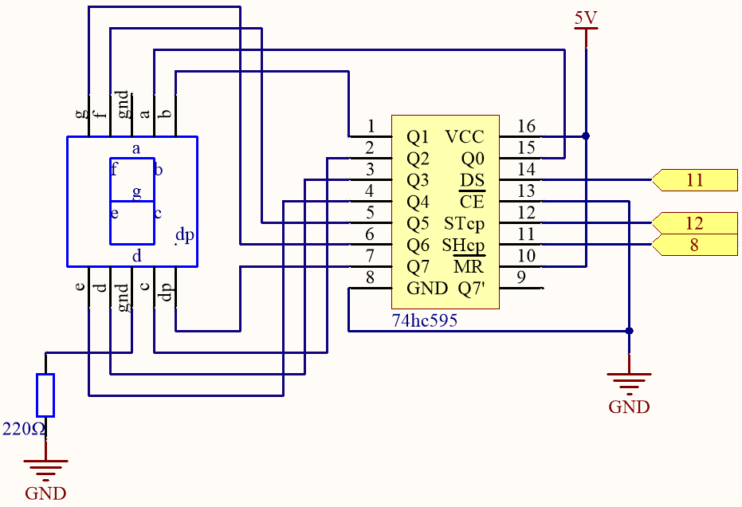
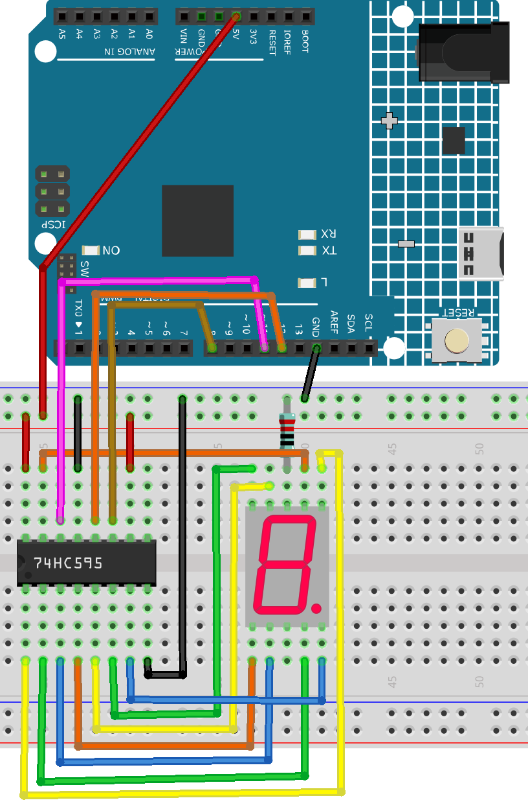
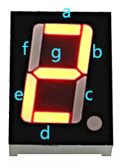

.. note::

    Hello, welcome to the SunFounder Raspberry Pi & Arduino & ESP32 Enthusiasts Community on Facebook! Dive deeper into Raspberry Pi, Arduino, and ESP32 with fellow enthusiasts.

    **Why Join?**

    - **Expert Support**: Solve post-sale issues and technical challenges with help from our community and team.
    - **Learn & Share**: Exchange tips and tutorials to enhance your skills.
    - **Exclusive Previews**: Get early access to new product announcements and sneak peeks.
    - **Special Discounts**: Enjoy exclusive discounts on our newest products.
    - **Festive Promotions and Giveaways**: Take part in giveaways and holiday promotions.

    👉 Ready to explore and create with us? Click [|link_sf_facebook|] and join today!

.. _ar_segment:

5.10 ShiftOut(Segment Display)
===================================

Previously, we used the ``shiftout()`` function to light up eight LEDs; here we use it to display 0-9 on the 7-aegment Display.

The 7-segment Display is essentially a device packaged by 8 LEDs, of which 7 strip-shaped LEDs form an "8" shape, and there is a slightly smaller dotted LED as a decimal point. These LEDs are marked as a, b, c, d, e, f, g, and dp. They have their own anode pins and share cathodes. Their pin locations are shown in the figure below.

.. image:: img/segment_cathode.png
    :width: 600
    :align: center

**Required Components**

In this project, we need the following components. 

It's definitely convenient to buy a whole kit, here's the link: 

.. list-table::
    :widths: 20 20 20
    :header-rows: 1

    *   - Name	
        - ITEMS IN THIS KIT
        - LINK
    *   - 3 in 1 Starter Kit
        - 380+
        - |link_3IN1_kit|

You can also buy them separately from the links below.

.. list-table::
    :widths: 30 20
    :header-rows: 1

    *   - COMPONENT INTRODUCTION
        - PURCHASE LINK

    *   - :ref:`cpn_uno`
        - \-
    *   - :ref:`cpn_breadboard`
        - |link_breadboard_buy|
    *   - :ref:`cpn_wires`
        - |link_wires_buy|
    *   - :ref:`cpn_resistor`
        - |link_resistor_buy|
    *   - :ref:`cpn_7_segment`
        - |link_7segment_buy|
    *   - :ref:`cpn_74hc595`
        - |link_74hc595_buy|

**Schematic**

**Wiring**

.. list-table:: Wiring
    :widths: 15 25
    :header-rows: 1

    *   - 74HC595
        - LED Segment Display
    *   - Q0
        - a
    *   - Q1
        - b
    *   - Q2
        - c
    *   - Q3
        - d
    *   - Q4
        - e
    *   - Q5
        - f
    *   - Q6
        - g
    *   - Q7
        - dp

**Code**

.. note::

    * Open the ``5.10.shiftout_segment.ino`` file under the path of ``3in1-kit\learning_project\5.10.shiftout_segment``.
    * Or copy this code into **Arduino IDE**.
    
    

.. raw:: html
    
    <iframe src=https://create.arduino.cc/editor/sunfounder01/23b9a3ea-c648-4f33-8622-e279d94ee507/preview?embed style="height:510px;width:100%;margin:10px 0" frameborder=0></iframe>
    
After the code is uploaded successfully, you will be able to see the LED Segment Display display 0~9 in sequence.

**How it works?**

``shiftOut()`` will make 74HC595 output 8 digital signals.
It outputs the last bit of the binary number to Q0, 
and the output of the first bit to Q7. In other words, 
writing the binary number "00000001" will make Q0 output high level and Q1~Q7 output low level.

Suppose that the 7-segment Display display the number "2", 
we need to write a high level for a, b, d, e and g, and write a low level for c, f and dp.
That is, the binary number " 01011011" needs to be written. 
For readability, we will use hexadecimal notation as "0x5b".

* `Hexadecimal <https://en.wikipedia.org/wiki/Hexadecimal>`_

* `BinaryHex Converter <https://www.binaryhexconverter.com/binary-to-hex-converter>`_

Similarly, we can also make the 7-Segment Display display other numbers in the same way. 
The following table shows the codes corresponding to these numbers.

.. list-table:: Glyph Code
    :widths: 20 20 20
    :header-rows: 1

    *   - Numbers	
        - Binary Code
        - Hex Code  
    *   - 0	
        - 00111111	
        - 0x3f
    *   - 1	
        - 00000110	
        - 0x06
    *   - 2	
        - 01011011	
        - 0x5b
    *   - 3	
        - 01001111	
        - 0x4f
    *   - 4	
        - 01100110	
        - 0x66
    *   - 5	
        - 01101101	
        - 0x6d
    *   - 6	
        - 01111101	
        - 0x7d
    *   - 7	
        - 00000111	
        - 0x07
    *   - 8	
        - 01111111	
        - 0x7f
    *   - 9	
        - 01101111	
        - 0x6f

Write these codes into ``shiftOut()`` to make the LED Segment Display display the corresponding numbers.