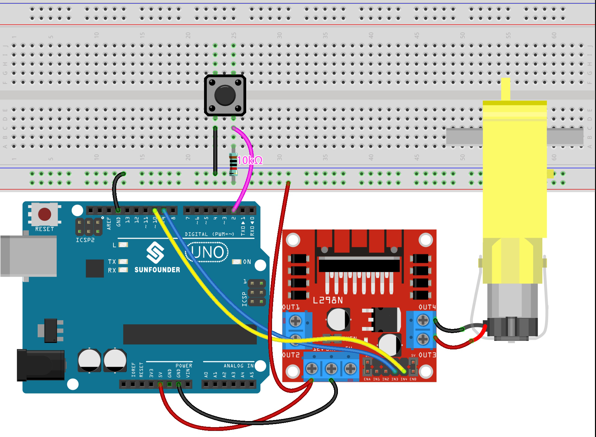

.. _ar_state_change:

5.3 State Change Detection
===========================

When the button controls other devices, it can not only work when it is pressed, but stop when it is released.
It is also possible to switch the working state each time the button is pressed.

In order to achieve this effect, you need to know how to toggle the working state between off and on when the button is pressed,
That is "state change detection".

In this project, we will use the button to control the motor.

**Schematic**

.. image:: img/circuit_8.3_statechange.png

**Wiring**

* :ref:`cpn_uno`
* :ref:`cpn_breadboard`
* :ref:`cpn_wires`
* :ref:`cpn_resistor`
* :ref:`cpn_button`
* :ref:`cpn_tt_motor`
* :ref:`cpn_l298n`

**Code**

.. note::

    * Open the ``5.3.state_change_detection.ino`` file under the path of ``3in1-kit\basic_project\5.3.state_change_detection``.
    * Or copy this code into **Arduino IDE**.
    
    * Or upload the code through the `Arduino Web Editor <https://docs.arduino.cc/cloud/web-editor/tutorials/getting-started/getting-started-web-editor>`_.

.. raw:: html
    
    <iframe src=https://create.arduino.cc/editor/sunfounder01/67a62a3d-46d3-4f5f-889c-364cbdf9b66f/preview?embed style="height:510px;width:100%;margin:10px 0" frameborder=0></iframe>
    
After the code is uploaded successfully, you press the button and the motor will turn; until you press the button again, the motor will stop.

**How it works?**

#. Create variables and define pins for the motor and button.

    .. code-block:: arduino

        ...
        int detectionState = 0;   
        int buttonState = 0;         
        int lastButtonState = 0;    

    * ``detectionState`` is a flag whose value changes each time the button is pressed, e.g., 0 this time, 1 the next, and so on alternately.
    * ``buttonState`` and ``lastButtonState`` are used to record the state of the button this time and the last time, to compare whether the button was pressed or released.

#. Initialize each pin and set the baud rate of the serial monitor.

    .. code-block:: arduino

        void setup() {
            pinMode(buttonPin, INPUT);
            Serial.begin(9600);
            pinMode(motorPinA,OUTPUT);
            pinMode(motorPinB,OUTPUT);
        }

#. First read the state of the button, and if the button is pressed, the variable ``detectionState`` will switch its value from 0 to 1 or 1 to 0. When ``detectionState`` is 1, the motor will be turned. It has the effect that this time the button is pressed, the motor turns, the next time the button is pressed, the motor stops, and so on alternately.

    .. code-block:: arduino

        void loop() {
        // Toggle the detectionState each time the button is pressed
        buttonState = digitalRead(buttonPin);
        if (buttonState != lastButtonState) {
            if (buttonState == HIGH) {
            detectionState=(detectionState+1)%2;
            Serial.print("The detection state is: ");
            Serial.println(detectionState);
            } 
            delay(50);
        }
        lastButtonState = buttonState;
        
        // According to the detectionState, start the motor
        if(detectionState==1){
            digitalWrite(motorPinA,HIGH);
            digitalWrite(motorPinB,LOW);
        }else{
            digitalWrite(motorPinA,LOW);
            digitalWrite(motorPinB,LOW);
        }
        }

    The entire workflow is as follows.

    * Read the button value.

    .. code-block:: arduino

        buttonState = digitalRead(buttonPin);

    * If ``buttonState`` and ``lastButtonState`` are not equal, it means that the button state has changed, continue with the next judgment, and store the button state at this time into the variable ``lastButtonState``. ``delay(50)`` is used to eliminate jitter.
    
    .. code-block:: arduino

        if (buttonState != lastButtonState) {
        ...
            delay(50);
        }
        lastButtonState = buttonState;

    * When the button is pressed, its value is HIGH. Here, when the button is pressed, the value of the variable ``detectionState`` is changed, e.g., from 0 to 1 after an operation.

    .. code-block:: arduino

        if (buttonState == HIGH) {
            detectionState=(detectionState+1)%2;
            Serial.print("The detection state is: ");
            Serial.println(detectionState);
            }

    * When the variable ``detectionState`` is 1, let the motor rotate, otherwise stop.

    .. code-block:: arduino

        if(detectionState==1){
            digitalWrite(motorPinA,HIGH);
            digitalWrite(motorPinB,LOW);
        }else{
            digitalWrite(motorPinA,LOW);
            digitalWrite(motorPinB,LOW);
        }

