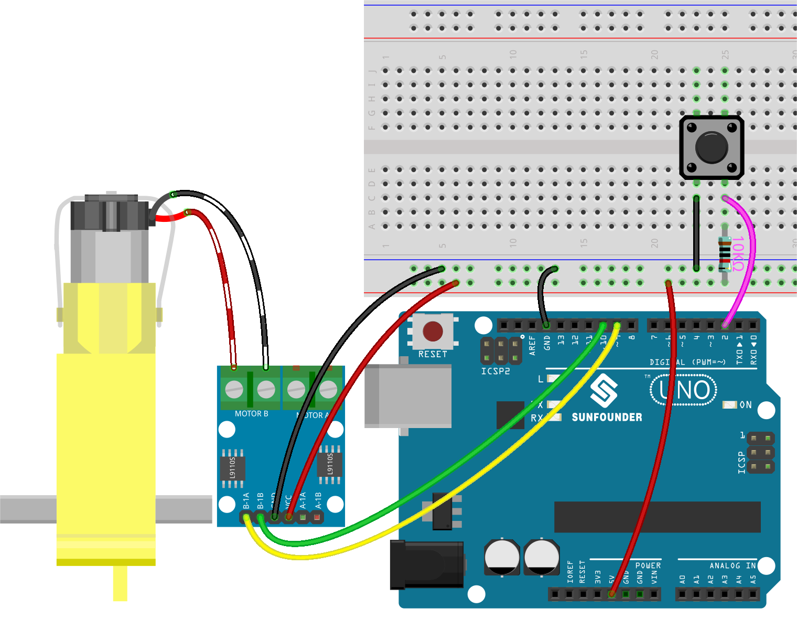

.. note::

    こんにちは、SunFounderのRaspberry Pi & Arduino & ESP32愛好家コミュニティへようこそ！Facebook上でRaspberry Pi、Arduino、ESP32についてもっと深く掘り下げ、他の愛好家と交流しましょう。

    **参加する理由は？**

    - **エキスパートサポート**：コミュニティやチームの助けを借りて、販売後の問題や技術的な課題を解決します。
    - **学び＆共有**：ヒントやチュートリアルを交換してスキルを向上させましょう。
    - **独占的なプレビュー**：新製品の発表や先行プレビューに早期アクセスしましょう。
    - **特別割引**：最新製品の独占割引をお楽しみください。
    - **祭りのプロモーションとギフト**：ギフトや祝日のプロモーションに参加しましょう。

    👉 私たちと一緒に探索し、創造する準備はできていますか？[|link_sf_facebook|]をクリックして今すぐ参加しましょう！

.. _ar_state_change:

5.3 ステート変更の検出
===========================

ボタンが他のデバイスを制御する際、ボタンが押されている間だけ動作するわけではなく、離されると動作が停止することもあります。
ボタンが押されるたびに動作状態を切り替えることも可能です。

この効果を実現するためには、ボタンが押されるとオフとオンの間で動作状態を切り替える方法を知っておく必要があります。
それは「ステート変更の検出」と言います。

このプロジェクトでは、ボタンを使用してモーターを制御します。

**必要な部品**

このプロジェクトで必要な部品は以下の通りです。

キット全体を購入するのは非常に便利です。リンクは以下の通りです：

.. list-table::
    :widths: 20 20 20
    :header-rows: 1

    *   - 名称	
        - このキットのアイテム
        - リンク
    *   - 3 in 1 Starter Kit
        - 380+
        - |link_3IN1_kit|

以下のリンクから個別に購入することも可能です。

.. list-table::
    :widths: 30 20
    :header-rows: 1

    *   - コンポーネントの紹介
        - 購入リンク

    *   - :ref:`cpn_uno`
        - |link_Uno_R3_buy|
    *   - :ref:`cpn_breadboard`
        - |link_breadboard_buy|
    *   - :ref:`cpn_wires`
        - |link_wires_buy|
    *   - :ref:`cpn_resistor`
        - |link_resistor_buy|
    *   - :ref:`cpn_button`
        - |link_button_buy|
    *   - :ref:`cpn_tt_motor`
        - \-
    *   - :ref:`cpn_l9110`
        - \-

**回路図**

.. image:: img/circuit_8.3_statechange.png

**配線図**

**コード**

.. note::

    * ``3in1-kit\basic_project\5.3.state_change_detection`` のパスの下にある ``5.3.state_change_detection.ino`` ファイルを開きます。
    * または、このコードを **Arduino IDE** にコピーします。
    
    * または、 `Arduino Web Editor <https://docs.arduino.cc/cloud/web-editor/tutorials/getting-started/getting-started-web-editor>`_ を通じてコードをアップロードします。

.. raw:: html
    
    <iframe src=https://create.arduino.cc/editor/sunfounder01/67a62a3d-46d3-4f5f-889c-364cbdf9b66f/preview?embed style="height:510px;width:100%;margin:10px 0" frameborder=0></iframe>
    
コードが正常にアップロードされた後、ボタンを押すとモーターが回転し、再びボタンを押すとモーターが停止します。

**どのように動作するのか？**

1. モーターやボタンのピンの変数を作成し、ピンを定義します。

    .. code-block:: arduino

        ...
        int detectionState = 0;   
        int buttonState = 0;         
        int lastButtonState = 0;    

    * ``detectionState`` is a flag whose value changes each time the button is pressed, e.g., 0 this time, 1 the next, and so on alternately.
    * ``buttonState`` and ``lastButtonState`` are used to record the state of the button this time and the last time, to compare whether the button was pressed or released.

#. 各ピンを初期化し、シリアルモニタのボーレートを設定します。

    .. code-block:: arduino

        void setup() {
            pinMode(buttonPin, INPUT);
            Serial.begin(9600);
            pinMode(B_1A, OUTPUT);
            pinMode(B_1B, OUTPUT);
        }

#. ボタンの状態を最初に読み取り、ボタンが押されると、変数 ``detectionState`` が0から1、または1から0に切り替えられます。 ``detectionState`` が1の場合、モーターが回転します。この回路の効果は、ボタンが押されるたびにモーターが回転し、次にボタンが押されるとモーターが停止する、というものです。

    .. code-block:: arduino

        void loop() {
            // Toggle the detectionState each time the button is pressed
            buttonState = digitalRead(buttonPin);
            if (buttonState != lastButtonState) {
                if (buttonState == HIGH) {
                detectionState=(detectionState+1)%2;
                Serial.print("The detection state is: ");
                Serial.println(detectionState);
                } 
                delay(50);
            }
            lastButtonState = buttonState;

            // According to the detectionState, start the motor
            if(detectionState==1){
                digitalWrite(B_1A,HIGH);
                digitalWrite(B_1B,LOW);
            }else{
                digitalWrite(B_1A,LOW);
                digitalWrite(B_1B,LOW);
            }
        }

全体のワークフローは以下の通りです。

    * ボタンの値を読み取ります。

    .. code-block:: arduino

        buttonState = digitalRead(buttonPin);

    * ``buttonState`` と ``lastButtonState`` が等しくない場合、ボタンの状態が変更されたことを意味します。次の判断を続け、この時点のボタンの状態を変数 ``lastButtonState`` に格納します。 ``delay(50)`` はジッタを排除するために使用されます。
    
    .. code-block:: arduino

        if (buttonState != lastButtonState) {
        ...
            delay(50);
        }
        lastButtonState = buttonState;

    * ボタンが押されると、その値はHIGHになります。ここで、ボタンが押されると、変数 ``detectionState`` の値が変更されます。例えば、1つの操作後に0から1になります。

    .. code-block:: arduino

        if (buttonState == HIGH) {
            detectionState=(detectionState+1)%2;
            Serial.print("The detection state is: ");
            Serial.println(detectionState);
            }

    * 変数 ``detectionState`` が1の場合、モーターを回転させ、それ以外の場合は停止します。

    .. code-block:: arduino

        if(detectionState==1){
            digitalWrite(B_1A,HIGH);
            digitalWrite(B_1B,LOW);
        }else{
            digitalWrite(B_1A,LOW);
            digitalWrite(B_1B,LOW);
        }

