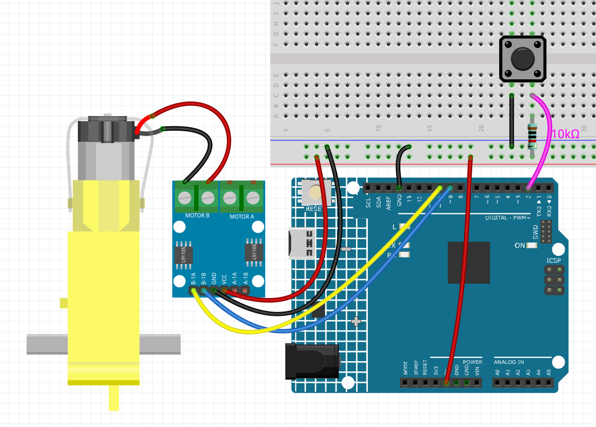

.. _ar_state_change:

5.3 状態変化の検出
===========================

ボタンが他のデバイスを制御する場合、それは押されているときにのみ動作するだけでなく、リリースされたときに停止することもできます。
ボタンが押されるたびに動作状態を切り替えることも可能です。

この効果を達成するために、ボタンが押されたときに動作状態をオフとオンの間で切り替える方法を知る必要があります。
それは「状態変化の検出」です。

このプロジェクトでは、モーターを制御するためのボタンを使用します。

.. **回路図**

.. .. image:: img/circuit_8.3_statechange.png

**必要な部品**

このプロジェクトには、以下の部品が必要です。

全体のキットを購入すると非常に便利です。こちらがリンクです:

.. list-table::
    :widths: 20 20 20
    :header-rows: 1

    *   - 名前
        - このキットのアイテム
        - リンク
    *   - 3 in 1 Starter Kit
        - 380+
        - |link_3IN1_kit|

下記のリンクからも個別に購入することができます。

.. list-table::
    :widths: 30 20
    :header-rows: 1

    *   - コンポーネントの紹介
        - 購入リンク

    *   - :ref:`cpn_uno`
        - \-
    *   - :ref:`cpn_breadboard`
        - |link_breadboard_buy|
    *   - :ref:`cpn_wires`
        - |link_wires_buy|
    *   - :ref:`cpn_resistor`
        - |link_resistor_buy|
    *   - :ref:`cpn_button`
        - |link_button_buy|
    *   - :ref:`cpn_tt_motor`
        - \-
    *   - :ref:`cpn_l9110`
        - \-

**回路図**

.. image:: img/circuit_8.3_statechange.png

**配線図**

**コード**

.. note::

    * ``3in1-kit\learning_project\5.3.state_change_detection`` のパスの下で ``5.3.state_change_detection.ino`` ファイルを開きます。
    * または、このコードを **Arduino IDE** にコピーします。
    

.. raw:: html
    
    <iframe src=https://create.arduino.cc/editor/sunfounder01/67a62a3d-46d3-4f5f-889c-364cbdf9b66f/preview?embed style="height:510px;width:100%;margin:10px 0" frameborder=0></iframe>
    
コードが正常にアップロードされた後、ボタンを押すとモーターが動き、再びボタンを押すとモーターが停止します。

**どのように動作するのか？**

#. モーターとボタンのための変数を作成し、ピンを定義します。

    .. code-block:: arduino

        ...
        int detectionState = 0;   
        int buttonState = 0;         
        int lastButtonState = 0;    

    * ``detectionState`` はボタンが押されるたびに値が変わるフラグです。例：この時は0、次は1、と交互に変わります。
    * ``buttonState`` と ``lastButtonState`` は、この回と前回のボタンの状態を記録し、ボタンが押されたか、放されたかを比較するために使われます。

#. 各ピンを初期化し、シリアルモニターのボーレートを設定します。

    .. code-block:: arduino

        void setup() {
            pinMode(buttonPin, INPUT);
            Serial.begin(9600);
            pinMode(motorPinA,OUTPUT);
            pinMode(motorPinB,OUTPUT);
        }

#. まず、ボタンの状態を読み取ります。ボタンが押された場合、変数 ``detectionState`` の値は0から1、または1から0に切り替わります。 ``detectionState`` が1の場合、モーターが回転します。ボタンが押されるたびに、モーターが交互に動作し、停止する効果があります。

    .. code-block:: arduino

        void loop() {
        // ボタンが押されるたびにdetectionStateを切り替える
        buttonState = digitalRead(buttonPin);
        if (buttonState != lastButtonState) {
            if (buttonState == HIGH) {
            detectionState=(detectionState+1)%2;
            Serial.print("The detection state is: ");
            Serial.println(detectionState);
            } 
            delay(50);
        }
        lastButtonState = buttonState;
        
        // detectionStateに従って、モーターを起動する
        if(detectionState==1){
            digitalWrite(motorPinA,HIGH);
            digitalWrite(motorPinB,LOW);
        }else{
            digitalWrite(motorPinA,LOW);
            digitalWrite(motorPinB,LOW);
        }
        }

    すべてのワークフローは以下の通りです。

    * ボタンの値を読み取る。

    .. code-block:: arduino

        buttonState = digitalRead(buttonPin);

    * ``buttonState`` と ``lastButtonState`` が等しくない場合、ボタンの状態が変わったことを意味します。次の判断を続け、この時のボタンの状態を変数 ``lastButtonState`` に格納します。 ``delay(50)`` はジッタを排除するために使用されます。

    .. code-block:: arduino

        if (buttonState != lastButtonState) {
        ...
            delay(50);
        }
        lastButtonState = buttonState;

    * ボタンが押されたとき、その値はHIGHです。ここでは、ボタンが押されたときに変数 ``detectionState`` の値が変更されます。例：操作後に0から1へ。

    .. code-block:: arduino

        if (buttonState == HIGH) {
            detectionState=(detectionState+1)%2;
            Serial.print("The detection state is: ");
            Serial.println(detectionState);
            }

    * 変数 ``detectionState`` が1の場合、モーターを回転させます。それ以外の場合は停止します。

    .. code-block:: arduino

        if(detectionState==1){
            digitalWrite(motorPinA,HIGH);
            digitalWrite(motorPinB,LOW);
        }else{
            digitalWrite(motorPinA,LOW);
            digitalWrite(motorPinB,LOW);
        }

