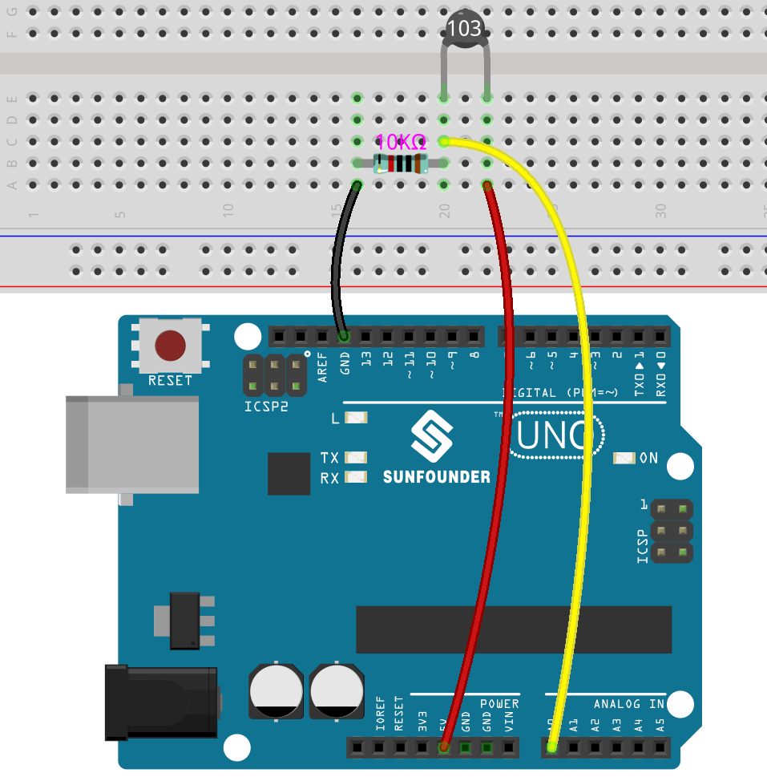

.. _ar_temp:

4.5 温度計
===========================

温度計は、温度または温度勾配（物体の暖かさまたは寒さの度合い）を測定する装置です。 
温度計には2つの重要な要素があります：(1)温度が変わると何らかの変化が生じる温度センサー（例：水銀温度計の球部や赤外線温度計の焼結センサー） 
および(2)この変化を数値に変換する手段（例：水銀温度計にマークされている可視スケールや赤外線モデルのデジタル表示）。 
温度計は、工業や技術でのプロセスの監視、気象学、医学、科学研究で幅広く使用されています。

サーミスタは、温度に強く依存する抵抗を持つ温度センサの一種で、2つのタイプがあります： 
Negative Temperature Coefficient（NTC）およびPositive Temperature Coefficient（PTC）、 
またはNTCおよびPTCとして知られています。 PTCサーミスタの抵抗は温度とともに増加し、NTCの状態は前者とは逆です。

この実験では、 **NTCサーミスタ** を使用して温度計を作成します。

**必要な部品**

このプロジェクトでは、以下のコンポーネントが必要です。

一式を購入することは非常に便利です。リンクはこちら：

.. list-table::
    :widths: 20 20 20
    :header-rows: 1

    *   - 名前	
        - このキットのアイテム
        - リンク
    *   - 3 in 1 Starter Kit
        - 380+
        - |link_3IN1_kit|

以下のリンクから個別に購入することもできます。

.. list-table::
    :widths: 30 20
    :header-rows: 1

    *   - コンポーネント紹介
        - 購入リンク

    *   - :ref:`cpn_uno`
        - |link_Uno_R3_buy|
    *   - :ref:`cpn_breadboard`
        - |link_breadboard_buy|
    *   - :ref:`cpn_wires`
        - |link_wires_buy|
    *   - :ref:`cpn_resistor`
        - |link_resistor_buy|
    *   - :ref:`cpn_thermistor`
        - |link_thermistor_buy|

**回路図**

.. image:: img/circuit_5.5_thermistor.png

各サーミスタには通常の抵抗があります。ここでは、それは10kオームで、25度セルシウスで測定されます。

温度が上昇すると、サーミスタの抵抗は減少します。その後、電圧データはA/Dアダプタによってデジタル量に変換されます。

セルシウス度または華氏での温度は、プログラミングを介して出力されます。

抵抗と温度の間の関係は以下の通りです：

    **RT =RN expB(1/TK – 1/TN)** 

    * **RT** は、温度が **TK** の場合のNTCサーミスタの抵抗です。
    * **RN** は、定格温度TN下のNTCサーミスタの抵抗です。ここでは、RNの数値は10kです。
    * **TK** は、ケルビン温度で、単位はKです。ここでは、 **TK** の数値は ``273.15 + セルシウス度`` です。
    * **TN** は、定格ケルビン温度で、単位もKです。ここでは、TNの数値は ``273.15+25`` です。
    * **B(beta)** は、NTCサーミスタの材料定数であり、熱感度指数とも呼ばれ、数値は ``3950`` です。
    * **exp** は指数の略であり、基数 ``e`` は自然数で、おおよそ2.7に等しいです。

    この式 ``TK=1/(ln(RT/RN)/B+1/TN)`` を変換して、ケルビン温度から273.15を引くとセルシウス度になります。

    この関係は経験的な式です。温度と抵抗が有効範囲内の場合にのみ正確です。

**配線図**

.. note::
    * サーミスタは黒または緑で、103とマークされています。

**コード**

.. note::

   * ``euler-kit/arduino/4.5_thermometer`` のパスの下の ``4.5_thermometer.ino`` ファイルを開くことができます。
   * または、このコードを **Arduino IDE** にコピーします。
   
   * または、 `Arduino Web Editor <https://docs.arduino.cc/cloud/web-editor/tutorials/getting-started/getting-started-web-editor>`_ を通じてコードをアップロードします。

   アップロードボタンをクリックする前に、Raspberry Pi Picoボードと正しいポートを選択することを忘れないでください。

.. raw:: html

    <iframe src=https://create.arduino.cc/editor/sunfounder01/1ceb0ea2-a330-4052-824d-bd6762c6f0e0/preview?embed style="height:510px;width:100%;margin:10px 0" frameborder=0></iframe>
    

コードが正常にアップロードされると、シリアルモニタはセルシウス度と華氏温度を出力します。
