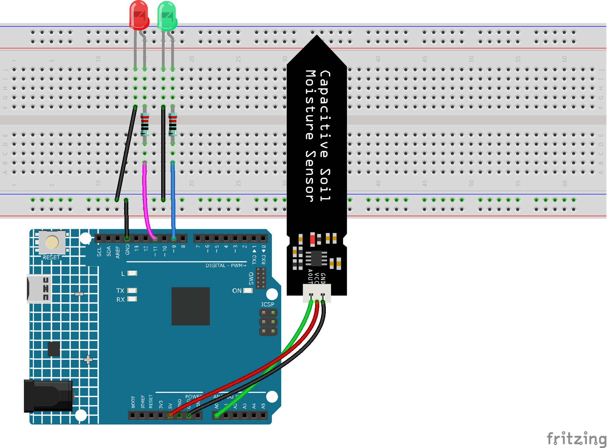

.. _ar_threshold:

5.2 Schwellenwert
=======================

In vielen Projekten werden Sie auf solch ein Bedürfnis stoßen.
"Wenn xxx ein bestimmtes Niveau erreicht, dann..."

Zum Beispiel in einem Smart Home: Wenn die Lichtintensität weniger als 50Lux beträgt, schalte das Licht ein;
Ein weiteres Beispiel ist auf dem Computer-Motherboard: Wenn die Betriebstemperatur des CPUs höher als 65 Grad Celsius ist, schalte den Lüfter ein, und so weiter.

In diesen Anforderungen spiegelt sich das Schlüsselwort "Schwellenwert" wider.

Wir können den Wert des Schwellenwerts anpassen, um den Schaltkreis stärker an individuelle Bedürfnisse anzupassen.
Zum Beispiel, wenn ich ein helleres Wohnambiente bevorzuge, kann ich den Schwellenwert der automatischen Beleuchtung des Smart Homes auf 80Lux erhöhen.
Ein weiteres Beispiel ist, wenn die Belüftungsumgebung meines Studios nicht sehr gut ist und der Bedarf an Wärmeableitung höher ist, kann der Schwellenwert für das automatische Öffnen des Lüfters auf 50 Grad Celsius eingestellt werden.

Hier verwenden wir einen Bodenfeuchtigkeitssensor und 2 LEDs, um einen Topfmonitor zu erstellen. Wenn der Boden zu trocken ist, leuchtet die rote LED; wenn der Boden feucht genug ist, leuchtet die grüne LED. Sie müssen die Schwellenwerte zur Bestimmung der Trockenheit und Feuchtigkeit des Bodens manuell anpassen.

**Benötigte Komponenten**

Für dieses Projekt benötigen wir die folgenden Komponenten.

Es ist definitiv praktisch, ein ganzes Set zu kaufen, hier ist der Link:

.. list-table::
    :widths: 20 20 20
    :header-rows: 1

    *   - Name	
        - ARTIKEL IN DIESEM KIT
        - LINK
    *   - 3 in 1 Starter Kit
        - 380+
        - |link_3IN1_kit|

Sie können sie auch einzeln über die untenstehenden Links kaufen.

.. list-table::
    :widths: 30 20
    :header-rows: 1

    *   - KOMPONENTENBESCHREIBUNG
        - KAUF-LINK

    *   - :ref:`cpn_uno`
        - \-
    *   - :ref:`cpn_breadboard`
        - |link_breadboard_buy|
    *   - :ref:`cpn_wires`
        - |link_wires_buy|
    *   - :ref:`cpn_resistor`
        - |link_resistor_buy|
    *   - :ref:`cpn_led`
        - |link_led_buy|
    *   - :ref:`cpn_soil_moisture`
        - |link_soil_moisture_buy|

**Schaltplan**

.. image:: img/circuit_8.2_threshold.png

**Verdrahtung**

**Code**

.. note::

    * Öffnen Sie die Datei ``5.2.threshold.ino`` im Pfad ``3in1-kit\learning_project\5.2.threshold``.
    * Oder kopieren Sie diesen Code in die **Arduino IDE**.
    

.. raw:: html
    
    <iframe src=https://create.arduino.cc/editor/sunfounder01/9936413a-6e6c-4e57-b0c6-5df58dd48a3c/preview?embed style="height:510px;width:100%;margin:10px 0" frameborder=0></iframe>
    
Nachdem der Code erfolgreich hochgeladen wurde, und wenn Ihr Schwellenwert korrekt eingestellt ist, wird die rote LED leuchten, wenn der Boden trocken ist, um Sie daran zu erinnern, dass Sie gießen müssen; nach dem Gießen wird die grüne LED leuchten.

**Wie funktioniert das?**

.. code-block:: Arduino

    ...

    void loop() {
        int sensorValue = analogRead(soilMoisture);
        Serial.println(sensorValue);
        if (sensorValue > threshold) {
            digitalWrite(redPin, HIGH); // Turn the red LED
            digitalWrite(greenPin, LOW); // green
        } else {
            digitalWrite(greenPin, HIGH); // Turn on the green LED
            digitalWrite(redPin, LOW); // red
        }
    }
    ...

Zunächst setzen Sie einen ``Schwellenwert`` und lesen dann den Wert des Bodenfeuchtigkeitsmoduls; sein Wert nimmt ab, wenn der Feuchtigkeitsgrad steigt. Wenn der aktuell gelesene Wert größer als der eingestellte ``Schwellenwert`` ist, dann lassen Sie die rote LED leuchten, andernfalls schalten Sie die grüne LED ein.

Dieser ``Schwellenwert`` muss je nach tatsächlicher Situation angepasst werden. Sie können den Code zuerst hochladen, dann den seriellen Monitor öffnen, um den Wert zu überprüfen, den Wert in sowohl nassen als auch trockenen Zuständen aufzeichnen und dann einen Mittelwert als ``Schwellenwert`` wählen.

