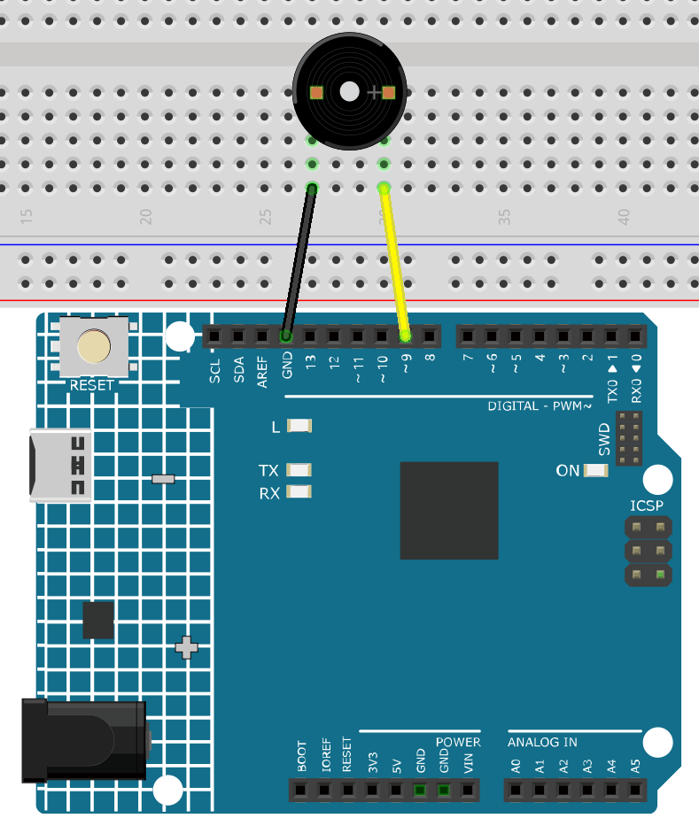

.. _ar_passive_buzzer:

.. _ar_map:

5.7 ``Tone()`` oder ``noTone()``
===================================

``Tone()`` wird verwendet, um eine Rechteckwelle der angegebenen Frequenz (und 50% Tastverhältnis) an einem Pin zu erzeugen. Eine Dauer kann angegeben werden, sonst setzt sich die Welle fort, bis ein Aufruf von ``noTone()`` erfolgt.

In diesem Projekt nutzen wir diese beiden Funktionen, um den passiven Summer zum Vibrieren und somit zum Tönen zu bringen.
Wie der aktive Summer verwendet auch der passive Summer das Phänomen der elektromagnetischen Induktion. 
Der Unterschied ist, dass ein passiver Summer keine Oszillationsquelle hat, sodass er bei Gleichstromsignalen nicht piept.
Dies ermöglicht jedoch dem passiven Summer, seine eigene Oszillationsfrequenz anzupassen und unterschiedliche Töne wie „do, re, mi, fa, sol, la, si“ zu erzeugen.

**Benötigte Komponenten**

Für dieses Projekt benötigen wir die folgenden Komponenten.

Es ist definitiv praktisch, ein komplettes Kit zu kaufen, hier ist der Link: 

.. list-table::
    :widths: 20 20 20
    :header-rows: 1

    *   - Name	
        - ARTIKEL IN DIESEM KIT
        - LINK
    *   - 3 in 1 Starter Kit
        - 380+
        - |link_3IN1_kit|

Sie können diese auch separat über die untenstehenden Links kaufen.

.. list-table::
    :widths: 30 20
    :header-rows: 1

    *   - KOMPONENTENBESCHREIBUNG
        - KAUF-LINK

    *   - :ref:`cpn_uno`
        - \-
    *   - :ref:`cpn_breadboard`
        - |link_breadboard_buy|
    *   - :ref:`cpn_wires`
        - |link_wires_buy|
    *   - :ref:`cpn_buzzer`
        - |link_passive_buzzer_buy|

**Schaltplan**

.. image:: img/circuit_6.1_passive.png

Verbinden Sie die Kathode des Summers mit GND und die Anode mit dem digitalen Pin 9. 

**Verdrahtung**

**Code**

.. note::

    * Öffnen Sie die Datei ``5.7.tone_notone.ino`` im Pfad ``3in1-kit\learning_project\5.7.tone_notone``.
    * Oder kopieren Sie diesen Code in die **Arduino IDE**.
    
    

.. raw:: html

    <iframe src=https://create.arduino.cc/editor/sunfounder01/9212e985-1f31-4bd9-bee6-f29357035aae/preview?embed style="height:510px;width:100%;margin:10px 0" frameborder=0></iframe>
    
Wenn Sie den Code erfolgreich auf das R4-Board hochgeladen haben, können Sie eine Melodie mit sieben Tönen hören.

**Wie funktioniert das?**

Es gibt zwei Punkte, auf die Sie achten sollten:

1. ``tone()`` & ``noTone()``: Mit dieser Funktion können Sie den Klang des passiven Summers direkt steuern, und ihr Prototyp lautet wie folgt:

**Syntax**
    void tone(int pin, unsigned int frequency)

    void tone(int pin, unsigned int frequency, unsigned long duration)

**Parameter**
    * ``pin``: Der Arduino-Pin, auf dem der Ton erzeugt werden soll.
    * ``frequency``: Die Frequenz des Tons in Hertz.
    * ``duration``: Die Dauer des Tons in Millisekunden (optional)

Generiert eine Rechteckwelle der angegebenen Frequenz (und 50% Tastverhältnis) an einem Pin (um den passiven Summer zum Tönen zu bringen). Eine Dauer kann angegeben werden, sonst setzt sich die Welle fort, bis ein Aufruf zu ``noTone()`` erfolgt.
Der Pin kann mit einem Piezo-Summer oder einem anderen Lautsprecher verbunden werden, um Töne zu spielen.

Zu einem Zeitpunkt kann nur ein Ton erzeugt werden. Wenn bereits ein Ton auf einem anderen Pin spielt, hat der Aufruf von ``tone()`` keine Wirkung. Spielt der Ton auf demselben Pin, setzt der Aufruf seine Frequenz.

Die Verwendung der Funktion ``tone()`` beeinträchtigt die PWM-Ausgabe an den Pins 3 und 11.

Es ist nicht möglich, Töne zu erzeugen, die niedriger sind als 31Hz.

**Syntax**
    void noTone(int pin)

**Parameter**
    ``pin``: Der Arduino-Pin, auf dem der Ton erzeugt werden soll.

Beendet die Generierung einer durch ``tone()`` ausgelösten Rechteckwelle. Hat keine Wirkung, wenn kein Ton erzeugt wird.

Nachdem Sie die beiden Funktionen kennengelernt haben, können Sie den Code verstehen – die Erstellung der Arrays ``melody[]`` und ``noteDurations[]`` dient als Vorbereitung für die nachfolgenden Aufrufe der Funktion ``tone()`` und das Ändern von Ton und Dauer in der Schleife, um einen besseren Musikspiel-Effekt zu erzielen.

2. ``pitches.h``: Der Code verwendet eine zusätzliche Datei namens ``pitches.h``. Diese Datei enthält alle Tonhöhenwerte für typische Noten. Zum Beispiel entspricht NOTE_C4 dem mittleren C. NOTE_FS4 ist Fis, und so weiter. Diese Notentabelle wurde ursprünglich von Brett Hagman erstellt, auf dessen Arbeit der Befehl ``tone()`` basiert. Sie könnte nützlich sein, wenn Sie musikalische Noten erzeugen möchten.

.. code-block:: arduino

    #include "pitches.h"

.. note::
    In diesem Beispielprogramm gibt es bereits eine Datei ``pitches.h``. Wenn Sie sie zusammen mit dem Hauptcode in einem Ordner ablegen, können die nachfolgenden Schritte zum Installieren von ``pitches.h`` weggelassen werden.

.. image:: img/image123.png

Wenn Sie die Code-Datei öffnen und die
``pitches.h``-Datei nicht öffnen können, können Sie diese einfach manuell erstellen. Die Schritte sind wie
folgt:

Um die Datei ``pitches.h`` zu erstellen, klicken Sie entweder auf die Schaltfläche direkt unter dem Symbol für den seriellen Monitor und wählen Sie **New Tab**, oder verwenden Sie **Ctrl+Shift+N**.

.. image:: img/image124.png

Fügen Sie dann den folgenden Code ein und speichern Sie ihn als ``pitches.h``:

.. code-block:: arduino

    /*****************
    Public Constants
    *****************/
    #define NOTE_B0  31
    #define NOTE_C1  33
    #define NOTE_CS1 35
    #define NOTE_D1  37
    #define NOTE_DS1 39
    #define NOTE_E1  41
    #define NOTE_F1  44
    #define NOTE_FS1 46
    #define NOTE_G1  49
    #define NOTE_GS1 52
    #define NOTE_A1  55
    #define NOTE_AS1 58
    #define NOTE_B1  62
    #define NOTE_C2  65
    #define NOTE_CS2 69
    #define NOTE_D2  73
    #define NOTE_DS2 78
    #define NOTE_E2  82
    #define NOTE_F2  87
    #define NOTE_FS2 93
    #define NOTE_G2  98
    #define NOTE_GS2 104
    #define NOTE_A2  110
    #define NOTE_AS2 117
    #define NOTE_B2  123
    #define NOTE_C3  131
    #define NOTE_CS3 139
    #define NOTE_D3  147
    #define NOTE_DS3 156
    #define NOTE_E3  165
    #define NOTE_F3  175
    #define NOTE_FS3 185
    #define NOTE_G3  196
    #define NOTE_GS3 208
    #define NOTE_A3  220
    #define NOTE_AS3 233
    #define NOTE_B3  247
    #define NOTE_C4  262
    #define NOTE_CS4 277
    #define NOTE_D4  294
    #define NOTE_DS4 311
    #define NOTE_E4  330
    #define NOTE_F4  349
    #define NOTE_FS4 370
    #define NOTE_G4  392
    #define NOTE_GS4 415
    #define NOTE_A4  440
    #define NOTE_AS4 466
    #define NOTE_B4  494
    #define NOTE_C5  523
    #define NOTE_CS5 554
    #define NOTE_D5  587
    #define NOTE_DS5 622
    #define NOTE_E5  659
    #define NOTE_F5  698
    #define NOTE_FS5 740
    #define NOTE_G5  784
    #define NOTE_GS5 831
    #define NOTE_A5  880
    #define NOTE_AS5 932
    #define NOTE_B5  988
    #define NOTE_C6  1047
    #define NOTE_CS6 1109
    #define NOTE_D6  1175
    #define NOTE_DS6 1245
    #define NOTE_E6  1319
    #define NOTE_F6  1397
    #define NOTE_FS6 1480
    #define NOTE_G6  1568
    #define NOTE_GS6 1661
    #define NOTE_A6  1760
    #define NOTE_AS6 1865
    #define NOTE_B6  1976
    #define NOTE_C7  2093
    #define NOTE_CS7 2217
    #define NOTE_D7  2349
    #define NOTE_DS7 2489
    #define NOTE_E7  2637
    #define NOTE_F7  2794
    #define NOTE_FS7 2960
    #define NOTE_G7  3136
    #define NOTE_GS7 3322
    #define NOTE_A7  3520
    #define NOTE_AS7 3729
    #define NOTE_B7  3951
    #define NOTE_C8  4186
    #define NOTE_CS8 4435
    #define NOTE_D8  4699
    #define NOTE_DS8 49
