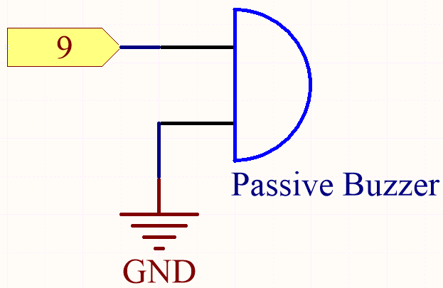
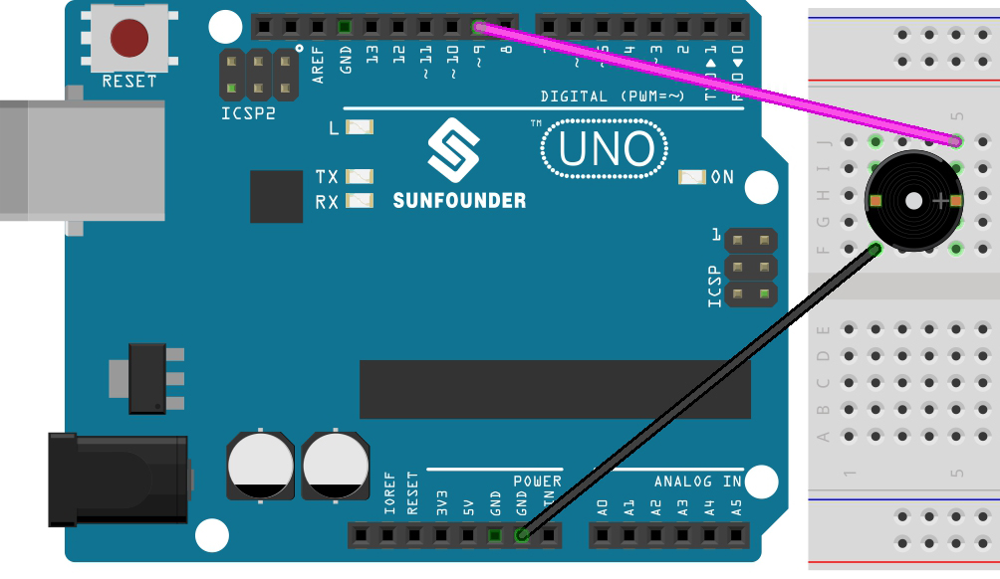

.. note::

    Ciao, benvenuto nella SunFounder Raspberry Pi & Arduino & ESP32 Enthusiasts Community su Facebook! Approfondisci le tue conoscenze su Raspberry Pi, Arduino ed ESP32 insieme ad altri appassionati.

    **Perché unirti?**

    - **Supporto esperto**: Risolvi problemi tecnici e post-vendita con l'aiuto della nostra community e del nostro team.
    - **Impara e condividi**: Scambia consigli e tutorial per migliorare le tue competenze.
    - **Anteprime esclusive**: Ottieni accesso anticipato ai nuovi annunci di prodotti e anteprime.
    - **Sconti speciali**: Approfitta di sconti esclusivi sui nostri prodotti più recenti.
    - **Promozioni festive e omaggi**: Partecipa a promozioni e omaggi durante le festività.

    👉 Sei pronto a esplorare e creare con noi? Clicca su [|link_sf_facebook|] e unisciti oggi!

.. _ar_passive_buzzer:

5.7 ``Tone()`` o ``noTone()``
==================================

``Tone()`` viene utilizzato per generare un'onda quadra con una frequenza specificata (e un ciclo di lavoro del 50%) su un pin. Si può specificare una durata, altrimenti l'onda continua fino a una chiamata a ``noTone()``.

In questo progetto, usiamo queste due funzioni per far vibrare il buzzer passivo emettendo suoni. 
Come il buzzer attivo, anche quello passivo sfrutta il fenomeno dell'induzione elettromagnetica per funzionare. 
La differenza è che il buzzer passivo non ha una sorgente di oscillazione interna, quindi non emette suoni se si usano segnali in continua. 
Ma questo permette al buzzer passivo di regolare la propria frequenza di oscillazione ed emettere note diverse come "do, re, mi, fa, sol, la, si".

**Componenti necessari**

In questo progetto ci servono i seguenti componenti.

È sicuramente conveniente acquistare un kit completo, ecco il link:

.. list-table::
    :widths: 20 20 20
    :header-rows: 1

    *   - Nome	
        - ELEMENTI IN QUESTO KIT
        - LINK
    *   - 3 in 1 Starter Kit
        - 380+
        - |link_3IN1_kit|

Puoi anche acquistarli separatamente dai link sottostanti.

.. list-table::
    :widths: 30 20
    :header-rows: 1

    *   - INTRODUZIONE AI COMPONENTI
        - LINK PER L'ACQUISTO

    *   - :ref:`cpn_uno`
        - |link_Uno_R3_buy|
    *   - :ref:`cpn_breadboard`
        - |link_breadboard_buy|
    *   - :ref:`cpn_wires`
        - |link_wires_buy|
    *   - :ref:`cpn_buzzer`
        - |link_passive_buzzer_buy|

**Schema**

Collega il catodo del buzzer al GND e l'anodo al pin digitale 9.

**Collegamenti**

**Codice**

.. note::

    * Apri il file ``5.7.tone_notone.ino`` nel percorso ``3in1-kit\basic_project\5.7.tone_notone``.
    * Oppure copia questo codice nell'**Arduino IDE**.
    
    * Oppure carica il codice tramite il `Arduino Web Editor <https://docs.arduino.cc/cloud/web-editor/tutorials/getting-started/getting-started-web-editor>`_.

.. raw:: html

    <iframe src=https://create.arduino.cc/editor/sunfounder01/9212e985-1f31-4bd9-bee6-f29357035aae/preview?embed style="height:510px;width:100%;margin:10px 0" frameborder=0></iframe>
    
Dopo aver caricato correttamente il codice sulla scheda R3, sentirai una melodia composta da sette note.

**Come funziona?**

Ci sono due punti da considerare:

1. ``tone()`` & ``noTone()``: Questa funzione viene utilizzata per controllare direttamente il suono del buzzer passivo e il suo prototipo è il seguente:

**Sintassi**
    void tone(int pin, unsigned int frequency)

    void tone(int pin, unsigned int frequency, unsigned long duration)

**Parametri**
    * ``pin``: Il pin di Arduino su cui generare il tono.
    * ``frequency``: La frequenza del tono in hertz.
    * ``duration``: La durata del tono in millisecondi (opzionale).

Genera un'onda quadra alla frequenza specificata (e con ciclo di lavoro al 50%) su un pin, facendo vibrare il buzzer passivo. Si può specificare una durata, altrimenti l'onda continua fino alla chiamata di ``noTone()``. 
Il pin può essere collegato a un buzzer piezoelettrico o ad un altro altoparlante per riprodurre toni.

Si può generare solo un tono alla volta. Se un tono è già in riproduzione su un altro pin, la chiamata a ``tone()`` non avrà effetto. Se il tono è in riproduzione sullo stesso pin, la chiamata ne imposterà la frequenza.

L'uso della funzione ``tone()`` interferirà con l'output PWM sui pin 3 e 11.

Non è possibile generare toni inferiori a 31Hz.

**Sintassi**
    void noTone(int pin)

**Parametri**
    ``pin``: Il pin di Arduino su cui generare il tono.

Interrompe la generazione di un'onda quadra attivata da ``tone()``. Non ha effetto se non viene generato alcun tono.

Conoscendo queste due funzioni, si può comprendere il codice: l'installazione dell'array ``melody[]`` e dell'array ``noteDurations[]`` serve a preparare le successive chiamate alla funzione ``tone()`` e la variazione di tono e durata nel ciclo per migliorare l'effetto della riproduzione musicale.

2. ``pitches.h``: Il codice utilizza un file aggiuntivo, ``pitches.h``. Questo file contiene tutti i valori delle note musicali standard. Ad esempio, NOTE_C4 è il DO centrale. NOTE_FS4 è il FA diesis, e così via. Questa tabella delle note è stata originariamente scritta da Brett Hagman, il cui lavoro ha ispirato il comando ``tone()``. Potrebbe risultarti utile ogni volta che vorrai riprodurre note musicali.

.. code-block:: arduino

    #include "pitches.h"
.. note::
    Questo programma di esempio contiene già un file ``pitches.h``. Se lo posizioniamo insieme al codice principale in una cartella, i passaggi successivi per l'installazione di ``pitches.h`` possono essere omessi.

.. image:: img/image123.png

Dopo aver aperto il file del codice, se non riesci ad aprire
``pitches.h``, puoi crearne uno manualmente. I passaggi sono i seguenti:

Per creare il file ``pitches.h``, clicca sul pulsante appena sotto l'icona 
del monitor seriale e seleziona **Nuova scheda**, oppure utilizza **Ctrl+Shift+N**.

.. image:: img/image124.png

Poi incolla il seguente codice e salvalo come ``pitches.h``:

.. code-block:: arduino

    /*****************
    Public Constants
    *****************/
    #define NOTE_B0  31
    #define NOTE_C1  33
    #define NOTE_CS1 35
    #define NOTE_D1  37
    #define NOTE_DS1 39
    #define NOTE_E1  41
    #define NOTE_F1  44
    #define NOTE_FS1 46
    #define NOTE_G1  49
    #define NOTE_GS1 52
    #define NOTE_A1  55
    #define NOTE_AS1 58
    #define NOTE_B1  62
    #define NOTE_C2  65
    #define NOTE_CS2 69
    #define NOTE_D2  73
    #define NOTE_DS2 78
    #define NOTE_E2  82
    #define NOTE_F2  87
    #define NOTE_FS2 93
    #define NOTE_G2  98
    #define NOTE_GS2 104
    #define NOTE_A2  110
    #define NOTE_AS2 117
    #define NOTE_B2  123
    #define NOTE_C3  131
    #define NOTE_CS3 139
    #define NOTE_D3  147
    #define NOTE_DS3 156
    #define NOTE_E3  165
    #define NOTE_F3  175
    #define NOTE_FS3 185
    #define NOTE_G3  196
    #define NOTE_GS3 208
    #define NOTE_A3  220
    #define NOTE_AS3 233
    #define NOTE_B3  247
    #define NOTE_C4  262
    #define NOTE_CS4 277
    #define NOTE_D4  294
    #define NOTE_DS4 311
    #define NOTE_E4  330
    #define NOTE_F4  349
    #define NOTE_FS4 370
    #define NOTE_G4  392
    #define NOTE_GS4 415
    #define NOTE_A4  440
    #define NOTE_AS4 466
    #define NOTE_B4  494
    #define NOTE_C5  523
    #define NOTE_CS5 554
    #define NOTE_D5  587
    #define NOTE_DS5 622
    #define NOTE_E5  659
    #define NOTE_F5  698
    #define NOTE_FS5 740
    #define NOTE_G5  784
    #define NOTE_GS5 831
    #define NOTE_A5  880
    #define NOTE_AS5 932
    #define NOTE_B5  988
    #define NOTE_C6  1047
    #define NOTE_CS6 1109
    #define NOTE_D6  1175
    #define NOTE_DS6 1245
    #define NOTE_E6  1319
    #define NOTE_F6  1397
    #define NOTE_FS6 1480
    #define NOTE_G6  1568
    #define NOTE_GS6 1661
    #define NOTE_A6  1760
    #define NOTE_AS6 1865
    #define NOTE_B6  1976
    #define NOTE_C7  2093
    #define NOTE_CS7 2217
    #define NOTE_D7  2349
    #define NOTE_DS7 2489
    #define NOTE_E7  2637
    #define NOTE_F7  2794
    #define NOTE_FS7 2960
    #define NOTE_G7  3136
    #define NOTE_GS7 3322
    #define NOTE_A7  3520
    #define NOTE_AS7 3729
    #define NOTE_B7  3951
    #define NOTE_C8  4186
    #define NOTE_CS8 4435
    #define NOTE_D8  4699
    #define NOTE_DS8 49
