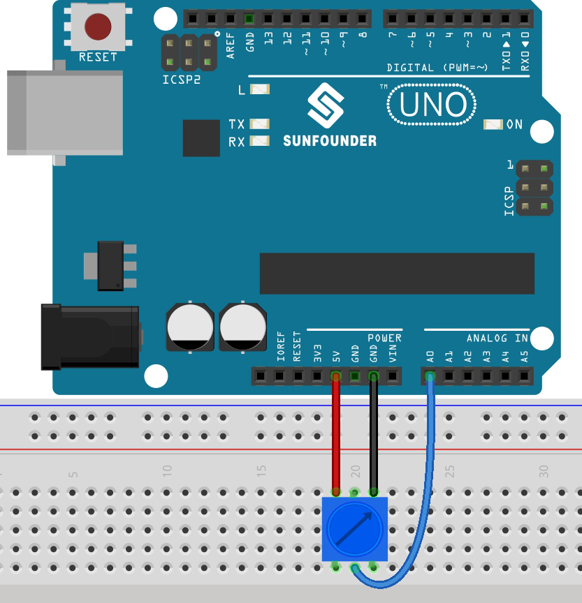

.. note::

    Ciao, benvenuto nella SunFounder Raspberry Pi & Arduino & ESP32 Enthusiasts Community su Facebook! Approfondisci le tue conoscenze su Raspberry Pi, Arduino ed ESP32 insieme ad altri appassionati.

    **Perché unirti?**

    - **Supporto esperto**: Risolvi problemi tecnici e post-vendita con l'aiuto della nostra community e del nostro team.
    - **Impara e condividi**: Scambia consigli e tutorial per migliorare le tue competenze.
    - **Anteprime esclusive**: Ottieni accesso anticipato ai nuovi annunci di prodotti e anteprime.
    - **Sconti speciali**: Approfitta di sconti esclusivi sui nostri prodotti più recenti.
    - **Promozioni festive e omaggi**: Partecipa a promozioni e omaggi durante le festività.

    👉 Sei pronto a esplorare e creare con noi? Clicca su [|link_sf_facebook|] e unisciti oggi!

.. _ar_potentiometer:

4.1 Gira la Manopola
========================

Il potenziometro è un componente resistivo con 3 terminali, il cui valore di 
resistenza può essere regolato in base a una variazione prestabilita.

**Componenti necessari**

In questo progetto ci servono i seguenti componenti.

È sicuramente conveniente acquistare un kit completo, ecco il link:

.. list-table::
    :widths: 20 20 20
    :header-rows: 1

    *   - Nome	
        - ELEMENTI IN QUESTO KIT
        - LINK
    *   - 3 in 1 Starter Kit
        - 380+
        - |link_3IN1_kit|

Puoi anche acquistarli separatamente dai link sottostanti.

.. list-table::
    :widths: 30 20
    :header-rows: 1

    *   - INTRODUZIONE AI COMPONENTI
        - LINK PER L'ACQUISTO

    *   - :ref:`cpn_uno`
        - |link_Uno_R3_buy|
    *   - :ref:`cpn_breadboard`
        - |link_breadboard_buy|
    *   - :ref:`cpn_wires`
        - |link_wires_buy|
    *   - :ref:`cpn_potentiometer`
        - |link_potentiometer_buy|

**Schema**

.. image:: img/circuit_5.1_potentiometer.png

In questo esempio, utilizziamo il pin analogico (A0) per leggere il valore 
del potenziometro. Ruotando l'asse del potenziometro, è possibile modificare 
la distribuzione della resistenza tra questi tre pin, cambiando la tensione 
sul pin centrale. Quando la resistenza tra il pin centrale e uno dei pin esterni 
collegato a 5V è vicina a zero (e la resistenza tra il pin centrale e l'altro 
pin esterno è vicina a 10kΩ), la tensione sul pin centrale è vicina a 5V. 
L'operazione inversa (quando la resistenza tra il pin centrale e uno dei pin 
esterni collegato a 5V è vicina a 10kΩ) farà sì che la tensione sul pin centrale 
sia vicina a 0V.

**Collegamenti**

**Codice**

.. note::

   * Apri il file ``4.1.turn_the_knob.ino`` nel percorso ``3in1-kit\basic_project\4.1.turn_the_knob``.
   * Oppure copia questo codice nell'**Arduino IDE**.
   
   * Oppure carica il codice tramite il `Arduino Web Editor <https://docs.arduino.cc/cloud/web-editor/tutorials/getting-started/getting-started-web-editor>`_.

.. raw:: html

    <iframe src=https://create.arduino.cc/editor/sunfounder01/d931f2c9-74bc-4a53-8531-39a21a07dbaf/preview?embed style="height:510px;width:100%;margin:10px 0" frameborder=0></iframe>
    
Dopo aver caricato il codice sulla scheda, puoi aprire il monitor seriale per 
visualizzare il valore letto dal pin. Ruotando l'asse del potenziometro, il 
monitor seriale stamperà il valore compreso tra 「0」 e 「1023」.
