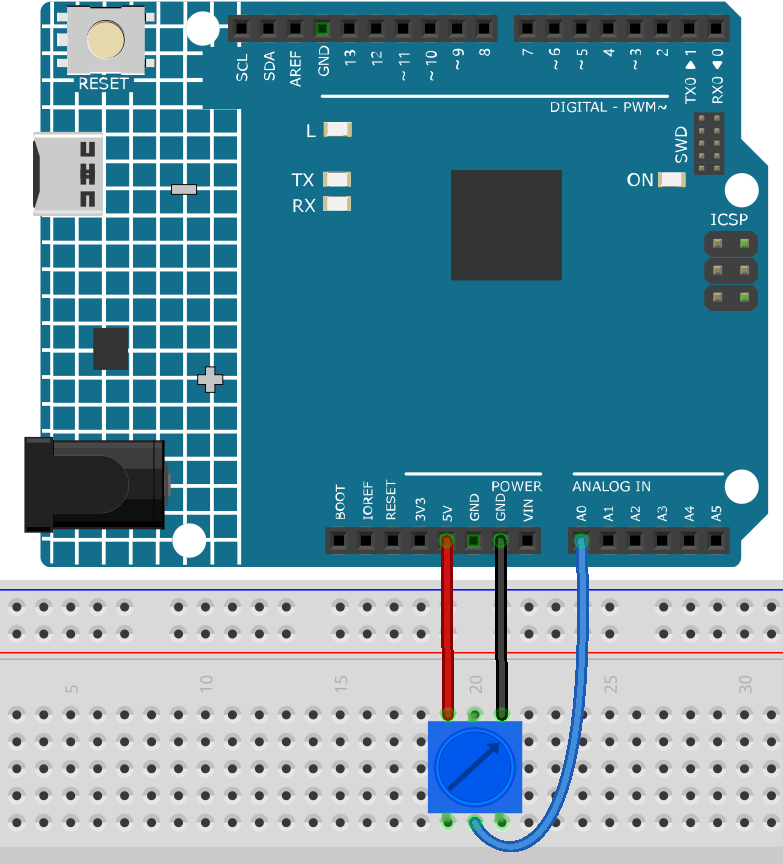

.. _ar_potentiometer:

4.1 Turn the Knob
===================

Potentiometer is a resistor component with 3 terminals and its resistance value can be
adjusted according to some regular variation.

**Schematic**

.. image:: img/circuit_5.1_potentiometer.png

In this example, we use the analog pin (A0) to read the value
of the potentiometer. By rotating the axis of the potentiometer, you can
change the distribution of resistance among these three pins, changing
the voltage on the middle pin. When the resistance between the middle
and a outside pin connected to 5V is close to zero (and the resistance
between the middle and the other outside pin is close to 10kΩ), the
voltage at the middle pin is close to 5V. The reverse operation (the
resistance between the middle and a outside pin connected to 5V is close
to 10kΩ) will make the voltage at the middle pin be close to 0V.

**Wiring**

* :ref:`cpn_uno`
* :ref:`cpn_breadboard`
* :ref:`cpn_wires`
* :ref:`cpn_potentiometer`

**Code**

.. note::

   * You can open the file ``4.1.turn_the_knob.ino`` under the path of ``3in1-kit\learning_project\4.1.turn_the_knob``. 
   * Or copy this code into **Arduino IDE**.
   
   * Or upload the code through the `Arduino Web Editor <https://docs.arduino.cc/cloud/web-editor/tutorials/getting-started/getting-started-web-editor>`_.

.. raw:: html

    <iframe src=https://create.arduino.cc/editor/sunfounder01/d931f2c9-74bc-4a53-8531-39a21a07dbaf/preview?embed style="height:510px;width:100%;margin:10px 0" frameborder=0></iframe>
    
    
After uploading the codes to the board, you can open the serial
monitor to see the reading value of the pin. When rotating the axis of
the potentiometer, the serial monitor will print the value
「0」~「1023」. 