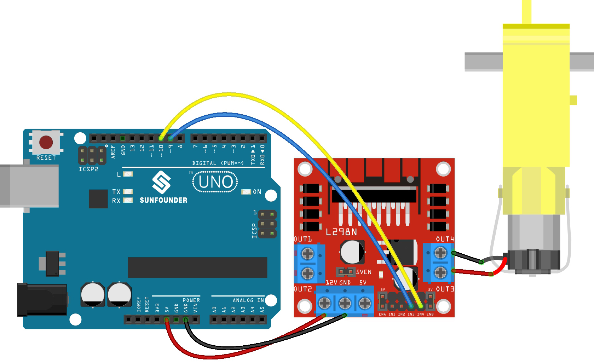

.. _ar_motor:

1.3 車輪を回す
============================

モーターは典型的なデジタル出力デバイスであり、LEDと同様の方法で使用されます。
ただし、モーターは大電流で駆動する必要があり、大電流はR3ボードなどのメイン制御ボードを損傷させる可能性があります。
そのため、この場合にはL298Nモジュールを使用して、R3ボードがモーターを安全に制御するのに役立ちます。

**必要な部品**

このプロジェクトでは、以下の部品が必要です。

全体のキットを購入するのは非常に便利です。リンクはこちら：

.. list-table::
    :widths: 20 20 20
    :header-rows: 1

    *   - 名前
        - このキットのアイテム
        - リンク
    *   - 3 in 1 Starter Kit
        - 380+
        - |link_3IN1_kit|

以下のリンクから別々に購入することもできます。

.. list-table::
    :widths: 30 20
    :header-rows: 1

    *   - コンポーネント紹介
        - 購入リンク

    *   - :ref:`cpn_uno`
        - |link_Uno_R3_buy|
    *   - :ref:`cpn_wires`
        - |link_wires_buy|
    *   - :ref:`cpn_tt_motor`
        - \-
    *   - :ref:`cpn_l298n`
        - |link_l298n_buy|

**回路図**

.. image:: img/circuit_1.3_wheel.png

IN1〜IN4はL298Nモジュールの入力であり、OUT1〜OUT4は出力です。

使い方としては、INxに高レベルを入力すると、OUTxが高レベルを出力します。INxに低レベルを入力すると、OUTxが低レベルを出力します。
モーターの両端をOUT1とOUT2に接続し、IN1とIN2に逆のレベル信号を入力すると、モーターが回転します。OUT3とOUT4も同様の方法で使用できます。

**配線図**

.. list-table:: 
    :widths: 25 25 50
    :header-rows: 1

    * - L298N
      - R3ボード
      - モーター
    * - 12V
      - 5V
      - 
    * - GND
      - GND
      - 
    * - IN3
      - 9
      -
    * - IN4
      - 10
      - 
    * - OUT3
      - 
      - モーターのワイヤー
    * - OUT4
      - 
      - モーターのワイヤー

**コード**

.. note::

   * ファイル ``1.3.turn_the_wheel.ino`` を ``3in1-kit\basic_project\1.3.turn_the_wheel`` のパスで開くことができます。
   * または、このコードを **Arduino IDE** にコピーします。
   
   * あるいは、 `Arduino Web Editor <https://docs.arduino.cc/cloud/web-editor/tutorials/getting-started/getting-started-web-editor>`_ を通じてコードをアップロードします。

.. raw:: html

    <iframe src=https://create.arduino.cc/editor/sunfounder01/5f8e4f33-883b-4c06-9516-f1754ea2121d/preview?embed style="height:510px;width:100%;margin:10px 0" frameborder=0></iframe>
