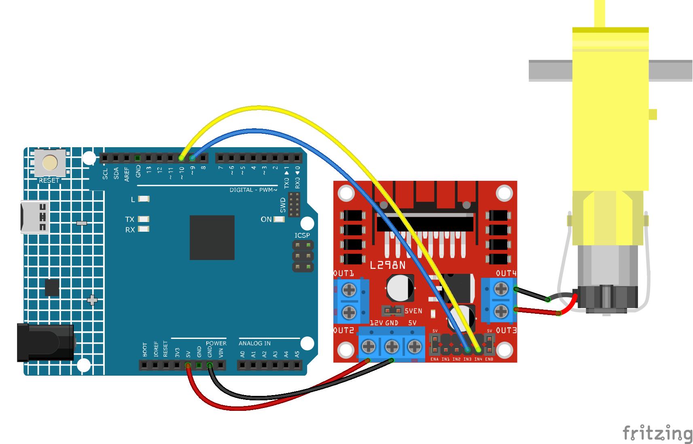

.. _ar_motor:

1.3 Turn the Wheel
============================

A motor is a typical digital output device, and it is used in the same way as an LED.
However, the motor needs to be driven with a large current, and the large current may damage the main control board such as R3 board.
Therefore, an L298N module is used in this occasion, which is a good helper for the R3 board to control the motor safely.

**Schematic**

.. image:: img/circuit_1.3_wheel.png

IN1~IN4 are the inputs of the L298N module, and OUT1~OUT4 are the outputs.

A simple way to use them is: input high level for INx, OUTx will output high level; input low level for INx, OUTx will output low level.
Connecting the two ends of the motor to OUT1 and OUT2, inputting opposite level signals for IN1 and IN2 will make the motor rotate. OUT3 and OUT4 can be used in the same way.

**Wiring**

.. list-table:: 
    :widths: 25 25 50
    :header-rows: 1

    * - L298N
      - R3 Board
      - Motor
    * - 12V
      - 5V
      - 
    * - GND
      - GND
      - 
    * - IN3
      - 9
      -
    * - IN4
      - 10
      - 
    * - OUT3
      - 
      - one wire of the motor
    * - OUT4
      - 
      - one wire of the motor

* :ref:`cpn_uno`
* :ref:`cpn_wires`
* :ref:`cpn_tt_motor`
* :ref:`cpn_l298n`

**Code**

.. note::

   * You can open the file ``1.3.turn_the_wheel.ino`` under the path of ``3in1-kit\learning_project\1.3.turn_the_wheel``. 
   * Or copy this code into **Arduino IDE**.
   
   * Or upload the code through the `Arduino Web Editor <https://docs.arduino.cc/cloud/web-editor/tutorials/getting-started/getting-started-web-editor>`_.

.. raw:: html
    
    <iframe src=https://create.arduino.cc/editor/sunfounder01/5f8e4f33-883b-4c06-9516-f1754ea2121d/preview?embed style="height:510px;width:100%;margin:10px 0" frameborder=0></iframe>
