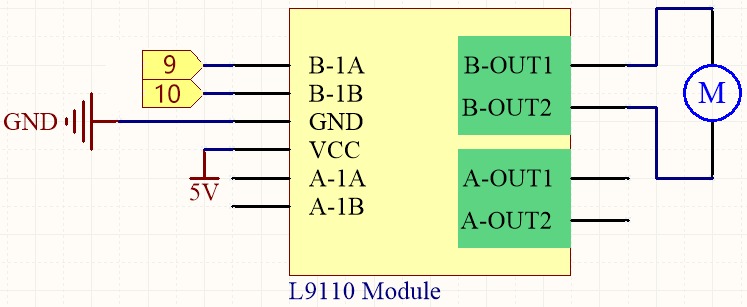
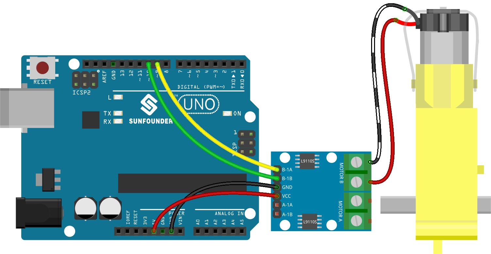

.. note::

    Hallo und willkommen in der SunFounder Raspberry Pi & Arduino & ESP32 Enthusiasten-Gemeinschaft auf Facebook! Tauchen Sie tiefer ein in die Welt von Raspberry Pi, Arduino und ESP32 mit anderen Enthusiasten.

    **Warum beitreten?**

    - **Expertenunterstützung**: Lösen Sie Nachverkaufsprobleme und technische Herausforderungen mit Hilfe unserer Gemeinschaft und unseres Teams.
    - **Lernen & Teilen**: Tauschen Sie Tipps und Anleitungen aus, um Ihre Fähigkeiten zu verbessern.
    - **Exklusive Vorschauen**: Erhalten Sie frühzeitigen Zugang zu neuen Produktankündigungen und exklusiven Einblicken.
    - **Spezialrabatte**: Genießen Sie exklusive Rabatte auf unsere neuesten Produkte.
    - **Festliche Aktionen und Gewinnspiele**: Nehmen Sie an Gewinnspielen und Feiertagsaktionen teil.

    👉 Sind Sie bereit, mit uns zu erkunden und zu erschaffen? Klicken Sie auf [|link_sf_facebook|] und treten Sie heute bei!

.. _ar_motor:

1.3 Das Rad drehen
============================

Ein Motor ist ein typisches digitales Ausgabegerät und wird genauso verwendet wie eine LED.
Allerdings benötigt der Motor einen großen Strom, und der hohe Strom kann das Hauptsteuerungsboard wie z.B. das R3-Board beschädigen.
Deshalb wird in diesem Fall ein L298N-Modul verwendet, welches ein guter Helfer für das R3-Board ist, um den Motor sicher zu steuern.

**Benötigte Komponenten**

Für dieses Projekt benötigen wir die folgenden Komponenten.

Es ist definitiv praktisch, ein komplettes Kit zu kaufen, hier ist der Link:

.. list-table::
    :widths: 20 20 20
    :header-rows: 1

    *   - Name	
        - ARTIKEL IN DIESEM KIT
        - LINK
    *   - 3 in 1 Starter Kit
        - 380+
        - |link_3IN1_kit|

Sie können diese auch einzeln über die untenstehenden Links kaufen.

.. list-table::
    :widths: 30 20
    :header-rows: 1

    *   - KOMPONENTENBESCHREIBUNG
        - KAUF-LINK

    *   - :ref:`cpn_uno`
        - |link_Uno_R3_buy|
    *   - :ref:`cpn_wires`
        - |link_wires_buy|
    *   - :ref:`cpn_tt_motor`
        - \-
    *   - :ref:`cpn_l9110`
        - \-

**Schaltplan**

**Verdrahtung**

**Code**

.. note::

   * Sie können die Datei ``1.3.turn_the_wheel.ino`` unter dem Pfad ``3in1-kit\basic_project\1.3.turn_the_wheel`` öffnen. 
   * Oder kopieren Sie diesen Code in die **Arduino IDE**.
   
   * Oder laden Sie den Code über den `Arduino Web Editor <https://docs.arduino.cc/cloud/web-editor/tutorials/getting-started/getting-started-web-editor>`_ hoch.

.. raw:: html
    
    <iframe src=https://create.arduino.cc/editor/sunfounder01/5f8e4f33-883b-4c06-9516-f1754ea2121d/preview?embed style="height:510px;width:100%;margin:10px 0" frameborder=0></iframe>
