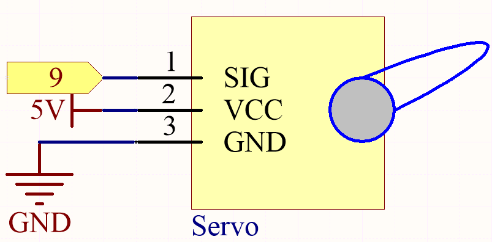
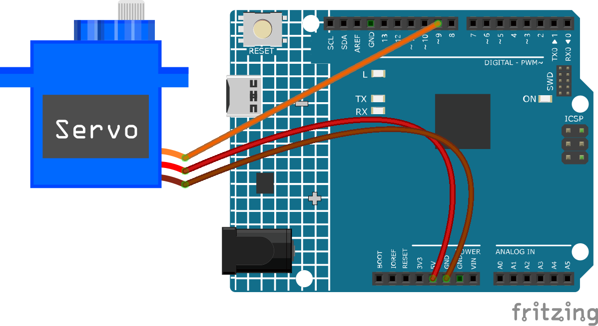

.. note::

    こんにちは、SunFounderのRaspberry Pi & Arduino & ESP32愛好家コミュニティへようこそ！Facebook上でRaspberry Pi、Arduino、ESP32についてもっと深く掘り下げ、他の愛好家と交流しましょう。

    **参加する理由は？**

    - **エキスパートサポート**：コミュニティやチームの助けを借りて、販売後の問題や技術的な課題を解決します。
    - **学び＆共有**：ヒントやチュートリアルを交換してスキルを向上させましょう。
    - **独占的なプレビュー**：新製品の発表や先行プレビューに早期アクセスしましょう。
    - **特別割引**：最新製品の独占割引をお楽しみください。
    - **祭りのプロモーションとギフト**：ギフトや祝日のプロモーションに参加しましょう。

    👉 私たちと一緒に探索し、創造する準備はできていますか？[|link_sf_facebook|]をクリックして今すぐ参加しましょう！

.. _ar_servo:

5.5 内蔵ライブラリの使用
=======================================

Arduino IDEでは、対応する ``.h`` ファイルを直接コードに追加することで、多くの組み込みライブラリを使用することができます。

このプロジェクトでは ``Servo`` ライブラリを使用してサーボを駆動し、0°から180°の間で回転させることができます。

**必要な部品**

このプロジェクトでは、以下の部品が必要です。

全体のキットを購入するのは確かに便利です。こちらがリンクです：

.. list-table::
    :widths: 20 20 20
    :header-rows: 1

    *   - 名前	
        - このキットのアイテム
        - リンク
    *   - 3 in 1 Starter Kit
        - 380+
        - |link_3IN1_kit|

以下のリンクから、個別に購入することもできます。

.. list-table::
    :widths: 30 20
    :header-rows: 1

    *   - コンポーネントの紹介
        - 購入リンク

    *   - :ref:`cpn_uno`
        - \-
    *   - :ref:`cpn_wires`
        - |link_wires_buy|
    *   - :ref:`cpn_servo`
        - |link_servo_buy|

**回路図**

このプロジェクトでは、PWMピン9を使用してサーボを駆動し、サーボのオレンジ色のワイヤをPWMピン9に、赤色のワイヤを5Vに、茶色のワイヤをGNDに接続します。

**配線図**

**コード**

.. note::

    * ``3in1-kit\learning_project\5.5.use_internal_library`` のパス下の ``5.5.use_internal_library.ino`` ファイルを開く。
    * または、このコードを **Arduino IDE** にコピーする。
    
    

.. raw:: html

    <iframe src=https://create.arduino.cc/editor/sunfounder01/fa27db71-b191-4eda-b5c7-bbbe5f2652ca/preview?embed style="height:510px;width:100%;margin:10px 0" frameborder=0></iframe>
    
コードをR4ボードにアップロードすると、サーボアームが0°〜180°の範囲で回転するのを確認できます。

**どのように動作するのか？**

``Servo.h`` ライブラリを呼び出すことで、サーボを簡単に駆動することができます。

.. code-block:: arduino

    #include <Servo.h> 

ライブラリ関数：

.. code-block:: arduino

    Servo

サーボを制御するための **Servo** オブジェクトを作成。

.. code-block:: arduino

    uint8_t attach(int pin); 

``pinMode()`` を呼び出して、ピンをサーボドライバーに変換し、失敗した場合は0を返す。

.. code-block:: arduino

    void detach();

サーボ駆動からピンを解放。

.. code-block:: arduino

    void write(int value); 

サーボの角度を度数で設定、0から180まで。

.. code-block:: arduino

    int read();

最後の ``write()`` で設定された値を返す。

.. code-block:: arduino

    bool attached(); 

サーボが現在アタッチされている場合は1を返す。
