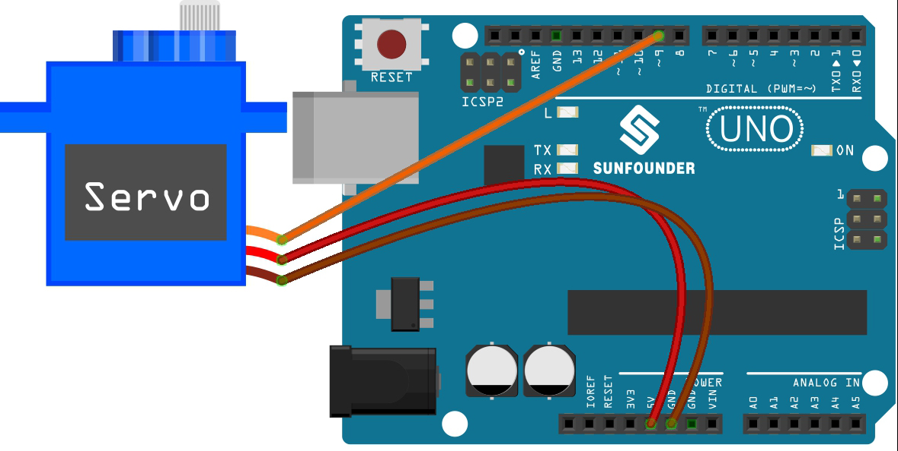

.. note::

    ¡Hola, bienvenido a la Comunidad de Aficionados a Raspberry Pi, Arduino y ESP32 de SunFounder en Facebook! Profundiza en Raspberry Pi, Arduino y ESP32 con otros entusiastas.

    **¿Por qué unirse?**

    - **Soporte de expertos**: Resuelve problemas posventa y desafíos técnicos con ayuda de nuestra comunidad y equipo.
    - **Aprender y compartir**: Intercambia consejos y tutoriales para mejorar tus habilidades.
    - **Vistas previas exclusivas**: Obtén acceso anticipado a anuncios de nuevos productos y avances.
    - **Descuentos especiales**: Disfruta de descuentos exclusivos en nuestros productos más nuevos.
    - **Promociones festivas y sorteos**: Participa en sorteos y promociones de fiestas.

    👉 ¿Listo para explorar y crear con nosotros? Haz clic en [|link_sf_facebook|] y únete hoy!

.. _ar_servo:

5.5 Usar Biblioteca Interna
=============================

En el IDE de Arduino, puedes utilizar muchas bibliotecas integradas añadiendo directamente el archivo ``.h`` correspondiente a tu código.

Este proyecto utiliza la biblioteca ``Servo`` para controlar el Servo, de modo que pueda rotar entre 0° y 180°.

**Componentes Necesarios**

En este proyecto, necesitamos los siguientes componentes.

Es definitivamente conveniente comprar todo un kit, aquí está el enlace:

.. list-table::
    :widths: 20 20 20
    :header-rows: 1

    *   - Nombre	
        - ELEMENTOS DE ESTE KIT
        - ENLACE
    *   - 3 in 1 Starter Kit
        - 380+
        - |link_3IN1_kit|

También puedes comprarlos por separado en los siguientes enlaces.

.. list-table::
    :widths: 30 20
    :header-rows: 1

    *   - INTRODUCCIÓN DEL COMPONENTE
        - ENLACE DE COMPRA

    *   - :ref:`cpn_uno`
        - |link_Uno_R3_buy|
    *   - :ref:`cpn_wires`
        - |link_wires_buy|
    *   - :ref:`cpn_servo`
        - |link_servo_buy|

**Esquemático**

.. image:: img/circuit_6.2_servo.png

En este proyecto, usamos el pin PWM 9 para controlar el Servo, y conectamos el cable naranja del servo al pin PWM 9, el rojo a 5V y el marrón a GND.

**Cableado**

**Código**

.. note::

    * Abre el archivo ``5.5.use_internal_library.ino`` en la ruta ``3in1-kit\basic_project\5.5.use_internal_library``.
    * O copia este código en el **Arduino IDE**.
    
    * O sube el código a través del `Arduino Web Editor <https://docs.arduino.cc/cloud/web-editor/tutorials/getting-started/getting-started-web-editor>`_.

.. raw:: html

    <iframe src=https://create.arduino.cc/editor/sunfounder01/fa27db71-b191-4eda-b5c7-bbbe5f2652ca/preview?embed style="height:510px;width:100%;margin:10px 0" frameborder=0></iframe>
    
Una vez que termines de subir los códigos a la placa R3, puedes ver el brazo del servo rotando en el rango de 0°~180°.

**¿Cómo funciona?**

Al llamar a la biblioteca ``Servo.h``, puedes controlar el servo fácilmente.

.. code-block:: arduino

    #include <Servo.h> 

Funciones de la Biblioteca:

.. code-block:: arduino

    Servo

Crear objeto **Servo** para controlar un servo.

.. code-block:: arduino

    uint8_t attach(int pin); 

Llamar a ``pinMode()`` para convertir un pin en un controlador de servo y devolver 0 en caso de fallo.

.. code-block:: arduino

    void detach();

Liberar un pin del control del servo.

.. code-block:: arduino

    void write(int value); 

Establecer el ángulo del servo en grados, de 0 a 180.

.. code-block:: arduino

    int read();

Devolver el valor establecido con el último ``write()``.

.. code-block:: arduino

    bool attached(); 

Devolver 1 si el servo está actualmente conectado.
