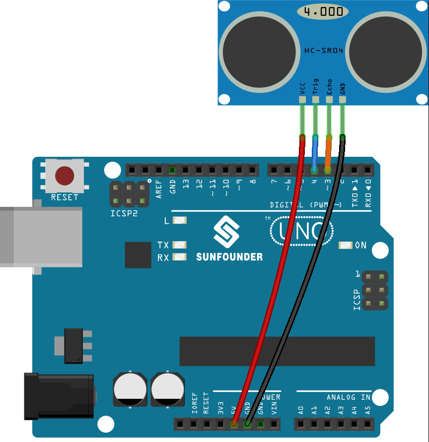

.. _ar_ultrasonic:

5.8 Función Definida por el Usuario
======================================

En C, podemos dividir un programa grande en los bloques básicos de construcción conocidos como función. 
La función contiene un conjunto de declaraciones de programación encerradas por {}. 
Una función se puede llamar varias veces para proporcionar reusabilidad y modularidad al programa C. 
En otras palabras, podemos decir que la colección de funciones crea un programa. 
La función también se conoce como procedimiento o subrutina en otros lenguajes de programación.

Hay las siguientes ventajas de las funciones.

* Mediante el uso de funciones, podemos evitar reescribir la misma lógica/código una y otra vez en un programa.
* Podemos llamar a funciones C cualquier número de veces en un programa y desde cualquier lugar en un programa.
* Podemos rastrear fácilmente un gran programa C cuando se divide en múltiples funciones.
* La reusabilidad es el principal logro de las funciones C.
* Sin embargo, la llamada a funciones siempre es una sobrecarga en un programa C.

Hay dos tipos de funciones en la programación C:

* **Funciones de Biblioteca**: las funciones que se declaran en los archivos de encabezado de C.
* **Funciones Definidas por el Usuario**: las funciones que crea el programador de C, para que él/ella pueda usarlas muchas veces. Reduce la complejidad de un programa grande y optimiza el código.

En este proyecto, define una función para leer el valor del módulo ultrasónico.

**Componentes Necesarios**

En este proyecto, necesitamos los siguientes componentes.

Es definitivamente conveniente comprar todo un kit, aquí está el enlace:

.. list-table::
    :widths: 20 20 20
    :header-rows: 1

    *   - Nombre	
        - ELEMENTOS DE ESTE KIT
        - ENLACE
    *   - 3 in 1 Starter Kit
        - 380+
        - |link_3IN1_kit|

También puedes comprarlos por separado en los siguientes enlaces.

.. list-table::
    :widths: 30 20
    :header-rows: 1

    *   - INTRODUCCIÓN DEL COMPONENTE
        - ENLACE DE COMPRA

    *   - :ref:`cpn_uno`
        - |link_Uno_R3_buy|
    *   - :ref:`cpn_wires`
        - |link_wires_buy|
    *   - :ref:`cpn_ultrasonic`
        - |link_ultrasonic_buy|

**Esquemático**

.. image:: img/circuit_6.3_ultrasonic.png

**Cableado**

**Código**

.. note::

    * Abre el archivo ``5.8.user_function.ino`` bajo el camino de ``3in1-kit\basic_project\5.8.user_function``.
    * O copia este código en **Arduino IDE**.
    
    * O sube el código a través del `Editor Web de Arduino <https://docs.arduino.cc/cloud/web-editor/tutorials/getting-started/getting-started-web-editor>`_.

.. raw:: html
    
    <iframe src=https://create.arduino.cc/editor/sunfounder01/11717782-3ee6-4eca-bbb9-094385d9eb4b/preview?embed style="height:510px;width:100%;margin:10px 0" frameborder=0></iframe>
    

Después de que el código se haya subido con éxito, el monitor serie mostrará la distancia entre el sensor ultrasónico y el obstáculo adelante.

**¿Cómo funciona?**

Acerca de la aplicación del sensor ultrasónico, podemos revisar directamente la subfunción.

.. code-block:: arduino

    float readSensorData(){// ...}

El ``trigPin`` del módulo ultrasónico transmite una señal de onda cuadrada de 10us cada 2us.

.. code-block:: arduino

    digitalWrite(trigPin, LOW); 
    delayMicroseconds(2);
    digitalWrite(trigPin, HIGH); 
    delayMicroseconds(10);
    digitalWrite(trigPin, LOW); 

El ``echoPin`` recibe una señal de nivel alto si hay un obstáculo dentro del alcance y utiliza la función ``pulseIn()`` para registrar el tiempo desde el envío hasta la recepción.

.. code-block:: arduino

    microsecond=pulseIn(echoPin, HIGH);

La velocidad del sonido es de 340 m/s o 29 microsegundos por centímetro.

Esto da la distancia recorrida por la onda cuadrada, ida y vuelta, por lo que
dividimos por 2 para obtener la distancia del obstáculo.

.. code-block:: arduino

    float distance = microsecond / 29.00 / 2; 

Toma en cuenta que el sensor ultrasónico pausará el programa cuando esté funcionando, lo que puede causar cierto retraso al escribir proyectos complejos.
