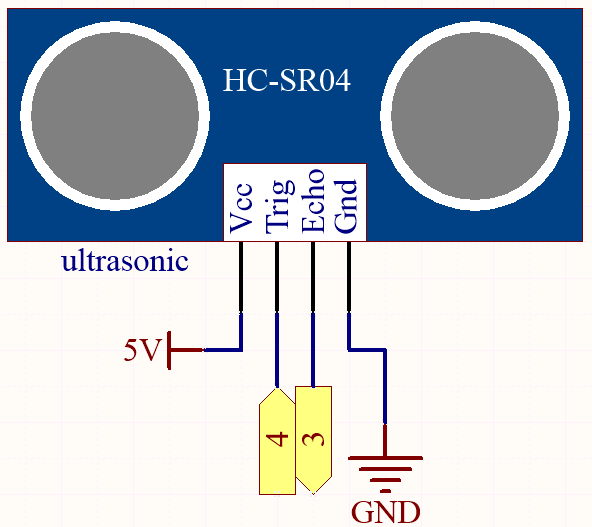
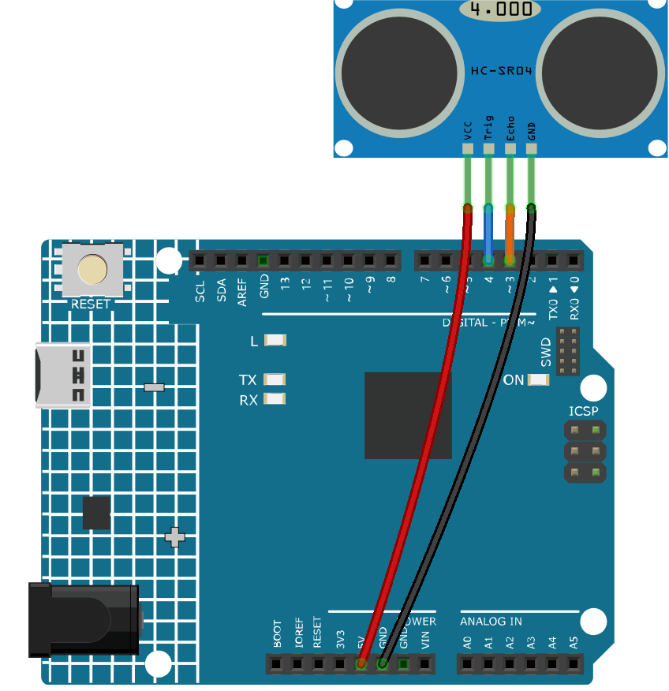

.. note::

    Bonjour, bienvenue dans la communauté SunFounder Raspberry Pi & Arduino & ESP32 Enthusiasts sur Facebook ! Explorez en profondeur Raspberry Pi, Arduino et ESP32 avec d'autres passionnés.

    **Pourquoi nous rejoindre ?**

    - **Assistance d'experts** : Résolvez les problèmes après-vente et les défis techniques grâce à l'aide de notre communauté et de notre équipe.
    - **Apprendre et partager** : Échangez des astuces et des tutoriels pour améliorer vos compétences.
    - **Aperçus exclusifs** : Accédez en avant-première aux annonces de nouveaux produits.
    - **Réductions spéciales** : Profitez de remises exclusives sur nos derniers produits.
    - **Promotions et concours festifs** : Participez à des concours et des promotions spéciales.

    👉 Prêt à explorer et créer avec nous ? Cliquez sur [|link_sf_facebook|] et rejoignez-nous dès aujourd'hui !

.. _ar_ultrasonic:

5.8 Fonction définie par l'utilisateur
==========================================

En langage C, nous pouvons diviser un programme volumineux en blocs de construction de base appelés fonctions. 
Une fonction contient un ensemble d'instructions de programmation délimitées par des accolades {}. 
Une fonction peut être appelée plusieurs fois, offrant ainsi réutilisabilité et modularité au programme C. 
En d'autres termes, on peut dire qu'un programme est une collection de fonctions. 
Une fonction est également connue sous le nom de procédure ou de sous-routine dans d'autres langages de programmation.

Voici les avantages des fonctions :

* Grâce aux fonctions, nous évitons de réécrire la même logique ou le même code à plusieurs reprises dans un programme.
* Nous pouvons appeler des fonctions C autant de fois que nécessaire et à n'importe quel endroit d'un programme.
* Diviser un programme volumineux en plusieurs fonctions facilite sa gestion.
* La réutilisabilité est un des principaux atouts des fonctions en C.
* Cependant, l'appel de fonctions engendre une surcharge dans un programme C.

Il existe deux types de fonctions en programmation C :

* **Fonctions de bibliothèque** : fonctions déclarées dans les fichiers d'en-tête C.
* **Fonctions définies par l'utilisateur** : fonctions créées par le programmeur C pour une utilisation fréquente. Cela réduit la complexité d'un programme volumineux et optimise le code.

Dans ce projet, nous définissons une fonction pour lire la valeur du module ultrasonique.

**Composants requis**

Pour ce projet, nous avons besoin des composants suivants :

Il est très pratique d’acheter un kit complet. Voici le lien :

.. list-table::
    :widths: 20 20 20
    :header-rows: 1

    *   - Nom
        - ÉLÉMENTS DANS CE KIT
        - LIEN
    *   - Kit de démarrage 3 en 1
        - 380+
        - |link_3IN1_kit|

Vous pouvez également les acheter séparément via les liens ci-dessous.

.. list-table::
    :widths: 30 20
    :header-rows: 1

    *   - INTRODUCTION AUX COMPOSANTS
        - LIEN D'ACHAT
    *   - :ref:`cpn_uno`
        - \-
    *   - :ref:`cpn_wires`
        - |link_wires_buy|
    *   - :ref:`cpn_ultrasonic`
        - |link_ultrasonic_buy|

**Schéma**

**Câblage**

**Code**

.. note::

    * Ouvrez le fichier ``5.8.user_function.ino`` dans le chemin ``3in1-kit\learning_project\5.8.user_function``.
    * Ou copiez ce code dans **Arduino IDE**.

.. raw:: html

    <iframe src=https://create.arduino.cc/editor/sunfounder01/11717782-3ee6-4eca-bbb9-094385d9eb4b/preview?embed style="height:510px;width:100%;margin:10px 0" frameborder=0></iframe>

Une fois le code téléchargé avec succès, le moniteur série affichera la distance entre le capteur ultrasonique et l'obstacle devant.

**Comment ça fonctionne ?**

Concernant l'application du capteur ultrasonique, nous pouvons directement vérifier la sous-fonction.

.. code-block:: arduino

    float readSensorData(){// ...}

Le ``trigPin`` du module ultrasonique transmet un signal d'onde carrée de 10 us toutes les 2 us.

.. code-block:: arduino

    digitalWrite(trigPin, LOW); 
    delayMicroseconds(2);
    digitalWrite(trigPin, HIGH); 
    delayMicroseconds(10);
    digitalWrite(trigPin, LOW); 

Le ``echoPin`` reçoit un signal de niveau haut si un obstacle est détecté dans la portée, et utilise la fonction ``pulseIn()`` pour enregistrer le temps entre l'émission et la réception.

.. code-block:: arduino

    microsecond=pulseIn(echoPin, HIGH);

La vitesse du son est de 340 m/s ou 29 microsecondes par centimètre.

Cela donne la distance parcourue par l'onde carrée (aller-retour), il faut 
donc diviser par 2 pour obtenir la distance de l'obstacle.

.. code-block:: arduino

    float distance = microsecond / 29.00 / 2;

Notez que le capteur ultrasonique met le programme en pause lorsqu'il fonctionne, ce qui peut entraîner des retards dans les projets complexes.
