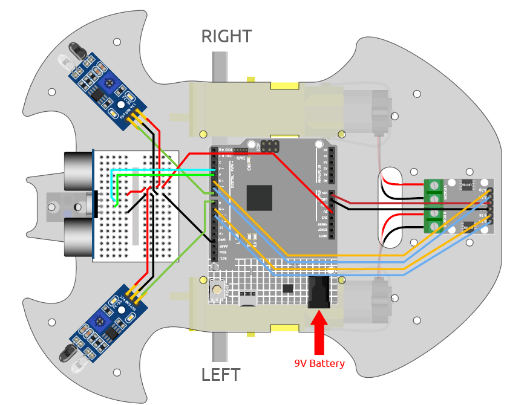

.. _follow_your_hand:

7. Folge Deiner Hand
=========================

Betrachten Sie dieses Auto als Ihr Haustier hier. Wenn Sie ihm zuwinken, kommt es zu Ihnen gelaufen.

**Benötigte Komponenten**

Für dieses Projekt benötigen wir die folgenden Komponenten.

Es ist definitiv praktisch, ein komplettes Set zu kaufen, hier ist der Link:

.. list-table::
    :widths: 20 20 20
    :header-rows: 1

    *   - Name	
        - ARTIKEL IM SET
        - LINK
    *   - 3-in-1 Starter Kit
        - 380+
        - |link_3IN1_kit|

Sie können diese auch einzeln über die untenstehenden Links kaufen.

.. list-table::
    :widths: 30 20
    :header-rows: 1

    *   - KOMPONENTENBESCHREIBUNG
        - KAUF-LINK

    *   - :ref:`cpn_uno`
        - |link_Uno_R3_buy|
    *   - :ref:`cpn_l9110`
        - \-
    *   - :ref:`cpn_tt_motor`
        - \-
    *   - :ref:`cpn_ultrasonic`
        - |link_ultrasonic_buy|
    *   - :ref:`cpn_avoid`
        - |link_obstacle_avoidance_buy|

**Verkabelung**

Schließen Sie das Ultraschallmodul und die beiden IR-Hinderniserkennungs-Module gleichzeitig an.

Verbinden Sie das Ultraschallmodul wie folgt mit dem R3-Board.

.. list-table:: 
    :header-rows: 1

    * - Ultraschallmodul
      - R3 Board
    * - Vcc
      - 5V
    * - Trig
      - 3
    * - Echo
      - 4
    * - Gnd
      - GND

Die Verkabelung der beiden IR-Hinderniserkennungs-Module zum R3-Board ist wie folgt:

.. list-table:: 
    :header-rows: 1

    * - Linkes IR-Modul
      - R3 Board
    * - OUT
      - 8
    * - GND
      - GND
    * - VCC
      - 5V

.. list-table:: 
    :header-rows: 1

    * - Rechtes IR-Modul
      - R3 Board
    * - OUT
      - 7
    * - GND
      - GND
    * - VCC
      - 5V

**Code**

.. note::

    * Öffnen Sie die Datei ``7.follow_your_hand.ino`` im Pfad ``3in1-kit\car_project\7.follow_your_hand``.
    * Oder kopieren Sie diesen Code in die **Arduino IDE**.
    
    * Oder laden Sie den Code über den `Arduino Web Editor <https://docs.arduino.cc/cloud/web-editor/tutorials/getting-started/getting-started-web-editor>`_ hoch.

.. raw:: html
    
    <iframe src=https://create.arduino.cc/editor/sunfounder01/584e42c8-8842-4db0-93b5-f6f949b6ffca/preview?embed style="height:510px;width:100%;margin:10px 0" frameborder=0></iframe>

Stellen Sie das Auto auf den Boden, nachdem der Code erfolgreich hochgeladen wurde. Halten Sie Ihre Hand in einem Abstand von 5*10cm vor das Auto, und es wird Ihrer Hand folgen. Wenn Sie Ihre Hand nah an das IR-Hindernismodul auf beiden Seiten halten, wird es auch in die entsprechende Richtung drehen.

**Wie funktioniert es?**

Dieses Projekt ist eine Kombination aus den vorherigen zwei Projekten :ref:`car_ultrasonic` und :ref:`car_ir_obstacle`, jedoch mit einem anderen implementierten Effekt. Bei den vorherigen 2 Projekten wurde ein Hindernis rückwärts erkannt, während hier erkannt wird, dass Ihre Hand der Vorwärts- oder Drehrichtung folgt.
Der Ablauf dieses Projekts ist wie folgt:

* Lesen Sie die vom Ultraschallmodul erfasste Entfernung und den Wert beider Infrarotmodule.
* Wenn die Entfernung 5~10cm beträgt, lassen Sie das Auto mit Ihrer Hand fahren.
* Wenn das linke IR-Modul Ihre Hand erkennt, nach links abbiegen.
* Wenn das rechte IR-Modul Ihre Hand erkennt, nach rechts abbiegen.
* Wenn weder das Infrarotmodul noch das Ultraschallmodul Ihre Hand erkennen, lassen Sie das Auto anhalten.

.. code-block:: arduino

    void loop() {

        float distance = readSensorData();

        int left = digitalRead(leftIR);    // 0: Obstructed  1: Empty
        int right = digitalRead(rightIR);
        int speed = 150;

        if (distance>5 && distance<10){
            moveForward(speed);
        }
        if(!left&&right){
            turnLeft(speed);
        }else if(left&&!right){
            turnRight(speed);
        }else{
            stopMove();
        }
    }

