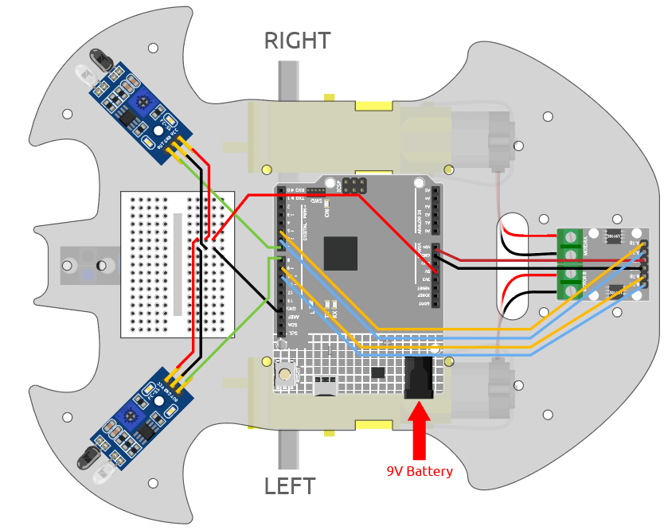
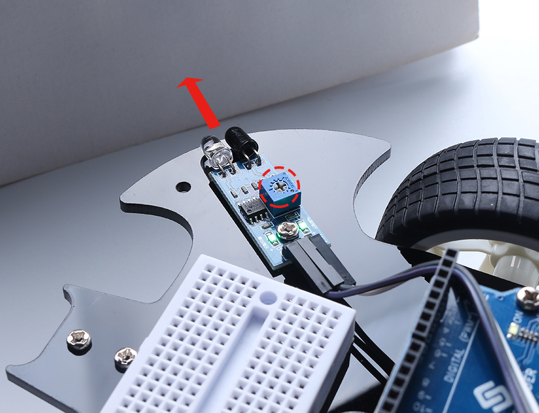

.. note::

    Hello, welcome to the SunFounder Raspberry Pi & Arduino & ESP32 Enthusiasts Community on Facebook! Dive deeper into Raspberry Pi, Arduino, and ESP32 with fellow enthusiasts.

    **Why Join?**

    - **Expert Support**: Solve post-sale issues and technical challenges with help from our community and team.
    - **Learn & Share**: Exchange tips and tutorials to enhance your skills.
    - **Exclusive Previews**: Get early access to new product announcements and sneak peeks.
    - **Special Discounts**: Enjoy exclusive discounts on our newest products.
    - **Festive Promotions and Giveaways**: Take part in giveaways and holiday promotions.

    👉 Ready to explore and create with us? Click [|link_sf_facebook|] and join today!

.. _car_ir_obstacle:

5. Play with Obstacle Avoidance Module
===============================================

Two infrared obstacle avoidance modules are mounted on the front of the car, which can be used to detect some close obstacles.

In this project, the car is allowed to move forward freely, and when it encounters an obstacle it is able to avoid it and continue to move in other directions.

**Required Components**

In this project, we need the following components. 

It's definitely convenient to buy a whole kit, here's the link: 

.. list-table::
    :widths: 20 20 20
    :header-rows: 1

    *   - Name	
        - ITEMS IN THIS KIT
        - LINK
    *   - 3 in 1 Starter Kit
        - 380+
        - |link_3IN1_kit|

You can also buy them separately from the links below.

.. list-table::
    :widths: 30 20
    :header-rows: 1

    *   - COMPONENT INTRODUCTION
        - PURCHASE LINK

    *   - :ref:`cpn_uno`
        - |link_Uno_R3_buy|
    *   - :ref:`cpn_l9110`
        - \-
    *   - :ref:`cpn_tt_motor`
        - \-
    *   - :ref:`cpn_avoid` 
        - |link_obstacle_avoidance_buy|

**Wiring**

The obstacle avoidance module is a distance-adjustable infrared proximity sensor whose output is normally high and low when an obstacle is detected.

.. raw:: html

    <iframe width="600" height="400" src="https://www.youtube.com/embed/vadNtXwITFc?si=gY4Ww31zmcs8AObP" title="YouTube video player" frameborder="0" allow="accelerometer; autoplay; clipboard-write; encrypted-media; gyroscope; picture-in-picture; web-share" allowfullscreen></iframe>

Now build the circuit according to the diagram below.

.. list-table:: 
    :header-rows: 1

    * - Left IR Module
      - R3 Board
    * - OUT
      - 8
    * - GND
      - GND
    * - VCC
      - 5V

.. list-table:: 
    :header-rows: 1

    * - Right IR Module
      - R3 Board
    * - OUT
      - 7
    * - GND
      - GND
    * - VCC
      - 5V

**Adjust the Module**

.. raw:: html

    <video width="600" loop autoplay muted>
        <source src="_static/video/calibrate_ir.mp4" type="video/mp4">
        Ihr Browser unterstützt das Video-Tag nicht.
    </video>
    
Before starting the project, you need to adjust the detection distance of the module.

Wiring according to the above diagram, power up the R3 board (either by plugging in the USB cable directly or by snapping the 9V battery cable), without uploading the code.

Place a notebook or any other flat object about 5cm in front of the IR obstacle avoidance.

Then use a screwdriver to rotate the potentiometer on the module until the signal indicator on the module just lights up, so as to adjust its maximum detection distance of 5cm.

Follow the same method to adjust another infrared module.

**Code**

.. note::

    * Open the ``5.obstacle_avoidance_module.ino`` file under the path of ``3in1-kit\car_project\5.obstacle_avoidance_module``.
    * Or copy this code into **Arduino IDE**.
    
    * Or upload the code through the `Arduino Web Editor <https://docs.arduino.cc/cloud/web-editor/tutorials/getting-started/getting-started-web-editor>`_.

.. raw:: html
    
    <iframe src=https://create.arduino.cc/editor/sunfounder01/289ca80d-009f-4f60-b36d-1da6c5e10233/preview?embed style="height:510px;width:100%;margin:10px 0" frameborder=0></iframe>

The car will move forward once the code has been successfully uploaded. When the left infrared module detects an obstacle, it will go backwards to the left; when the right infrared module detects an obstacle, it will go backwards to the right; if both sides detect an obstacle, it will go backwards squarely.

**How it works?**

This project is based on the value of the left and right infrared obstacle avoidance modules to make the car make the appropriate action.

#. Add the pin definition for the 2 obstacle avoidance modules, here they are set to ``INPUT``.

    .. code-block:: arduino

        ...
        const int rightIR = 7;
        const int leftIR = 8;

        void setup() {
        ...

        //IR obstacle
            pinMode(leftIR, INPUT);
            pinMode(rightIR, INPUT);
        }

#. Read the values of the left and right infrared modules and let the car to make the corresponding action.

    .. code-block:: arduino

        void loop() {

            int left = digitalRead(leftIR);   // 0: Obstructed  1: Empty
            int right = digitalRead(rightIR);
            int speed = 150;

            if (!left && right) {
                backLeft(speed);
            } else if (left && !right) {
                backRight(speed);
            } else if (!left && !right) {
                moveBackward(speed);
            } else {
                moveForward(speed);
            }
        }

    * If the left IR module is 0 (obstacle detected) and the right IR module is 1, let the car back up to the left.
    * If the right IR module is 0 (obstacle detected), let the car go back up to the right.
    * If 2 IR modules detect the obstacle at the same time, the car will go backward.
    * Otherwise the car will keep going forward.

#. About the ``backLeft()`` function.

    When the right motor is turning counterclockwise and the left motor is not turning, the car will go backward to the left. 

    .. code-block:: arduino

        void backLeft(int speed) {
            analogWrite(A_1B, speed);
            analogWrite(A_1A, 0);
            analogWrite(B_1B, 0);
            analogWrite(B_1A, 0);
        }

#. About the ``backLeft()`` function.

    When the left motor is turning clockwise and the right motor is not turning, the car will go backward to the right.

    .. code-block:: arduino

        void backRight(int speed) {
            analogWrite(A_1B, 0);
            analogWrite(A_1A, 0);
            analogWrite(B_1B, 0);
            analogWrite(B_1A, speed);
        }

* `&& <https://www.arduino.cc/reference/en/language/structure/boolean-operators/logicaland/>`_: Logical AND results in true only if both operands are true.

* `! <https://www.arduino.cc/reference/en/language/structure/boolean-operators/logicalnot/>`_: Logical NOT results in a true if the operand is false and vice versa.
