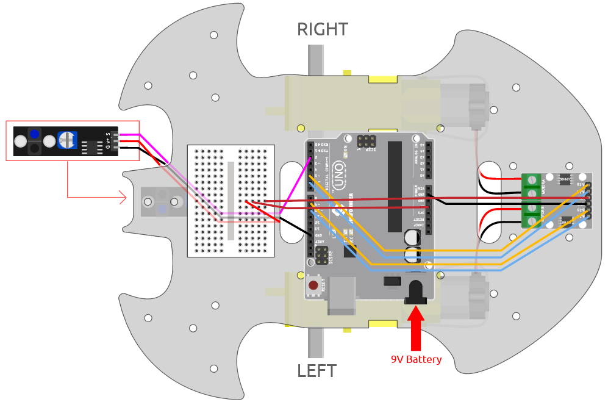

.. note:: 

    Bonjour, bienvenue dans la communauté SunFounder Raspberry Pi, Arduino et ESP32 sur Facebook ! Plongez dans l'univers de Raspberry Pi, Arduino et ESP32 avec d'autres passionnés.

    **Pourquoi nous rejoindre ?**

    - **Support d'experts** : Résolvez les problèmes après-vente et les défis techniques avec l'aide de notre communauté et de notre équipe.
    - **Apprendre et partager** : Échangez des conseils et des tutoriels pour améliorer vos compétences.
    - **Aperçus exclusifs** : Accédez en avant-première aux annonces de nouveaux produits et aux aperçus.
    - **Réductions spéciales** : Profitez de réductions exclusives sur nos derniers produits.
    - **Promotions festives et cadeaux** : Participez à des concours et des promotions spéciales.

    👉 Prêt à explorer et créer avec nous ? Cliquez sur [|link_sf_facebook|] et rejoignez-nous dès aujourd'hui !

.. _follow_the_line:

4. Suivez la ligne
======================

La voiture est équipée d'un module de suivi de ligne, qui peut être utilisé pour suivre une ligne noire.

Lorsque le module de suivi de ligne détecte la ligne noire, le moteur droit tourne tandis que le moteur gauche reste immobile, ce qui fait avancer la voiture légèrement vers la gauche. 
Au fur et à mesure que la voiture avance, le module de ligne sera déplacé hors de la ligne, puis le moteur gauche tournera tandis que le moteur droit restera immobile, permettant à la voiture de revenir sur la ligne. 
En répétant ces étapes, la voiture peut avancer le long de la ligne noire.

Avant de commencer le projet, vous devez créer une carte courbe avec du ruban adhésif noir. La largeur de la ligne recommandée est comprise entre 0,8 et 1,5 cm, et l'angle du virage ne doit pas être inférieur à 90 degrés.

**Composants Requis**

Dans ce projet, nous avons besoin des composants suivants :

Il est certainement pratique d'acheter un kit complet, voici le lien :

.. list-table::
    :widths: 20 20 20
    :header-rows: 1

    *   - Nom	
        - ARTICLES DANS CE KIT
        - LIEN
    *   - Kit de démarrage 3 en 1
        - 380+
        - |link_3IN1_kit|

Vous pouvez également les acheter séparément via les liens ci-dessous.

.. list-table::
    :widths: 30 20
    :header-rows: 1

    *   - INTRODUCTION DU COMPOSANT
        - LIEN D'ACHAT

    *   - :ref:`cpn_uno`
        - |link_Uno_R3_buy|
    *   - :ref:`cpn_l9110`
        - \-
    *   - :ref:`cpn_tt_motor`
        - \-
    *   - :ref:`cpn_track`
        - |link_track_buy|

**Câblage**

Il s'agit d'un module de suivi de ligne numérique, lorsqu'une ligne noire est détectée, il émet une valeur de 1 ; lorsqu'une ligne blanche est détectée, il émet une valeur de 0. De plus, vous pouvez ajuster sa distance de détection via le potentiomètre sur le module.

Construisez le circuit selon le schéma suivant.

.. list-table:: 
    :header-rows: 1

    * - Line Tracking Module
      - R4 Board
    * - S
      - 2
    * - V+
      - 5V
    * - G
      - GND

**Ajustez le Module**

Avant de commencer le projet, vous devez ajuster la sensibilité du module.

Câblez selon le schéma ci-dessus, puis alimentez la carte R4 (soit directement avec le câble USB, soit avec le câble de batterie 9V), sans téléverser le code.

Collez un ruban électrique noir sur la table et placez la voiture dessus.

Observez la LED de signal sur le module pour vous assurer qu'elle s'allume sur la table blanche et s'éteint sur le ruban noir.

Sinon, vous devez ajuster le potentiomètre sur le module pour obtenir cet effet.

.. image:: img/line_track_cali.JPG

**Code**

.. note::

    * Ouvrez le fichier ``4.follow_the_line.ino`` sous le chemin ``3in1-kit\car_project\4.follow_the_line``.
    * Ou copiez ce code dans **Arduino IDE**.
    
    * Ou téléversez le code via l'`Éditeur Web Arduino <https://docs.arduino.cc/cloud/web-editor/tutorials/getting-started/getting-started-web-editor>`_.

.. raw:: html
    
    <iframe src=https://create.arduino.cc/editor/sunfounder01/2779e9eb-b7b0-4d47-b8c0-78fed39828c3/preview?embed style="height:510px;width:100%;margin:10px 0" frameborder=0></iframe>
    
Une fois le code téléversé sur la carte R4, alignez le module de suivi de ligne sous la voiture avec la ligne noire, et vous verrez la voiture suivre la ligne.

**Comment ça marche ?**

Dans ce code, les deux moteurs effectuent de petites rotations gauche-droite selon la valeur du module de suivi de ligne, permettant à la voiture de suivre la ligne noire.

#. Ajoutez la définition des broches pour le module de suivi de ligne, ici il est défini comme ``INPUT``. Initialisez également le moniteur série et définissez le débit en bauds à 9600 bps.

    .. code-block:: arduino

        ...
        const int lineTrack = 2;
        Serial.begin(9600);
        void setup() {
            ...
            pinMode(lineTrack, INPUT);
        }

#. Lisez la valeur du module de suivi de ligne, si elle est égale à 1, faites avancer la voiture vers la gauche ; sinon, avancez vers la droite. Vous pouvez également ouvrir le moniteur série en cliquant sur l'icône de loupe dans le coin supérieur droit pour voir la variation de la valeur du module de suivi de ligne sur les lignes noire et blanche avant de débrancher le câble USB.

    .. code-block:: arduino
    
        void loop() {

            int speed = 150;

            int lineColor = digitalRead(lineTrack); // 0: blanc    1: noir
            Serial.println(lineColor); 
            if (lineColor) {
                moveLeft(speed);
            } else {
                moveRight(speed);
            }
        }

#. À propos des fonctions ``moveLeft()`` et ``moveRight()``.

    Contrairement à la fonction de virage gauche-droite dans le projet :ref:`car_move_code`, seuls de petits virages gauche-droite sont nécessaires ici, il suffit donc d'ajuster la valeur de ``A_1A`` ou ``B_1B`` à chaque fois. Par exemple, si vous déplacez la voiture vers l'avant à gauche (``moveLeft()``), vous devez uniquement définir la vitesse pour ``A_1A`` et mettre toutes les autres à 0, ce qui fera tourner le moteur droit dans le sens horaire tandis que le moteur gauche ne bougera pas.

    .. code-block:: arduino
        

        void moveLeft(int speed) {
            analogWrite(A_1B, 0);
            analogWrite(A_1A, speed);
            analogWrite(B_1B, 0);
            analogWrite(B_1A, 0);
        }

        void moveRight(int speed) {
            analogWrite(A_1B, 0);
            analogWrite(A_1A, 0);
            analogWrite(B_1B, speed);
            analogWrite(B_1A, 0);
        }

* `Serial <https://www.arduino.cc/reference/en/language/functions/communication/serial/>`_

    Utilisé pour la communication entre la carte Arduino et un ordinateur ou d'autres appareils.

    * ``Serial.begin()`` : Définit la vitesse de transmission des données en bits par seconde (baud) pour la transmission de données série.
    * ``Serial.println()`` : Imprime des données sur le port série sous forme de texte ASCII lisible suivi d'un caractère de retour chariot (ASCII 13, ou '\r') et d'un caractère de nouvelle ligne (ASCII 10, ou '\n'). 

* `if else <https://www.arduino.cc/reference/en/language/structure/control-structure/else/>`_

    La structure ``if else`` permet un contrôle plus précis du flux de code qu'une simple instruction if, en permettant de regrouper plusieurs tests.
