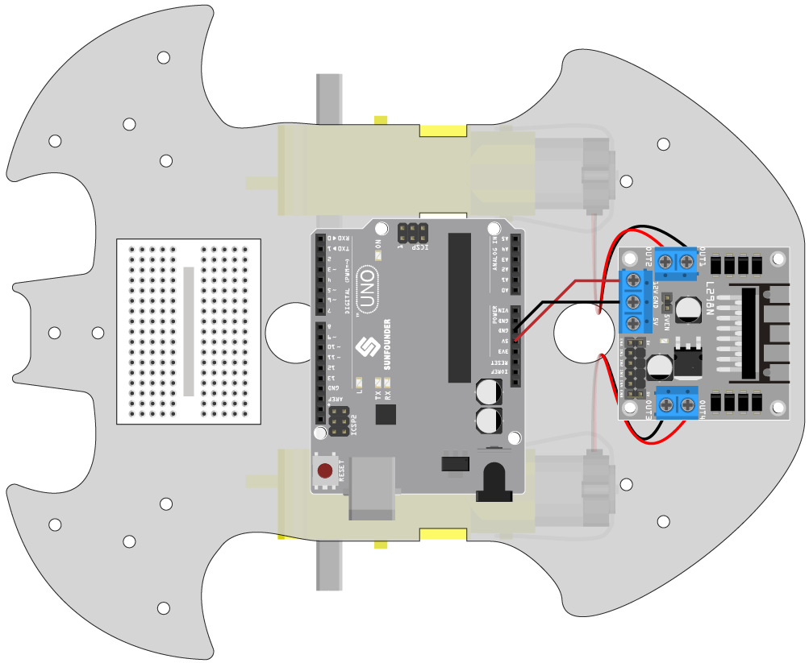

.. _car_move:

1. Bewegung
===============

.. image:: ../components/img/l298n_pin.jpg
    :width: 400
    :align: center

Bevor wir mit dem Programmieren beginnen, sollten wir uns das Funktionsprinzip des L298N nochmals vor Augen führen.

IN1~IN4 sind die Eingänge des L298N-Moduls und OUT1~OUT4 sind die Ausgänge.

Eine einfache Nutzung wäre: Gibt man IN1 ein hohes Signal, wird OUT1 ebenfalls ein hohes Signal ausgeben; bei einem niedrigen Signal an IN1 gibt OUT1 ein niedriges Signal aus.
Wenn man die beiden Enden des Motors an OUT1 und OUT2 anschließt und gegenläufige Signale an IN1 und IN2 sendet, wird der Motor sich drehen. OUT3 und OUT4 funktionieren auf die gleiche Weise.

Die Funktionsbeziehung zwischen ENA und IN1, IN2 ist wie folgt:

.. list-table:: 
    :widths: 25 25 25 50
    :header-rows: 1

    * - ENA
      - IN1
      - IN2
      - Zustand des rechten Motors(A)
    * - 0
      - X
      - X
      - Stopp
    * - 1
      - 0
      - 0
      - Bremsen
    * - 1
      - 0
      - 1
      - Drehung im Uhrzeigersinn
    * - 1
      - 1
      - 0
      - Drehung gegen den Uhrzeigersinn
    * - 1
      - 1
      - 1
      - Bremsen

Die Funktionsbeziehung zwischen ENB und IN3, IN4 ist wie folgt:

.. list-table:: 
    :widths: 25 25 25 50
    :header-rows: 1

    * - ENB
      - IN3
      - IN4
      - Zustand des linken Motors(B)
    * - 0
      - X
      - X
      - Stopp
    * - 1
      - 0
      - 0
      - Bremsen
    * - 1
      - 0
      - 1
      - Drehung im Uhrzeigersinn
    * - 1
      - 1
      - 0
      - Drehung gegen den Uhrzeigersinn
    * - 1
      - 1
      - 1
      - Bremsen

**Benötigte Komponenten**

Für dieses Projekt benötigen wir die folgenden Komponenten.

Es ist sicherlich praktisch, ein komplettes Set zu kaufen. Hier ist der Link dazu:

.. list-table::
    :widths: 20 20 20
    :header-rows: 1

    *   - Name
        - ARTIKEL IN DIESEM KIT
        - LINK
    *   - 3 in 1 Starter Kit
        - 380+
        - |link_3IN1_kit|

Sie können diese auch einzeln über die untenstehenden Links kaufen:

.. list-table::
    :widths: 30 20
    :header-rows: 1

    *   - KOMPONENTENBESCHREIBUNG
        - KAUF-LINK

    *   - :ref:`cpn_l298n`
        - |link_l298n_buy|

**Vorwärts**

Nun verbinden wir den Eingang des L298N-Moduls direkt mit 12V und GND, damit das Auto sich bewegt.

1. Verbinden Sie das R3-Board, das L298N-Modul und die 2 Motoren.

.. list-table:: 
    :widths: 25 25 50
    :header-rows: 1

    * - L298N
      - R3-Board
      - Motor
    * - 12V
      - 5V
      - 
    * - GND
      - GND
      - 
    * - OUT1
      - 
      - Schwarzes Kabel des rechten Motors
    * - OUT2
      - 
      - Rotes Kabel des rechten Motors
    * - OUT3
      - 
      - Schwarzes Kabel des linken Motors
    * - OUT4
      - 
      - Rotes Kabel des linken Motors

2. Verbinden Sie IN2 und IN3 mit 12V und IN1 und IN4 mit GND. Das Auto sollte sich nun vorwärts bewegen.

.. image:: img/1.move_4.png 
    :align: center

Wenn nicht beide Motoren vorwärts drehen, sondern folgende Situationen auftreten, müssen Sie die Verkabelung der beiden Motoren neu einstellen:

* Wenn beide Motoren gleichzeitig rückwärts drehen (linker Motor dreht im Uhrzeigersinn, rechter Motor gegen den Uhrzeigersinn), tauschen Sie die Verkabelung der linken und rechten Motoren gleichzeitig. Tauschen Sie OUT1 und OUT2, sowie OUT3 und OUT4.
* Dreht sich der linke Motor rückwärts (im Uhrzeigersinn), tauschen Sie die Verkabelung von OUT3 und OUT4 des linken Motors.
* Dreht sich der rechte Motor rückwärts (gegen den Uhrzeigersinn), tauschen Sie die Verkabelung von OUT1 und OUT1 des rechten Motors.

**Rückwärts**

Verbinden Sie IN2 und IN3 mit GND und IN1 und IN4 mit 12V. Das Auto sollte sich nun rückwärts bewegen.

.. image:: img/1.move_back.png 
    :width: 800

**Links abbiegen**

Wenn Sie möchten, dass das Auto nach links abbiegt, d.h. beide Motoren im Uhrzeigersinn drehen, verbinden Sie IN1 und IN3 mit GND und IN2 und IN4 mit 12V.

.. image:: img/1.move_left.png 
    :width: 800

**Rechts abbiegen**

Umgekehrt, wenn Sie möchten, dass das Auto nach rechts abbiegt, d.h. beide Motoren gegen den Uhrzeigersinn drehen, verbinden Sie IN1 und IN3 mit 12V und IN2 und IN4 mit GND.

.. image:: img/1.move_right.png 
    :width: 800

**Stopp**

Um den Motor zu stoppen, verbinden Sie die Eingänge derselben Seite gleichzeitig mit 12V oder GND, z.B. verbinden Sie IN1 und IN2 gleichzeitig mit 12V oder 5V, ebenso IN3 und IN4.

Dies ist natürlich theoretisch und wird später beim Steuern mit Code benötigt. Hier kann das Entfernen der Stromversorgung des Autos es stoppen.
