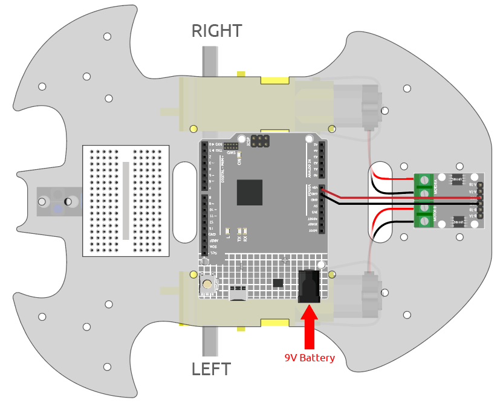
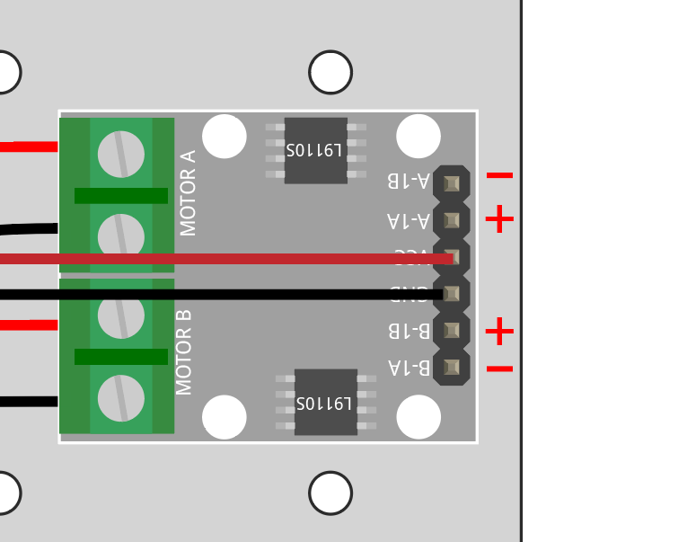
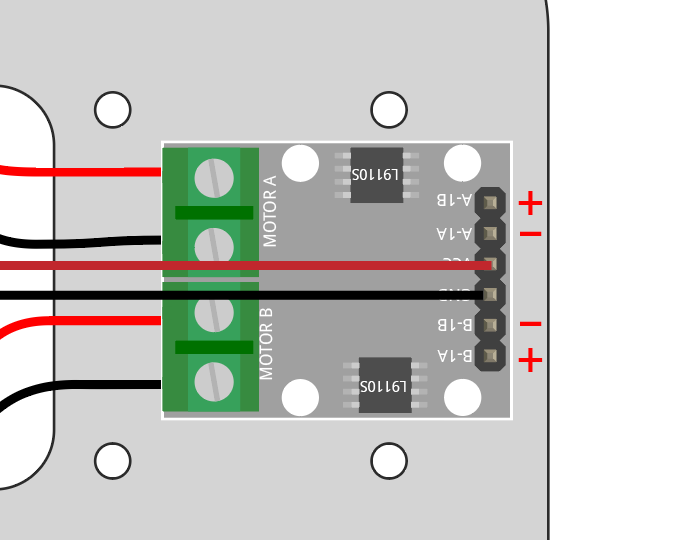
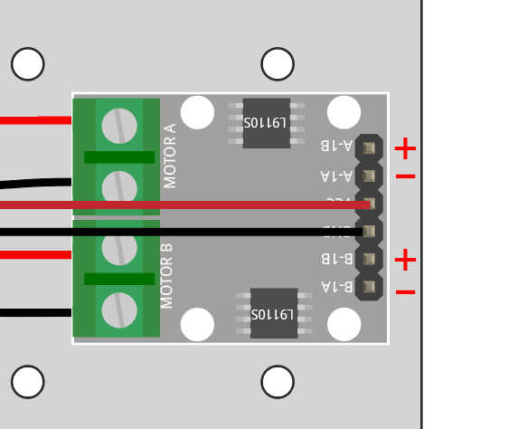
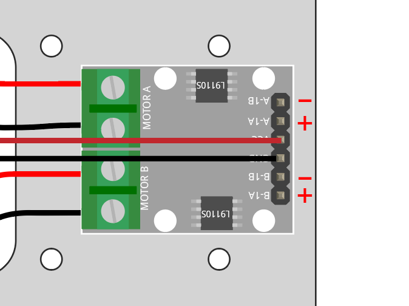

.. _car_move:

1. Move
===============

.. image:: ../components/img/l9110s.jpg
    :width: 400
    :align: center

Before we start programming, let's review the working principle of L9110s.

IA & IB are the inputs of the L9110S module, and OA & OB are the outputs.

A simple way to use them is: 
input high level for IA(A)(A-1A), OA(A) will output high level; 
input low level for IA(A)(A-1A), OA(A) will output low level.
Connecting the two ends of the motor to OA(A) and OB(A), 
inputting opposite level signals for IA(A)(A-1A) and IB(A)(A-1B) will make the motor rotate. 
OA(B) and OB(B) can be used in the same way.

The working relationship between IA,IB & OA,OB is as follows.

.. list-table:: 
    :widths: 25 25 50 50
    :header-rows: 1

    * - IA 
      - IB 
      - OA
      - OB
    * - H 
      - L 
      - H
      - L
    * - L 
      - H 
      - L
      - H
    * - L 
      - L 
      - high resistance
      - high resistance
    * - H 
      - H 
      - high resistance
      - high resistance

* :ref:`cpn_l9110s`

**Forward**

Now let's connect the input of L9110S module directly to 12V and GND respectively to make the car move.

1. Connect R4 board, L9110S module and 2 motors.

2. Connect IB(B) and IA(A) to VCC, and IA(B) and IB(A) to GND, then you will be able to see the car moving forward.

If not both turn forward, but the following situations occur, 
you need to readjust the wiring of the two motors.

* If both motors turn backward at the same time (left motor turns clockwise, right motor turns counterclockwise), swap the wiring of the left and right motors at the same time, OA(A) and OB(A) swap, OA(B) and OB(B) swap.
* If the left motor turns backward (clockwise rotation), exchange the wiring of OA(B) and OB(B) of the left motor.
* If the right motor turns backward (counterclockwise rotation), swap the wiring of OA(A) and OB(A) of the right motor.

**Backward**

Connect IB(B)  and IA(A) to GND, and IA(B)  and IB(A) to VCC, then you will be able to see the car moving backward.

**Turn Left**

If you want to make the car turn left, that is, make both motors turn clockwise. 
You need to connect IA(B)  and IA(A) to GND, and IB(B)  and IB(A) to VCC.

**Turn Right**

Conversely, if you want to turn the car to the right, that is, make both motors turn counterclockwise. 
You need to connect IA(B)  and IA(A) to VCC and IB(B)  and IB(A) to GND.

**Stop**

To stop the motor, connect the inputs on the same side to 12V or GND at the same time, e.g. connect IA(B)  and IB(B)  to 12V or 5V at the same time, and the same for IA(A) and IB(A).

This is of course theoretical and needed later on when controlling with code. Here remove the power supply to the car can stop it.