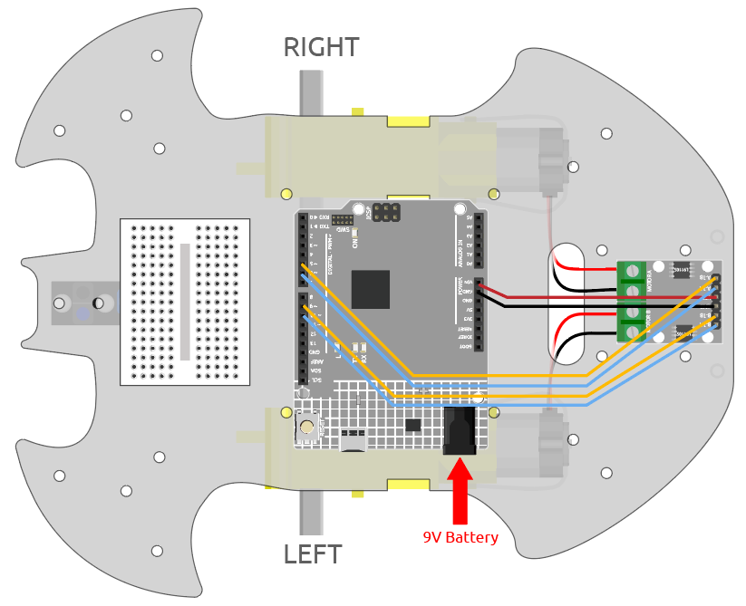

.. note::

    Hello, welcome to the SunFounder Raspberry Pi & Arduino & ESP32 Enthusiasts Community on Facebook! Dive deeper into Raspberry Pi, Arduino, and ESP32 with fellow enthusiasts.

    **Why Join?**

    - **Expert Support**: Solve post-sale issues and technical challenges with help from our community and team.
    - **Learn & Share**: Exchange tips and tutorials to enhance your skills.
    - **Exclusive Previews**: Get early access to new product announcements and sneak peeks.
    - **Special Discounts**: Enjoy exclusive discounts on our newest products.
    - **Festive Promotions and Giveaways**: Take part in giveaways and holiday promotions.

    👉 Ready to explore and create with us? Click [|link_sf_facebook|] and join today!

.. _car_move_code:

2. Move by Code
======================

In the previous project, we have tried to control the operation of the motor by using different level signals for the input of the L9110 module.

If we modify the level signals through the program, then we can control the movement of the car in a flexible way.

**Required Components**

In this project, we need the following components. 

It's definitely convenient to buy a whole kit, here's the link: 

.. list-table::
    :widths: 20 20 20
    :header-rows: 1

    *   - Name	
        - ITEMS IN THIS KIT
        - LINK
    *   - 3 in 1 Starter Kit
        - 380+
        - |link_3IN1_kit|

You can also buy them separately from the links below.

.. list-table::
    :widths: 30 20
    :header-rows: 1

    *   - COMPONENT INTRODUCTION
        - PURCHASE LINK

    *   - :ref:`cpn_uno`
        - |link_Uno_R3_buy|
    *   - :ref:`cpn_l9110`
        - \-
    *   - :ref:`cpn_tt_motor`
        - \-

**Wiring**

Connect the wires between the L9110 module and the R4 board according to the diagram below.

.. list-table:: 
    :widths: 25 25 50
    :header-rows: 1

    * - L9110 Module
      - R4 Board
      - Motor
    * - A-1B
      - 5
      - 
    * - A-1A
      - 6
      - 
    * - B-1B(B-2A)
      - 9
      - 
    * - B-1A
      - 10
      - 
    * - OB(B)
      - 
      - Black wire of right motor
    * - OA(B)
      - 
      - Red wire of right motor
    * - OB(A)
      - 
      - Black wire of left motor
    * - OA(A)
      - 
      - Red wire of left motor

**Code**

.. note::

    * Open the ``2.move.ino`` file under the path of ``3in1-kit\car_project\2.move``.
    * Or copy this code into **Arduino IDE**.

.. raw:: html

    <iframe src=https://create.arduino.cc/editor/sunfounder01/6ff67dfb-a1c1-474b-a106-6acbb3a39e6f/preview?embed style="height:510px;width:100%;margin:10px 0" frameborder=0></iframe>

After the code is uploaded, the car will move forward, backward, left and right for two seconds respectively.

**How it works?**

This project is essentially the same as the previous one, involving making the car move forward, backward, left, and right, as well as stopping by providing different signal levels to the input pins of the L9110 module.

#. Initialize the pins of L9110 module.

    .. code-block:: arduino

        const int A_1B = 5;
        const int A_1A = 6;
        const int B_1B = 9;
        const int B_1A = 10;

        void setup() {
            pinMode(A_1B, OUTPUT);
            pinMode(A_1A, OUTPUT);
            pinMode(B_1B, OUTPUT);
            pinMode(B_1A, OUTPUT);
        }

#. Set the input pins to different high or low levels to control the rotation of the left and right motors, and then encapsulate them in individual functions.

    .. code-block:: arduino

        void moveForward() {
            digitalWrite(A_1B, LOW);
            digitalWrite(A_1A, HIGH);
            digitalWrite(B_1B, HIGH);
            digitalWrite(B_1A, LOW);
        }

        void moveBackward() {
            digitalWrite(A_1B, HIGH);
            digitalWrite(A_1A, LOW);
            digitalWrite(B_1B, LOW);
            digitalWrite(B_1A, HIGH);
        }
        ...
#. Call these functions in ``loop()``.

    .. code-block:: arduino

        void loop() {
            moveForward();
            delay(2000);
            stopMove();
            delay(500);

            moveBackward();
            delay(2000);
            stopMove();
            delay(500);
        ...

* `digitalWrite(pin, value) <https://www.arduino.cc/reference/en/language/functions/digital-io/digitalwrite/>`_

    * ``pin``: the Arduino pin number.
    * ``value``: HIGH or LOW.
    
    Write a HIGH or a LOW value to a digital pin. If the pin has been configured as an ``OUTPUT`` with ``pinMode()``, its voltage will be set to the corresponding value: 5V (or 3.3V on 3.3V boards) for HIGH, 0V (ground) for LOW.

* `pinMode(pin, mode) <https://www.arduino.cc/reference/en/language/functions/digital-io/pinmode/>`_

    * ``pin``: the Arduino pin number to set the mode of.
    * ``mode``: INPUT, OUTPUT, or INPUT_PULLUP.
    
    Configures the specified pin to behave either as an input or an output.

* `delay(ms) <https://www.arduino.cc/reference/en/language/functions/time/delay/>`_

    * ``ms``: the number of milliseconds to pause. Allowed data types: unsigned long.

    Pauses the program for the amount of time (in milliseconds) specified as parameter. (There are 1000 milliseconds in a second.)
