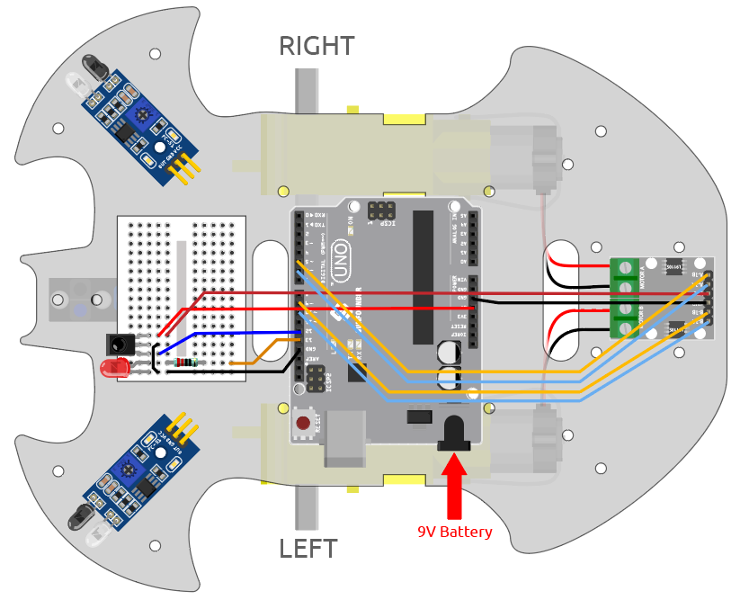

.. note::

    ¡Hola, bienvenido a la Comunidad de Aficionados a Raspberry Pi, Arduino y ESP32 de SunFounder en Facebook! Profundiza en Raspberry Pi, Arduino y ESP32 con otros entusiastas.

    **¿Por qué unirse?**

    - **Soporte de expertos**: Resuelve problemas posventa y desafíos técnicos con ayuda de nuestra comunidad y equipo.
    - **Aprender y compartir**: Intercambia consejos y tutoriales para mejorar tus habilidades.
    - **Vistas previas exclusivas**: Obtén acceso anticipado a anuncios de nuevos productos y avances.
    - **Descuentos especiales**: Disfruta de descuentos exclusivos en nuestros productos más nuevos.
    - **Promociones festivas y sorteos**: Participa en sorteos y promociones de fiestas.

    👉 ¿Listo para explorar y crear con nosotros? Haz clic en [|link_sf_facebook|] y únete hoy!

.. _car_remote:

9. Control Remoto
=====================

Este kit viene con un receptor IR, que te permite usar un control remoto IR para controlar el movimiento del coche.

**Componentes Necesarios**

Para este proyecto, necesitamos los siguientes componentes.

Es definitivamente conveniente comprar un kit completo, aquí tienes el enlace:

.. list-table::
    :widths: 20 20 20
    :header-rows: 1

    *   - Nombre	
        - ELEMENTOS DE ESTE KIT
        - ENLACE
    *   - 3 in 1 Starter Kit
        - 380+
        - |link_3IN1_kit|

También puedes comprarlos por separado en los siguientes enlaces.

.. list-table::
    :widths: 30 20
    :header-rows: 1

    *   - INTRODUCCIÓN DEL COMPONENTE
        - ENLACE DE COMPRA

    *   - :ref:`cpn_uno`
        - |link_Uno_R3_buy|
    *   - :ref:`cpn_l9110`
        - \-
    *   - :ref:`cpn_tt_motor`
        - \-
    *   - :ref:`cpn_led`
        - |link_led_buy|
    *   - :ref:`cpn_receiver`
        - \-

**Cableado**

.. raw:: html

    <iframe width="600" height="400" src="https://www.youtube.com/embed/M8buGWCkYcI?si=spLK2KP363rkN6sl" title="YouTube video player" frameborder="0" allow="accelerometer; autoplay; clipboard-write; encrypted-media; gyroscope; picture-in-picture; web-share" allowfullscreen></iframe>

Ahora construye el circuito de acuerdo con el diagrama a continuación.

.. list-table:: 
    :header-rows: 1

    * - Receptor IR
      - Placa R3
    * - OUT
      - 12
    * - GND
      - GND
    * - VCC
      - 5V

**Código**

.. note::

    * Abre el archivo ``9.remote_control.ino`` en la ruta ``3in1-kit\car_project\9.remote_control``.
    * O copia este código en el **Arduino IDE**.
    * Aquí se utiliza la biblioteca ``IRremote``, puedes instalarla desde el **Library Manager**.
  
        .. image:: ../img/lib_irremote.png

.. raw:: html
    
    <iframe src=https://create.arduino.cc/editor/sunfounder01/7c78450d-fcd2-4288-a00d-499c71ad2d52/preview?embed style="height:510px;width:100%;margin:10px 0" frameborder=0></iframe>

Una vez subido el código con éxito, al presionar un botón en el control remoto, el LED parpadeará una vez para indicar que la señal ha sido recibida, y el coche se moverá de acuerdo al botón que hayas presionado. Puedes presionar las siguientes teclas para controlar el coche.

* **+**: Acelerar
* **-**: Desacelerar
* **1**: Hacia adelante a la izquierda
* **2**: Hacia adelante
* **3**: Hacia adelante a la derecha
* **4**: Girar a la izquierda
* **6**: Girar a la derecha
* **7**: Hacia atrás a la izquierda
* **8**: Hacia atrás
* **9**: Hacia atrás a la derecha

**¿Cómo funciona?**

El efecto de este proyecto es hacer que el coche se mueva leyendo el valor de la tecla del control remoto IR. Además, el LED en el pin 13 parpadeará para indicar la recepción exitosa de la señal IR.

1. Importa la biblioteca ``IRremote``, puedes instalarla desde el **Library Manager**.

    .. code-block:: arduino

        #include <IRremote.h>

        const int IR_RECEIVE_PIN = 12;  // Define el número de pin para el Sensor IR

2. Inicializa la comunicación serial a una tasa de baudios de 9600. Inicializa el receptor IR en el pin especificado (``IR_RECEIVE_PIN``) y habilita la retroalimentación LED (si es aplicable).

    .. code-block:: arduino

        ...

        void setup() {

            ...
            //IR remote
            IrReceiver.begin(IR_RECEIVE_PIN, ENABLE_LED_FEEDBACK);  // Start the receiver
            Serial.println("REMOTE CONTROL START");

        }

3. Cuando presiones las teclas en el control remoto, el receptor infrarrojo sabrá qué tecla se ha presionado y luego el coche se moverá de acuerdo al valor de la tecla correspondiente.

    .. code-block:: arduino

        void loop() {

            if (IrReceiver.decode()) {
                //    Serial.println(results.value,HEX);
                String key = decodeKeyValue(IrReceiver.decodedIRData.command);
                if (key != "ERROR") {
                    Serial.println(key);

                    if (key == "+") {
                        speed += 50;
                    } else if (key == "-") {
                        speed -= 50;
                    } else if (key == "2") {
                        moveForward(speed);
                        delay(1000);
                    ...
                    }
                    IrReceiver.resume();  // Enable receiving of the next value
                    
            }
        }

    * Verifica si se recibe y descodifica exitosamente una señal IR.
    * Descodifica el comando IR y lo almacena en ``key`` usando una función personalizada ``decodeKeyValue()``.
    * Comprueba si el valor descodificado no es un error.
    * Imprime el valor IR descodificado en el monitor serial.
    * Reanuda la recepción de señal IR para la siguiente señal.
