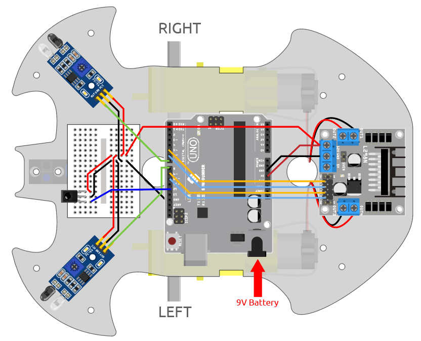

.. _car_remote:

9. リモートコントロール
=================================

このキットには、IRレシーバーが含まれているので、IRリモートコントロールを使用して車の動きをコントロールすることができます。

**必要な部品**

このプロジェクトには、以下のコンポーネントが必要です。

キット全体を購入するのが便利です。リンクはこちら：

.. list-table::
    :widths: 20 20 20
    :header-rows: 1

    *   - 名前
        - このキットのアイテム
        - リンク
    *   - 3 in 1 Starter Kit
        - 380+
        - |link_3IN1_kit|

以下のリンクからそれぞれのアイテムを購入することもできます。

.. list-table::
    :widths: 30 20
    :header-rows: 1

    *   - コンポーネント紹介
        - 購入リンク

    *   - :ref:`cpn_uno`
        - |link_Uno_R3_buy|
    *   - :ref:`cpn_l298n`
        - |link_l298n_buy|
    *   - :ref:`cpn_tt_motor`
        - \-
    *   - :ref:`cpn_led`
        - |link_led_buy|
    *   - :ref:`cpn_receiver`
        - \-

**配線図**

以下の図に従って回路を組み立ててください。

.. list-table:: 
    :header-rows: 1

    * - IR レシーバー
      - R3 ボード
    * - OUT
      - 12
    * - GND
      - GND
    * - VCC
      - 5V

.. list-table:: 
    :header-rows: 1

    * - LED
      - R3 ボード
    * - アノード(長いピン)
      - 13
    * - カソード
      - GND

**コード**

.. note::

    * ``3in1-kit\car_project\9.remote_control`` のパスにある ``9.remote_control.ino`` ファイルを開きます。
    * または、このコードを **Arduino IDE** にコピーします。
    * ここでは ``IRremote`` ライブラリが使用されています。 **Library Manager** からインストールできます。
  
        .. image:: ../img/lib_irremote.png

.. raw:: html
    
    <iframe src=https://create.arduino.cc/editor/sunfounder01/b5d87f03-c8e9-49de-a6d1-3b51036e1f5c/preview?embed style="height:510px;width:100%;margin:10px 0" frameborder=0></iframe>

コードのアップロードが成功したら、リモートコントロールのボタンを押すと、LEDが一回点滅して信号が受信されたことを示し、ボタンの指示に従って車が動きます。以下のキーを押して車を操作することができます。

* **+**：加速
* **-**：減速
* **1**：左前方へ進む
* **2**：前進
* **3**：右前方へ進む
* **4**：左折
* **6**：右折
* **7**：左後方へ後退
* **8**：後退
* **9**：右後方へ後退

**どのように動作するのか？**

このプロジェクトの効果は、IRリモートコントロールのキー値を読み取り、車を動かすことです。さらに、ピン13のLEDが点滅して、赤外線信号の受信が成功したことを示します。

#. ``IRremote`` ライブラリをインポートします。 **Library Manager** からインストールできます。

    .. code-block:: arduino

        #include <IRremote.h>

        const int IR_RECEIVE_PIN = 12;  // IRセンサのピン番号を定義する

#. ボーレート9600でシリアル通信を初期化します。指定されたピン(``IR_RECEIVE_PIN``)でIRレシーバを初期化し、LEDフィードバックを有効にします(該当する場合)。

    .. code-block:: arduino

        ...

        void setup() {

            ...
            //IR リモート
            IrReceiver.begin(IR_RECEIVE_PIN, ENABLE_LED_FEEDBACK);  // IRレシーバを開始する
            Serial.println("REMOTE CONTROL START");

        }

#. リモートコントロールのキーを押すと、赤外線受信機はどのキーが押されたかを知り、車は対応するキー値に従って動きます。

    .. code-block:: arduino

        void loop() {

            if (IrReceiver.decode()) {
                //    Serial.println(results.value,HEX);
                String key = decodeKeyValue(IrReceiver.decodedIRData.command);
                if (key != "ERROR") {
                    Serial.println(key);

                    if (key == "+") {
                        speed += 50;
                    } else if (key == "-") {
                        speed -= 50;
                    } else if (key == "2") {
                        moveForward(speed);
                        delay(1000);
                    ...
                    }
                    IrReceiver.resume();  // 次の値の受信を有効にする
            }
        }

    * IR信号が受信され、正常にデコードされたかどうかを確認する。
    * IRコマンドをデコードし、カスタム ``decodeKeyValue()`` 関数を使用して ``key`` に保存する。
    * デコードされた値がエラーでないかを確認します。
    * デコードされたIR値をシリアルモニタに表示する。
    * 次の信号のIR信号受信を再開する。
