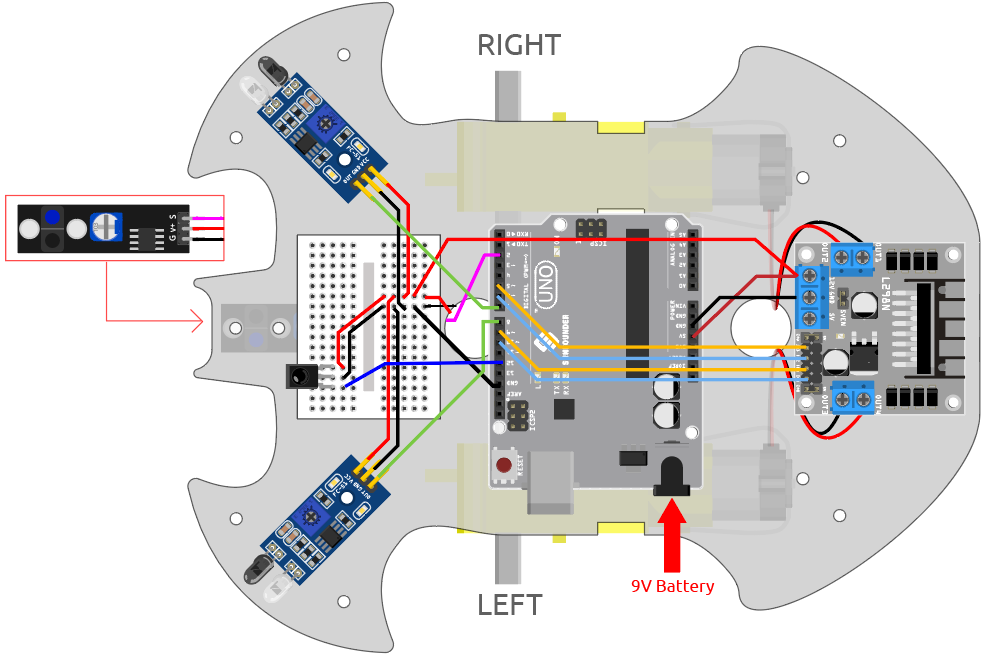

.. _car_remote_plus:

10. ワンタッチスタート
=============================

このプロジェクトでは、これまでのプロジェクト（ライン追従、追跡、障害物回避、自動運転など）を統合しました。リモコンのボタンで切り替えることができるので、車をスタートしてすべての機能を一度に体験できます。

**配線図**

**コード**

.. note::

    * ``3in1-kit\car_project\10.one_touch_start`` のパスの下の ``10.one_touch_start.ino`` ファイルを開きます。
    * または、このコードを **Arduino IDE** にコピーします。
    * ここでは ``IRremote`` ライブラリが使用されています。 **ライブラリマネージャー** からインストールできます。
  
        .. image:: ../img/lib_irremote.png
    

.. raw:: html
    
    <iframe src=https://create.arduino.cc/editor/sunfounder01/d48e05be-da3a-4515-a7f0-99ff965e597e/preview?embed style="height:510px;width:100%;margin:10px 0" frameborder=0></iframe>

コードが正常にアップロードされた後、IRレシーバーがリモートコントロールからの信号を受信するたびに、LEDが3回急速に点滅します。カートを操作するための以下のキーを押すことができます。

* **+**: 加速
* **-**: 減速
* **1**: 左前方に移動
* **2**: 前進
* **3**: 右に移動
* **4**: 左を向く
* **6**: 右を向く
* **7**: 左に後退
* **8**: 後退
* **9**: 右に後退
* **CYCLE**: ラインを追従
* **U/SD**: 自動運転
* **▷▷|**: 超音波モジュールを使用した障害物回避
* **|◁◁**: IR障害物モジュールを使用した障害物回避
* **EQ**: 手を追跡
* **0**: 停止
