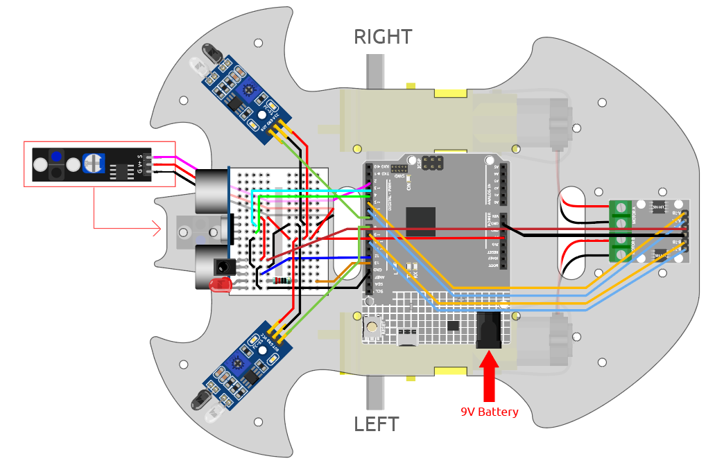

.. _car_remote_plus:

10. Start mit einem Tastendruck
=========================================

In diesem Projekt haben wir die vorherigen Projekte - Linienverfolgung, Nachfahren, Hindernisvermeidung, autonomes Fahren usw. zusammengeführt. Sie können über Tasten der Fernbedienung umgeschaltet werden, sodass Sie das Auto starten und alle Funktionen gleichzeitig erleben können.

**Verdrahtung**

**Code**

.. note::

    * Öffnen Sie die Datei ``10.one_touch_start.ino`` im Pfad ``3in1-kit\car_project\10.one_touch_start``.
    * Oder kopieren Sie diesen Code in die **Arduino IDE**.
    * Hier wird die Bibliothek ``IRremote`` verwendet. Sie können sie über den **Library Manager** installieren.
  
        .. image:: ../img/lib_irremote.png
    

.. raw:: html
    
    <iframe src=https://create.arduino.cc/editor/sunfounder01/d873724f-120e-4679-b4ec-8d72ad583c8c/preview?embed style="height:510px;width:100%;margin:10px 0" frameborder=0></iframe>

Nachdem der Code erfolgreich hochgeladen wurde, blinkt die LED 3 Mal schnell für jedes vom IR-Empfänger von der Fernbedienung empfangene Signal. Sie können die folgenden Tasten drücken, um den Wagen zu bedienen.

* **+**: Beschleunigen
* **-**: Verlangsamen
* **1**: Nach links vorne bewegen
* **2**: Vorwärts
* **3**: Nach rechts bewegen
* **4**: Links abbiegen
* **6**: Rechts abbiegen
* **7**: Rückwärts nach links
* **8**: Rückwärts
* **9**: Rückwärts nach rechts
* **CYCLE**: Der Linie folgen
* **U/SD**: Autonomes Fahren
* **▷▷|**: Hindernisvermeidung mit Ultraschallmodul
* **|◁◁**: Hindernisvermeidung mit IR-Hindernismodul
* **EQ**: Ihrer Hand folgen
* **0**: Stoppen
