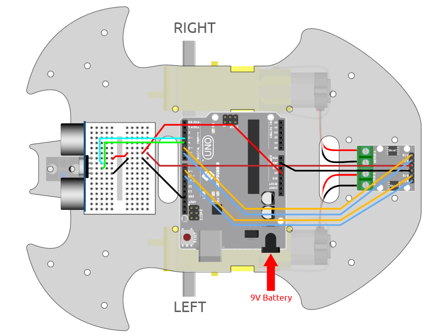

.. note::

    こんにちは、SunFounderのRaspberry Pi & Arduino & ESP32愛好家コミュニティへようこそ！Facebook上でRaspberry Pi、Arduino、ESP32についてもっと深く掘り下げ、他の愛好家と交流しましょう。

    **参加する理由は？**

    - **エキスパートサポート**：コミュニティやチームの助けを借りて、販売後の問題や技術的な課題を解決します。
    - **学び＆共有**：ヒントやチュートリアルを交換してスキルを向上させましょう。
    - **独占的なプレビュー**：新製品の発表や先行プレビューに早期アクセスしましょう。
    - **特別割引**：最新製品の独占割引をお楽しみください。
    - **祭りのプロモーションとギフト**：ギフトや祝日のプロモーションに参加しましょう。

    👉 私たちと一緒に探索し、創造する準備はできていますか？[|link_sf_facebook|]をクリックして今すぐ参加しましょう！

.. _car_ultrasonic:

6. 超音波モジュールで遊ぶ
=====================================

:ref:`car_ir_obstacle` プロジェクトでは、2つの赤外線障害物回避モジュールが障害物回避に使用されていますが、IR障害物回避モジュールの検出距離は短いため、車が障害物を避けるのが遅れる可能性があります。

このプロジェクトでは、車がもっと遠くの障害物を感知して判断できるように、超音波モジュールを使用して長距離検出を行います。

**必要なコンポーネント**

このプロジェクトでは、以下のコンポーネントが必要です。

一式を購入すると便利です。リンクは以下の通りです：

.. list-table::
    :widths: 20 20 20
    :header-rows: 1

    *   - 名前	
        - このキットの内容
        - リンク
    *   - 3 in 1 スターターキット
        - 380+
        - |link_3IN1_kit|

以下のリンクから別々に購入することもできます。

.. list-table::
    :widths: 30 20
    :header-rows: 1

    *   - コンポーネントの紹介
        - 購入リンク

    *   - :ref:`cpn_uno`
        - |link_Uno_R3_buy|
    *   - :ref:`cpn_l9110`
        - \-
    *   - :ref:`cpn_tt_motor`
        - \-
    *   - :ref:`cpn_ultrasonic`
        - |link_ultrasonic_buy|

**配線**

超音波センサモジュールは、超音波音波を使用して物体までの距離を測定する計器です。
2つのプローブがあります。一つは超音波を送信するためのもので、もう一つは超音波を受信して送受信の時間を距離に変換するためのものです。これにより、デバイスと障害物との距離を検出します。

.. raw:: html

    <iframe width="600" height="400" src="https://www.youtube.com/embed/qx9ZH-YnAkg?si=wfrsDrmGCPa2nYPD" title="YouTube video player" frameborder="0" allow="accelerometer; autoplay; clipboard-write; encrypted-media; gyroscope; picture-in-picture; web-share" allowfullscreen></iframe>

以下の図に従って回路を組み立ててください。

.. list-table:: 
    :header-rows: 1

    * - 超音波モジュール
      - R3ボード
    * - Vcc
      - 5V
    * - Trig
      - 3
    * - Echo
      - 4
    * - Gnd
      - GND

**コード**

.. note::

    * ``3in1-kit\car_project\6.ultrasonic_module`` のパスの下にある ``6.ultrasonic_module.ino`` ファイルを開きます。
    * または、このコードを **Arduino IDE** にコピーします。
    
    * または、 `Arduino Web Editor <https://docs.arduino.cc/cloud/web-editor/tutorials/getting-started/getting-started-web-editor>`_ を通じてコードをアップロードします。

.. raw:: html
    
    <iframe src=https://create.arduino.cc/editor/sunfounder01/ae97f966-9d72-40e6-aa9f-e0767ddf5bd5/preview?embed style="height:510px;width:100%;margin:10px 0" frameborder=0></iframe>

コードが正常にアップロードされた後、車を壁の方向に向けてください。距離が遠すぎると前進し、近すぎると後退し、安全な距離であれば停止します。

**仕組みは？**

このプロジェクトは、超音波モジュールから読み取った距離に基づいて車を動かすものです。

#. 超音波モジュールのピン定義を追加します。 ``trigPin`` は超音波を送信するために使用されるので、 ``OUTPUT`` に設定します。 ``echoPin`` は超音波を受信するために ``INPUT`` に設定します。

    .. code-block:: arduino

        ...
        const int trigPin = 3;
        const int echoPin = 4;

        void setup() {
        ...

        //ultrasonic
            pinMode(echoPin, INPUT);
            pinMode(trigPin, OUTPUT);
        }

#. 超音波モジュールから得られる距離値をまず読み取り、距離が25より大きい場合は車を前進させ、距離が2-10cmの間であれば後退させ、それ以外(10~25)は停止させます。

    .. code-block:: arduino

        void loop() {
            float distance = readSensorData();
            if (distance > 25) {
                moveForward(200);
            }
            else if (distance < 10 && distance > 2) {
                moveBackward(200);
            } else {
                stopMove();
            }
        }

#. ``readSensorData()`` 関数について。

    超音波モジュールの送信機は、2usごとに10usの正方波信号を送信し、受信機は範囲内に障害物がある場合に高レベル信号を受信します。 ``pulseIn()`` 関数を使用して送信から受信までの時間を記録し、音速340m/sで割ってから2で割ると、このモジュールと障害物との距離がcm単位で得られます。

    .. code-block:: arduino

        float readSensorData() {
            digitalWrite(trigPin, LOW);
            delayMicroseconds(2);
            digitalWrite(trigPin, HIGH);
            delayMicroseconds(10);
            digitalWrite(trigPin, LOW);
            float distance = pulseIn(echoPin, HIGH) / 58.00; //Equivalent to (340m/s*1us)/2
            return distance;
        }

* `pulseIn(pin, value) <https://www.arduino.cc/reference/en/language/functions/advanced-io/pulsein/>`_

    * ``pin``: パルスを読み取りたいArduinoのピンの番号。許可されるデータ型: int。
    * ``value``: 読み取るパルスの種類: HIGHまたはLOW。許可されるデータ型: int。

    ピン上でのパルス（HIGHまたはLOW）を読み取ります。例えば、valueがHIGHであれば、 ``pulseIn()`` は、ピンがLOWからHIGHになるのを待ち、タイミングを開始し、その後ピンがLOWになるのを待ち、タイミングを停止します。

