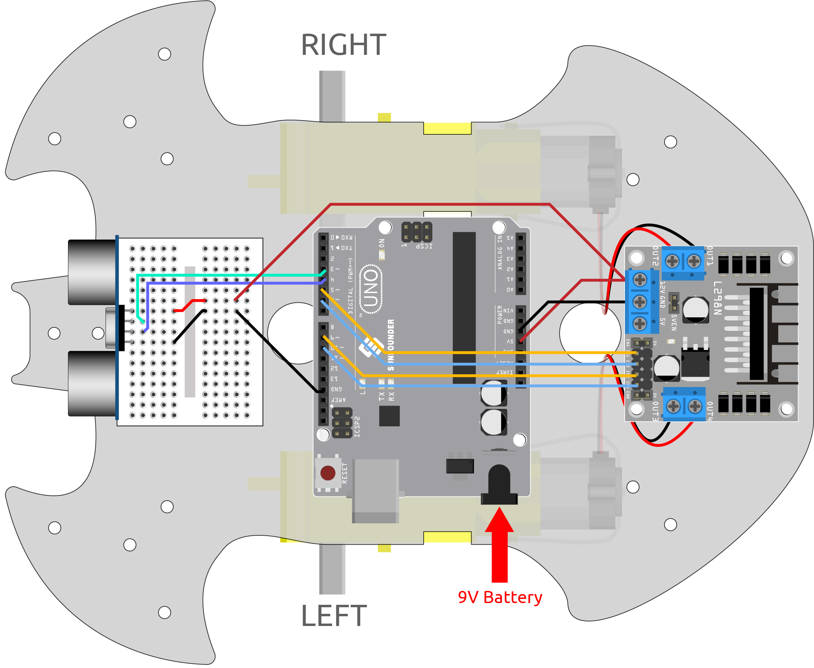

.. _car_ultrasonic:

6. 超音波モジュールで遊ぶ
=====================================

:ref:`car_ir_obstacle` プロジェクトでは、2つの赤外線障害物回避モジュールを障害物回避のために使用していますが、IR障害物回避モジュールの検出距離は短いため、車が障害物を避けるのが遅くなる可能性があります。

このプロジェクトでは、超音波モジュールを使って遠距離の検出を行い、車がもっと遠くの障害物を感知して判断できるようにします。

**必要な部品**

このプロジェクトでは、以下のコンポーネントが必要です。

全体のキットを購入すると非常に便利です。リンクは以下の通りです：

.. list-table::
    :widths: 20 20 20
    :header-rows: 1

    *   - 名前
        - このキットのアイテム
        - リンク
    *   - 3 in 1 Starter Kit
        - 380+
        - |link_3IN1_kit|

以下のリンクから個別に購入することもできます。

.. list-table::
    :widths: 30 20
    :header-rows: 1

    *   - コンポーネントの紹介
        - 購入リンク

    *   - :ref:`cpn_uno`
        - |link_Uno_R3_buy|
    *   - :ref:`cpn_l298n`
        - |link_l298n_buy|
    *   - :ref:`cpn_tt_motor`
        - \-
    *   - :ref:`cpn_ultrasonic`
        - |link_ultrasonic_buy|

**配線図**

超音波センサモジュールは、超音波を使って物体までの距離を測定する機器です。
2つのプローブがあります。1つは超音波を送信し、もう1つは超音波を受信して送受信の時間を距離に変換し、装置と障害物との間の距離を検出します。

以下の図に従って回路を組み立ててください。

.. list-table:: 
    :header-rows: 1

    * - 超音波モジュール
      - R3ボード
    * - Vcc
      - 5V
    * - Trig
      - 3
    * - Echo
      - 4
    * - Gnd
      - GND

**コード**

.. note::

    * ``3in1-kit\car_project\6.ultrasonic_module`` のパスの下で ``6.ultrasonic_module.ino`` ファイルを開きます。
    * または、このコードを **Arduino IDE** にコピーします。
    
    * または、 `Arduino Web Editor <https://docs.arduino.cc/cloud/web-editor/tutorials/getting-started/getting-started-web-editor>`_ を通じてコードをアップロードします。

.. raw:: html
    
    <iframe src=https://create.arduino.cc/editor/sunfounder01/cfa094c5-2dbf-4297-afbb-da2306ccc984/preview?embed style="height:510px;width:100%;margin:10px 0" frameborder=0></iframe>

コードが正常にアップロードされた後、車を壁に向けてください。距離が遠すぎる場合は前進し、近すぎる場合は後退し、安全な距離であれば停止します。

**どのように動作するのか？**

このプロジェクトは、超音波モジュールから読み取った距離に基づいて、車に適切な動作をさせるものです。

#. 超音波モジュールのピン定義を追加します。 ``trigPin`` は超音波を送信するために使用され、 ``OUTPUT`` に設定されます。 ``echoPin`` は超音波を受信するために ``INPUT`` に設定されます。

    .. code-block:: arduino

        ...
        const int trigPin = 3;
        const int echoPin = 4;

        void setup() {
        ...

        //超音波
            pinMode(echoPin, INPUT);
            pinMode(trigPin, OUTPUT);
        }

#. まず、超音波モジュールから取得した距離の値を読み取ります。距離が25より大きい場合、車を前進させます。距離が2~10cmの間であれば、車を後退させます。それ以外の場合（10~25の間）、停止します。

    .. code-block:: arduino

        void loop() {
            float distance = readSensorData();
            if (distance > 25) {
                moveForward(200);
            }
            else if (distance < 10 && distance > 2) {
                moveBackward(200);
            } else {
                stopMove();
            }
        }

#. ``readSensorData()`` 関数について。

    超音波モジュールの送信機は、2usごとに10usの正方形の波形信号を送信し、範囲内に障害物がある場合、受信機は高レベル信号を受信します。 ``pulseIn()`` 関数を使用して、送信から受信までの時間を記録し、音速340m/sで除算し、さらに2で除算すると、このモジュールと障害物との距離がcm単位で得られます。

    .. code-block:: arduino

        float readSensorData() {
            digitalWrite(trigPin, LOW);
            delayMicroseconds(2);
            digitalWrite(trigPin, HIGH);
            delayMicroseconds(10);
            digitalWrite(trigPin, LOW);
            float distance = pulseIn(echoPin, HIGH) / 58.00; //(340m/s*1us)/2に相当。
            return distance;
        }

* `pulseIn(pin, value) <https://www.arduino.cc/reference/en/language/functions/advanced-io/pulsein/>`_

    * ``pin``: パルスを読みたいArduinoのピンの番号。許可されているデータ型: int。
    * ``value``: 読みたいパルスの種類：HIGHまたはLOW。許可されているデータ型: int。

    ピン上でのパルス（HIGHまたはLOW）を読み取ります。例えば、valueがHIGHの場合、 ``pulseIn()`` は、ピンがLOWからHIGHになるのを待ち、タイミングを開始し、次にピンがLOWになるのを待ち、タイミングを停止します。
