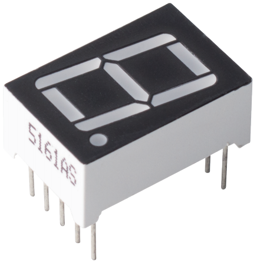

.. _cpn_7_segment:

Display de 7 Segmentos
======================

Un display de 7 segmentos es un componente en forma de 8 que agrupa 7 LEDs. Cada LED se llama segmento; al ser energizado, un segmento forma parte de un numeral a mostrar.

Hay dos tipos de conexión de pines: Cátodo Común (CC) y Ánodo Común (CA). Como su nombre indica, un display CC tiene todos los cátodos de los 7 LEDs conectados, mientras que un display CA tiene todos los ánodos de los 7 segmentos conectados.

En este kit, utilizamos el display de 7 segmentos de Cátodo Común, aquí está el símbolo electrónico.

.. image:: img/segment_cathode.png
    :width: 800

Cada uno de los LEDs en el display tiene un segmento posicional con uno de sus pines de conexión sacados del paquete plástico rectangular. Estos pines de LED están etiquetados de "a" a "g", representando cada LED individual. Los otros pines de LED están conectados juntos formando un pin común. Por lo tanto, al polarizar directamente los pines apropiados de los segmentos de LED en un orden particular, algunos segmentos se iluminarán y otros permanecerán apagados, mostrando así el carácter correspondiente en el display.

**Códigos de Display**

Para ayudarte a entender cómo los displays de 7 segmentos (Cátodo Común) muestran los números, hemos dibujado la siguiente tabla. Los números son el número 0-F mostrado en el display de 7 segmentos; (DP) GFEDCBA se refiere al conjunto de LEDs correspondiente configurado en 0 o 1, Por ejemplo, 00111111 significa que DP y G están configurados en 0, mientras que los demás están en 1. Por lo tanto, el número 0 se muestra en el display de 7 segmentos, mientras que HEX Code corresponde al número hexadecimal.

.. image:: img/segment_code.png

**Ejemplo**

* :ref:`ar_segment` (Proyecto Básico)
* :ref:`iot_gate` (Proyecto IoT)

