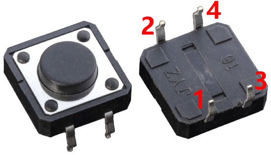
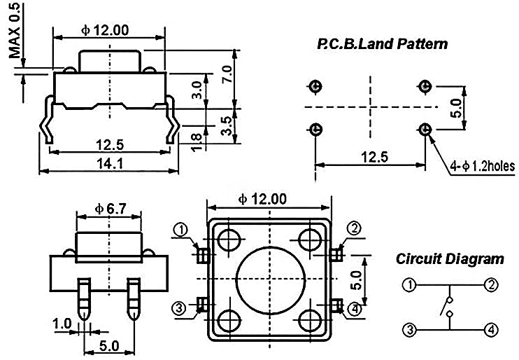

.. note::

    Hallo und willkommen in der SunFounder Raspberry Pi & Arduino & ESP32 Enthusiasten-Gemeinschaft auf Facebook! Tauchen Sie tiefer ein in die Welt von Raspberry Pi, Arduino und ESP32 mit anderen Enthusiasten.

    **Warum beitreten?**

    - **Expertenunterstützung**: Lösen Sie Nachverkaufsprobleme und technische Herausforderungen mit Hilfe unserer Gemeinschaft und unseres Teams.
    - **Lernen & Teilen**: Tauschen Sie Tipps und Anleitungen aus, um Ihre Fähigkeiten zu verbessern.
    - **Exklusive Vorschauen**: Erhalten Sie frühzeitigen Zugang zu neuen Produktankündigungen und exklusiven Einblicken.
    - **Spezialrabatte**: Genießen Sie exklusive Rabatte auf unsere neuesten Produkte.
    - **Festliche Aktionen und Gewinnspiele**: Nehmen Sie an Gewinnspielen und Feiertagsaktionen teil.

    👉 Sind Sie bereit, mit uns zu erkunden und zu erschaffen? Klicken Sie auf [|link_sf_facebook|] und treten Sie heute bei!

.. _cpn_button:

Knopf
==========

Knöpfe sind eine gängige Komponente zur Steuerung von elektronischen Geräten. Sie werden üblicherweise als Schalter verwendet, um Schaltkreise zu verbinden oder zu unterbrechen. Obwohl es Knöpfe in verschiedenen Größen und Formen gibt, handelt es sich bei dem hier verwendeten um einen 6mm Mini-Knopf, wie auf den folgenden Bildern gezeigt. Pin 1 ist mit Pin 2 und Pin 3 mit Pin 4 verbunden. Sie müssen also nur entweder Pin 1 oder Pin 2 mit Pin 3 oder Pin 4 verbinden.

Das Folgende zeigt den inneren Aufbau eines Knopfes. Das Symbol auf der rechten Seite unten wird normalerweise verwendet, um einen Knopf in Schaltkreisen darzustellen.

.. image:: img/button_symbol.png
    :width: 400
    :align: center

Da Pin 1 mit Pin 2 und Pin 3 mit Pin 4 verbunden ist, werden beim Drücken des Knopfes die 4 Pins verbunden, wodurch der Schaltkreis geschlossen wird.

**Beispiel**

* :ref:`ar_button` (Grundlegendes Projekt)
* :ref:`sh_doorbell` (Scratch-Projekt)
* :ref:`sh_eat_apple` (Scratch-Projekt)
* :ref:`sh_fishing` (Scratch-Projekt)
