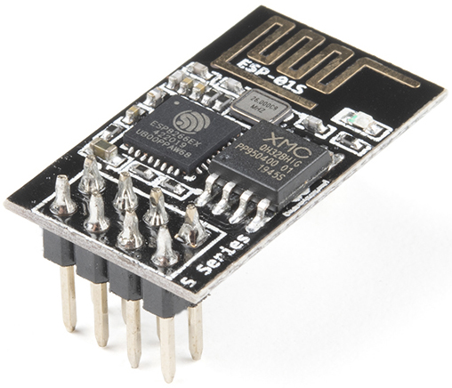
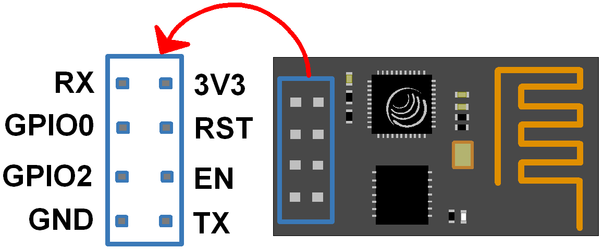
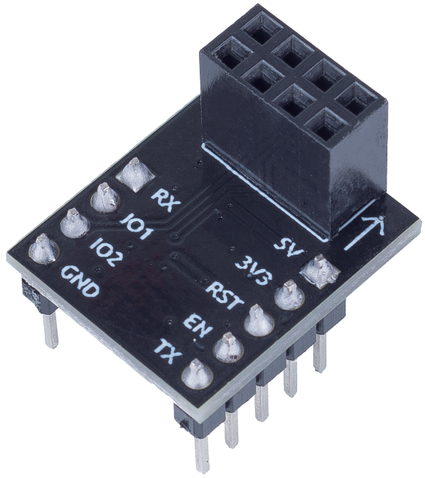
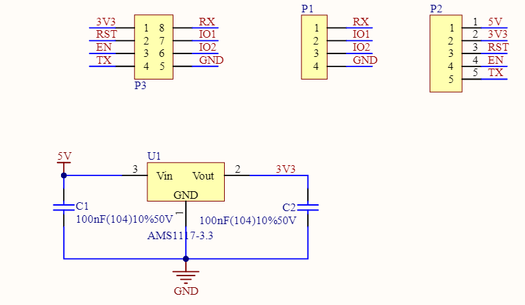

.. note::

    Hallo und willkommen in der SunFounder Raspberry Pi & Arduino & ESP32 Enthusiasten-Gemeinschaft auf Facebook! Tauchen Sie tiefer ein in die Welt von Raspberry Pi, Arduino und ESP32 mit anderen Enthusiasten.

    **Warum beitreten?**

    - **Expertenunterstützung**: Lösen Sie Nachverkaufsprobleme und technische Herausforderungen mit Hilfe unserer Gemeinschaft und unseres Teams.
    - **Lernen & Teilen**: Tauschen Sie Tipps und Anleitungen aus, um Ihre Fähigkeiten zu verbessern.
    - **Exklusive Vorschauen**: Erhalten Sie frühzeitigen Zugang zu neuen Produktankündigungen und exklusiven Einblicken.
    - **Spezialrabatte**: Genießen Sie exklusive Rabatte auf unsere neuesten Produkte.
    - **Festliche Aktionen und Gewinnspiele**: Nehmen Sie an Gewinnspielen und Feiertagsaktionen teil.

    👉 Sind Sie bereit, mit uns zu erkunden und zu erschaffen? Klicken Sie auf [|link_sf_facebook|] und treten Sie heute bei!

.. _cpn_esp8266:

ESP8266 Modul
=================

Das ESP8266 ist ein kostengünstiger Wi-Fi-Mikrochip 
mit integrierter TCP/IP-Netzwerksoftware 
und Mikrocontroller-Fähigkeit, produziert von Espressif Systems in Shanghai, China.

Der Chip erregte erstmals im August 2014 die Aufmerksamkeit westlicher Bastler mit dem ESP-01 Modul, 
hergestellt von einem Drittanbieter Ai-Thinker. 
Dieses kleine Modul ermöglicht es Mikrocontrollern, sich mit einem Wi-Fi-Netzwerk zu verbinden und einfache TCP/IP-Verbindungen mit Hayes-Stil-Befehlen herzustellen. 
Zu Beginn gab es jedoch kaum englischsprachige Dokumentationen über den Chip und die von ihm akzeptierten Befehle. 
Der sehr niedrige Preis und die Tatsache, dass es auf dem Modul sehr wenige externe Komponenten gab, 
was darauf hindeutete, dass es in größeren Mengen sehr kostengünstig sein könnte, 
lockte viele Hacker an, das Modul, 
den Chip und die darauf befindliche Software zu erkunden, sowie die chinesische Dokumentation zu übersetzen.

Pins des ESP8266 und ihre Funktionen:

.. list-table:: ESP8266-01 Pins
   :widths: 25 25 100
   :header-rows: 1

   * - Pin	
     - Bezeichnung	
     - Beschreibung
   * - 1	
     - TXD	
     - UART_TXD, Senden; Allgemeiner Eingabe/Ausgabe-Zweck: GPIO1; Pull-down beim Start nicht erlaubt.
   * - 2	
     - GND
     - GND
   * - 3	
     - CU_PD	
     - Funktioniert bei hohem Pegel; Ausschaltung bei niedrigem Pegel.
   * - 4		
     - GPIO2
     - Muss beim Einschalten auf hohem Pegel sein; Pull-down nicht erlaubt; Standardmäßig Pull-up;
   * - 5	
     - RST	
     - Externes Reset-Signal, Reset bei niedrigem Pegel; Funktioniert bei hohem Pegel (standardmäßig hoch);
   * - 6	
     - GPIO0	
     - WiFi Statusanzeige; Betriebsmodusauswahl: Pull-up: Flash Boot, Betriebsmodus; Pull-down: UART Download, Download-Modus.
   * - 7	
     - VCC	
     - Stromversorgung (3,3V)
   * - 8	
     - RXD	
     - UART_RXD, Empfangen; Allgemeiner Eingabe/Ausgabe-Zweck: GPIO3;

* `ESP8266 - Espressif <https://www.espressif.com/en/products/socs/esp8266>`_
* `ESP8266 AT Befehlssatz <https://github.com/sunfounder/3in1-kit/blob/main/iot_project/esp8266_at_instruction_set_en.pdf>`_

ESP8266 Adapter
---------------

Der ESP8266 Adapter ist eine Erweiterungsplatine, die es ermöglicht, das ESP8266 Modul auf einem Steckbrett zu verwenden.

Er passt perfekt zu den Pins des ESP8266 selbst und fügt zudem einen 5V Pin hinzu, um die Spannung von der Arduino-Platine zu erhalten. Der integrierte AMS1117-Chip wird verwendet, um das ESP8266 Modul nach der Spannungsabsenkung auf 3,3V zu betreiben.

Das Schaltbild ist wie folgt:

**Beispiel**

* :ref:`iot_projects` (IoT-Projekt)
