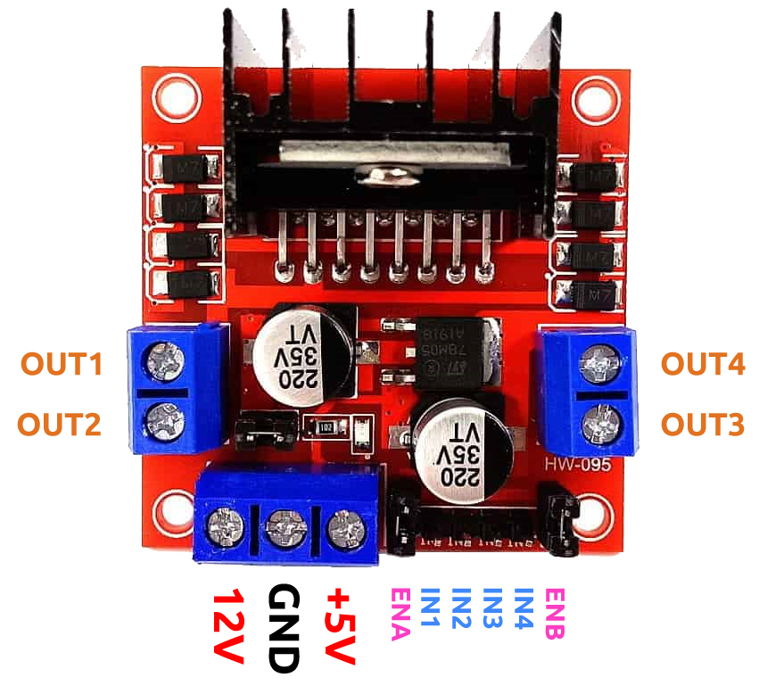
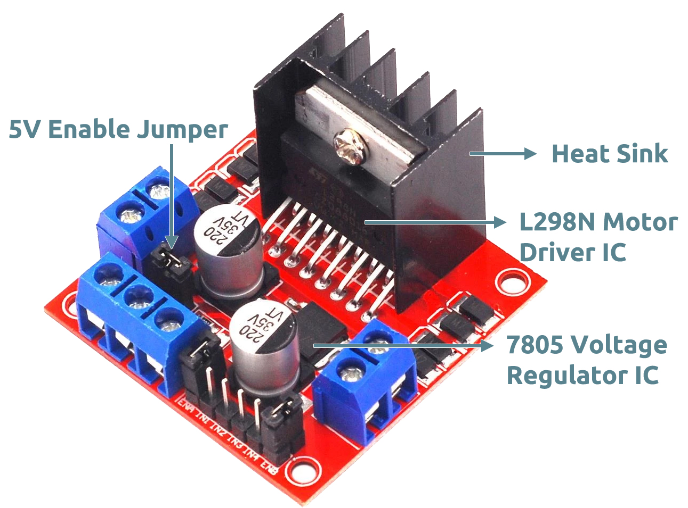

.. note::

    Hallo und willkommen in der SunFounder Raspberry Pi & Arduino & ESP32 Enthusiasten-Gemeinschaft auf Facebook! Tauchen Sie tiefer ein in die Welt von Raspberry Pi, Arduino und ESP32 mit anderen Enthusiasten.

    **Warum beitreten?**

    - **Expertenunterstützung**: Lösen Sie Nachverkaufsprobleme und technische Herausforderungen mit Hilfe unserer Gemeinschaft und unseres Teams.
    - **Lernen & Teilen**: Tauschen Sie Tipps und Anleitungen aus, um Ihre Fähigkeiten zu verbessern.
    - **Exklusive Vorschauen**: Erhalten Sie frühzeitigen Zugang zu neuen Produktankündigungen und exklusiven Einblicken.
    - **Spezialrabatte**: Genießen Sie exklusive Rabatte auf unsere neuesten Produkte.
    - **Festliche Aktionen und Gewinnspiele**: Nehmen Sie an Gewinnspielen und Feiertagsaktionen teil.

    👉 Sind Sie bereit, mit uns zu erkunden und zu erschaffen? Klicken Sie auf [|link_sf_facebook|] und treten Sie heute bei!

.. _cpn_l298n:

L298N Module
==================================

This L298N Motor Driver Module is a high power motor driver module for driving DC and Stepper Motors. This module consists of an L298 motor driver IC and a 78M05 5V regulator. L298N Module can control up to 4 DC motors, or 2 DC motors with directional and speed control.

* **IN1 & IN2**: Motor A input pins. Used to control the spinning direction of Motor A
* **IN3 & IN4**: Motor B input pins. Used to control the spinning direction of Motor B
* **ENA**: Enables PWM signal for Motor A. Here it has been connected to 5V with a jumper cap.
* **ENB**: Enables PWM signal for Motor B. Here it has been connected to 5V with a jumper cap.
* **OUT1 & OUT2**: Output pins of Motor A
* **OUT3 & OUT4**: Output pins of Motor B
* **12V**: 12V input from DC power Source
* **5V**: Supplies power for the switching logic circuitry inside L298N IC
* **GND**: Ground pin

**Features**

* Driver Model: L298N 2A
* Driver Chip: Double H Bridge L298N
* Motor Supply Voltage (Maximum): 46V
* Motor Supply Current (Maximum): 2A
* Logic Voltage: 5V
* Driver Voltage: 5-35V
* Driver Current:2A
* Logical Current:0-36mA
* Maximum Power (W): 25W
* Current Sense for each motor
* Heatsink for better performance
* Power-On LED indicator

**Operating Principle**

The driver module can drive two motors. The enabled terminals ENA and ENB are effective at high level. 

The working relationship between ENA and IN1,IN2 is as follows: 

.. list-table:: 
    :widths: 25 25 25 50
    :header-rows: 1

    * - ENA
      - IN1
      - IN2
      - The state of Motor A
    * - 0
      - X
      - X
      - Stop
    * - 1
      - 0
      - 0
      - Brake
    * - 1
      - 0
      - 1
      - Rotate clockwise
    * - 1
      - 1
      - 0
      - Rotate counterclockwise
    * - 1
      - 1
      - 1
      - Brake

The working relationship between ENB and IN3,IN4 is as follows.

.. list-table:: 
    :widths: 25 25 25 50
    :header-rows: 1

    * - ENB
      - IN3
      - IN4
      - The state of Motor B
    * - 0
      - X
      - X
      - Stop
    * - 1
      - 0
      - 0
      - Brake
    * - 1
      - 0
      - 1
      - Rotate clockwise
    * - 1
      - 1
      - 0
      - Rotate counterclockwise
    * - 1
      - 1
      - 1
      - Brake

**About 5V Enable Cap**

The L298N Motor Driver module consists of an L298 Motor Driver IC, 78M05 Voltage Regulator, resistors, capacitor, Power LED, 5V jumper in an integrated circuit.

78M05 Voltage regulator will be enabled only when the jumper is placed. When the power supply is less than or equal to 12V, then the internal circuitry will be powered by the voltage regulator and the 5V pin can be used as an output pin to power the microcontroller. 

The jumper should not be placed when the power supply is greater than 12V and separate 5V should be given through 5V terminal to power the internal circuitry.

* `L298N datasheet <https://www.yerical.com/product/L298N?product/XXXXX?source=adg&gclid=CjwKCAjwkYGVBhArEiwA4sZLuKEC19ydceKs396z1JENqjcbJDEvedRkcsza1aH_swhuNPWzL-CYfRoCMTMQAvD_BwE#g-pd-res>`_

**Example**

* :ref:`ar_motor` (Basic Project)
* :ref:`car_move` (Car Project)
* :ref:`car_speed` (Car Project)
* :ref:`iot_car` (IoT Project)
* :ref:`sh_test` (Scratch Project)

