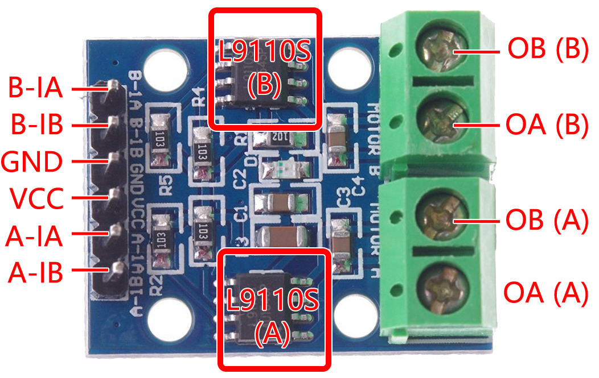

.. note::

    Ciao, benvenuto nella Community di appassionati di SunFounder per Raspberry Pi, Arduino e ESP32 su Facebook! Approfondisci le tue conoscenze su Raspberry Pi, Arduino e ESP32 con altri appassionati.

    **Perché unirti a noi?**

    - **Supporto di esperti**: Risolvi i problemi post-vendita e le sfide tecniche con l'aiuto della nostra comunità e del nostro team.
    - **Impara e condividi**: Scambia consigli e tutorial per migliorare le tue competenze.
    - **Anteprime esclusive**: Ottieni accesso anticipato agli annunci dei nuovi prodotti e alle anteprime esclusive.
    - **Sconti speciali**: Approfitta di sconti esclusivi sui nostri prodotti più recenti.
    - **Promozioni festive e omaggi**: Partecipa a omaggi e promozioni speciali durante le festività.

    👉 Sei pronto a esplorare e creare con noi? Clicca [|link_sf_facebook|] e unisciti oggi stesso!

.. _cpn_l9110:

Modulo Driver Motore L9110
=============================

Il modulo driver motore L9110 è ideale per il controllo di due motori in parallelo. Dispone di due chip driver L9110S indipendenti, 
ogni canale con una corrente di uscita stabile fino a 800mA.

Con un intervallo di tensione da 2.5V a 12V, il modulo è compatibile sia con microcontrollori a 3.3V che a 5V.

Come soluzione compatta, il modulo L9110 semplifica il controllo dei motori in molte applicazioni. 
Grazie alla sua architettura a doppio canale, consente la gestione indipendente di due motori, rendendolo ideale per progetti che richiedono il controllo simultaneo di entrambi.

Con la sua elevata corrente continua in uscita, questo modulo può alimentare con facilità motori di piccole e medie dimensioni, 
aprendo la strada a numerosi progetti di robotica, automazione e applicazioni motoristiche. La sua ampia gamma di tensioni lo rende adattabile a diverse configurazioni di alimentazione.

Progettato per essere user-friendly, il modulo presenta terminali di ingresso e uscita intuitivi, semplificando i collegamenti con microcontrollori 
o dispositivi di controllo simili. Inoltre, offre protezione integrata da sovracorrente e sovratemperatura, aumentando l'affidabilità 
e la sicurezza durante le operazioni con i motori.

* **B-1A & B-1B(B-2A)**: Pin di ingresso per il controllo della direzione di rotazione del motore B.
* **A-1A & A-1B**: Pin di ingresso per il controllo della direzione di rotazione del motore A.
* **0A & OB(A)**: Pin di uscita del motore A.
* **0A & OB(B)**: Pin di uscita del motore B.
* **VCC**: Pin di alimentazione (2.5V-12V).
* **GND**: Pin di massa.

**Caratteristiche**

* 2 chip di controllo motore L9110S integrati
* Controllo motore a doppio canale
* Controllo indipendente della direzione di rotazione dei motori
* Uscita di corrente elevata (800mA per canale)
* Ampia gamma di tensioni (2.5V-12V)
* Design compatto
* Terminali di ingresso e uscita pratici
* Funzioni di protezione integrate
* Applicazioni versatili
* Dimensioni PCB: 29.2mm x 23mm
* Temperatura di esercizio: -20°C ~ 80°C
* Indicatore LED di accensione

**Principio di funzionamento**

Ecco la tabella della verità per il motore B:

Questa tabella mostra i diversi stati del motore B in base ai valori dei pin di ingresso B-1A e B-1B(B-2A). Indica la direzione di rotazione (oraria o antioraria), frenata o arresto del motore B.

.. list-table:: 
    :widths: 25 25 50
    :header-rows: 1

    * - B-1A
      - B-1B(B-2A)
      - Stato del motore B
    * - 1
      - 0
      - Rotazione oraria
    * - 0
      - 1
      - Rotazione antioraria
    * - 0
      - 0
      - Freno
    * - 1
      - 1
      - Stop

Ecco la tabella della verità per il motore A:

Questa tabella mostra i diversi stati del motore A in base ai valori dei pin di ingresso A-1A e A-1B. Indica la direzione di rotazione (oraria o antioraria), frenata o arresto del motore A.

.. list-table:: 
    :widths: 25 25 50
    :header-rows: 1

    * - A-1A
      - A-1B
      - Stato del motore A
    * - 1
      - 0
      - Rotazione oraria
    * - 0
      - 1
      - Rotazione antioraria
    * - 0
      - 0
      - Freno
    * - 1
      - 1
      - Stop

* :ref:`ar_motor` (Basic Project)
* :ref:`car_move` (Car Project)
* :ref:`car_speed` (Car Project)
* :ref:`iot_car` (IoT Project)