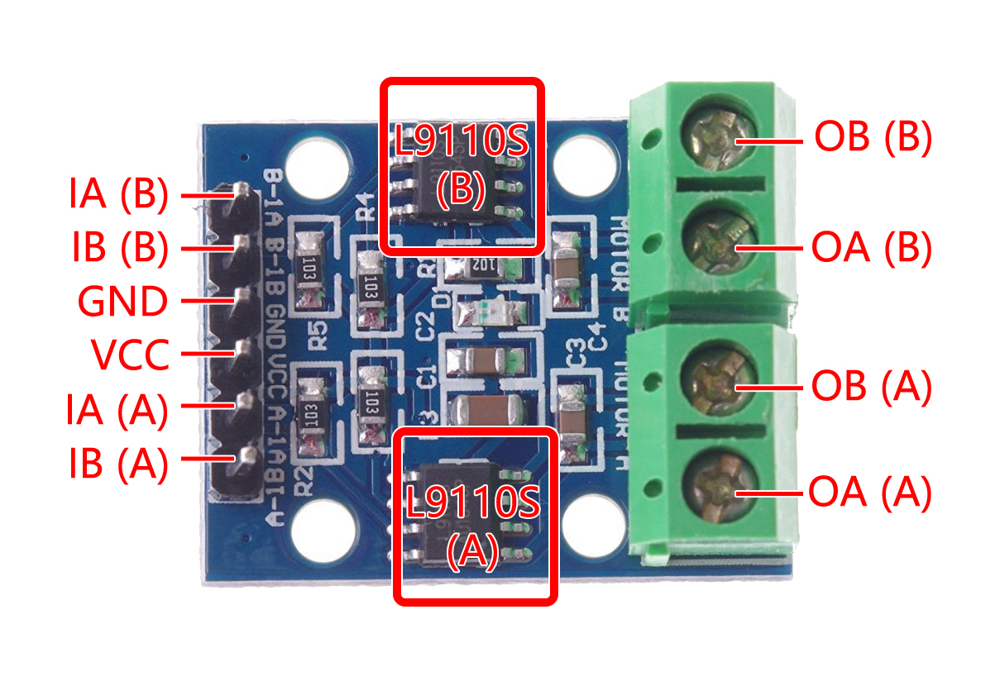

.. _cpn_l9110s:

L9110s Module
=======================

L9110S is a dual-channel push-pull power amplifier ASIC device designed for controlling and driving toy motors. It integrates discrete circuits into a single chip IC, which reduces the cost of peripheral components and improves the reliability of the whole machine.

The input terminal of the chip is compatible with TTL/CMOS level and has good anti-interference; the circuit has a large current drive capability, and each channel can pass a continuous current of 0.8-1.0A, and the peak current capability can reach 2.5A;

The circuit has an over-temperature protection function, and the built-in clamp diode can release the reverse impact current of the inductive load.

L9110S is widely used in toy car motor drives, stepper motor drive and switching power tube circuit.

**0A & OB(A)** : Output pins of Motor A.
**0A & OB(B)** : Output pins of Motor B.
**A-1A & A-1B**: Motor A input pins. Used to control the spinning direction of Motor A.
**B-1A & B-1B**: Motor B input pins. Used to control the spinning direction of Motor B.
**VCC**: Supplies power for the switching logic circuitry inside IC.
**GND**: Ground pin.

**Features**

* Low quiescent operating current
* Wide supply voltage range: 2.5V-12V
* Continuous current output capability of each channel (1.0A: VCC=8V DIP8 package; 0.8A: VCC=8V SOP8 package)
* Lower saturation pressure drop
* With over-temperature protection function
* The output has three states: forward rotation, reverse rotation and high impedance
* TTL/CMOS output level compatible, can be directly connected to CPU
* Output built-in clamping diode, suitable for inductive load
* Control and drive integrated in a single IC
* Suitable for three to six dry battery power supply systems
* With pin high voltage protection function
* Antistatic ability: 4000V (HBM)
* Working temperature range: -20℃ ~ +80℃

**Logical relationship**

.. list-table:: 
    :widths: 25 25 50 50
    :header-rows: 1

    * - IA 
      - IB 
      - OA
      - OB
    * - H 
      - L 
      - H
      - L
    * - L 
      - H 
      - L
      - H
    * - L 
      - L 
      - high resistance
      - high resistance
    * - H 
      - H 
      - high resistance
      - high resistance

* :ref:`ar_motor` (Learning Project)
* :ref:`car_move` (Car Project)
* :ref:`car_speed` (Car Project)
* :ref:`iot_car` (IoT Project)