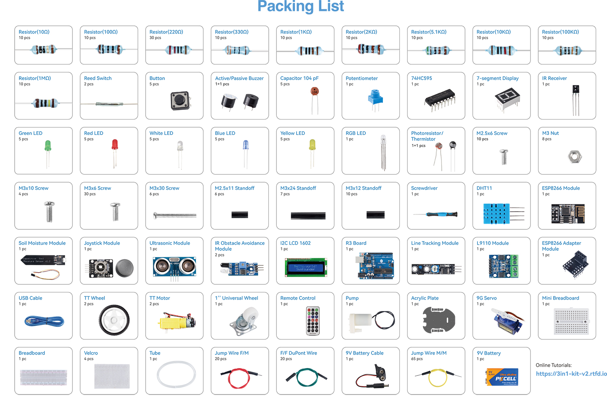

.. note::

    こんにちは、SunFounderのRaspberry Pi & Arduino & ESP32愛好家コミュニティへようこそ！Facebook上でRaspberry Pi、Arduino、ESP32についてもっと深く掘り下げ、他の愛好家と交流しましょう。

    **参加する理由は？**

    - **エキスパートサポート**：コミュニティやチームの助けを借りて、販売後の問題や技術的な課題を解決します。
    - **学び＆共有**：ヒントやチュートリアルを交換してスキルを向上させましょう。
    - **独占的なプレビュー**：新製品の発表や先行プレビューに早期アクセスしましょう。
    - **特別割引**：最新製品の独占割引をお楽しみください。
    - **祭りのプロモーションとギフト**：ギフトや祝日のプロモーションに参加しましょう。

    👉 私たちと一緒に探索し、創造する準備はできていますか？[|link_sf_facebook|]をクリックして今すぐ参加しましょう！

キットのコンポーネントについて学ぶ
====================================

パッケージを開封した後、コンポーネントの数量が商品説明と一致しているか、およびすべてのコンポーネントが良好な状態であるかどうかを確認してください。

以下は、各コンポーネントの紹介です。これには、コンポーネントの動作原理と対応するプロジェクトが含まれています。

**Control Board**

.. toctree::
    :maxdepth: 1

    component_uno
    component_esp8266

**Basic**

.. toctree::
    :maxdepth: 1

    component_breadboard
    component_resistor
    component_capacitor
    component_wires

**Chip**

.. toctree::
    :maxdepth: 1

    component_74hc595

**Display**

.. toctree::
    :maxdepth: 1

    component_led
    component_rgb_led
    component_7_segment
    component_i2c_lcd

**Sound**

.. toctree::
    :maxdepth: 1

    component_buzzer

**Driver**

.. toctree::
    :maxdepth: 1

    component_tt_motor
    component_servo
    component_pump
    component_l9110_module

**Controller**

.. toctree::
    :maxdepth: 1

    component_button
    component_reed
    component_potentiometer
    component_joystick_module
    component_receiver

**Sensor**

.. toctree::
    :maxdepth: 1

    component_photoresistor
    component_thermistor
    component_dht11
    component_track_module
    component_moisture_module
    component_avoidance_module
    component_ultrasonic_module
