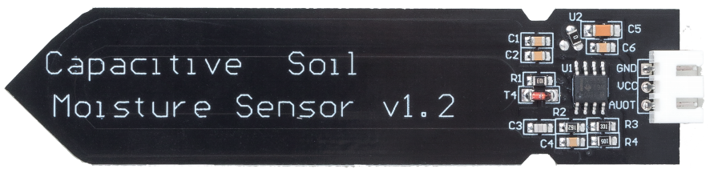
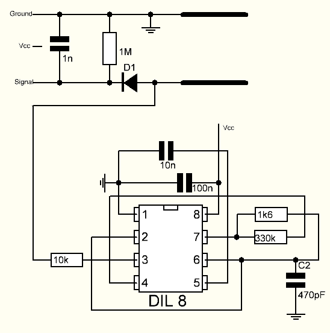

.. note::

    Hallo und willkommen in der SunFounder Raspberry Pi & Arduino & ESP32 Enthusiasten-Gemeinschaft auf Facebook! Tauchen Sie tiefer ein in die Welt von Raspberry Pi, Arduino und ESP32 mit anderen Enthusiasten.

    **Warum beitreten?**

    - **Expertenunterstützung**: Lösen Sie Nachverkaufsprobleme und technische Herausforderungen mit Hilfe unserer Gemeinschaft und unseres Teams.
    - **Lernen & Teilen**: Tauschen Sie Tipps und Anleitungen aus, um Ihre Fähigkeiten zu verbessern.
    - **Exklusive Vorschauen**: Erhalten Sie frühzeitigen Zugang zu neuen Produktankündigungen und exklusiven Einblicken.
    - **Spezialrabatte**: Genießen Sie exklusive Rabatte auf unsere neuesten Produkte.
    - **Festliche Aktionen und Gewinnspiele**: Nehmen Sie an Gewinnspielen und Feiertagsaktionen teil.

    👉 Sind Sie bereit, mit uns zu erkunden und zu erschaffen? Klicken Sie auf [|link_sf_facebook|] und treten Sie heute bei!

.. _cpn_soil_moisture:

Bodenfeuchtigkeitsmodul
================================

* GND: Masse
* VCC：Stromversorgung, 3.3v~5V
* AOUT: Gibt den Bodenfeuchtigkeitswert aus, je feuchter der Boden, desto geringer ist sein Wert.

Dieser kapazitive Bodenfeuchtigkeitssensor unterscheidet sich von den meisten auf dem Markt erhältlichen Widerstandssensoren, da er das Prinzip der kapazitiven Induktion zur Erfassung der Bodenfeuchtigkeit verwendet. Er umgeht das Problem, dass Widerstandssensoren sehr korrosionsanfällig sind und verlängert so seine Lebensdauer erheblich.

Er besteht aus korrosionsbeständigen Materialien und hat eine hervorragende Lebensdauer. Stecken Sie es in den Boden um Pflanzen herum und überwachen Sie die Bodenfeuchtigkeitsdaten in Echtzeit. Das Modul verfügt über einen integrierten Spannungsregler, der einen Betrieb in einem Spannungsbereich von 3,3 ~ 5,5 V ermöglicht. Es ist ideal für Mikrocontroller mit niedriger Spannung und 3,3 V und 5 V Versorgung geeignet.

Das Hardwareschema des kapazitiven Bodenfeuchtigkeitssensors ist unten dargestellt.

Es gibt einen Festfrequenzoszillator, der mit einem 555-Timer-IC aufgebaut ist. Die erzeugte Rechteckwelle wird dann wie ein Kondensator an den Sensor geleitet. Für das Rechteckwellensignal hat der Kondensator jedoch eine gewisse Reaktanz oder, um der Argumentation willen, einen Widerstand mit einem rein ohmschen Widerstand (10k Widerstand an Pin 3), um einen Spannungsteiler zu bilden.

Je höher die Bodenfeuchtigkeit, desto höher die Kapazität des Sensors. Infolgedessen hat die Rechteckwelle eine geringere Reaktanz, was die Spannung an der Signalleitung reduziert, und der Wert des analogen Eingangs durch den Mikrocontroller ist kleiner.

**Spezifikation**

* Betriebsspannung: 3,3 ~ 5,5 VDC
* Ausgangsspannung: 0 ~ 3,0 VDC
* Betriebsstrom: 5mA
* Schnittstelle: PH2.0-3P
* Abmessungen: 3,86 x 0,905 Zoll (L x B)
* Gewicht: 15g

**Beispiel**

* :ref:`ar_moisture` (Grundlegendes Projekt)
* :ref:`iot_plant` (IoT-Projekt)
