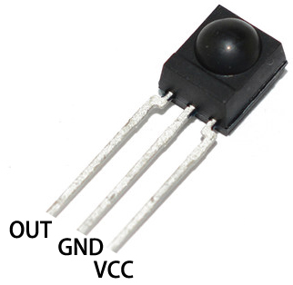

.. _cpn_receiver:

IRレシーバー
===========================

**IRレシーバー**

* OUT: シグナル出力
* GND：GND
* VCC: 電源供給、3.3v~5V

赤外線受信器は、赤外線信号を受け取り、TTLレベルと互換性のある信号を独立して出力できる部品です。サイズは通常のプラスチックパッケージのトランジスタと同等で、あらゆる種類の赤外線リモコンや赤外線伝送に適しています。

赤外線、またはIR、通信は人気があり、低コストで使いやすい無線通信技術です。赤外線は可視光線よりも僅かに長い波長を持っているため、人間の目には見えない - 無線通信に理想的です。赤外線通信の一般的な変調方式は38KHzの変調です。

* 採用した `HS0038B <https://pdf1.alldatasheet.com/datasheet-pdf/view/103034/VISHAY/HS0038B.html>`_ IR受信センサー、高感度
* リモートコントロールに使用可能
* 電源供給: 5V
* インターフェース: デジタル
* 変調周波数: 38Khz
* ピン定義: (1) 出力 (2) Vcc (3) GND
* サイズ: 23.5mm x 21.5mm

**リモートコントロール**

.. image:: img/image186.jpeg
    :width: 400

これは、21の機能ボタンと最大8メートルの伝送距離を持つミニサイズの薄型赤外線ワイヤレスリモコンで、子供部屋のさまざまなデバイスを操作するのに適しています。

* サイズ: 85x39x6mm
* リモートコントロール範囲: 8-10m
* バッテリー: 3Vボタン型リチウムマンガン電池
* 赤外線キャリア周波数: 38KHz
* 表面粘着材: 0.125mm PET
* 有効寿命: 20,000回以上

**例**

* :ref:`ar_receiver` (学習プロジェクト)
* :ref:`car_remote` (車プロジェクト)
* :ref:`car_remote_plus` (車プロジェクト)