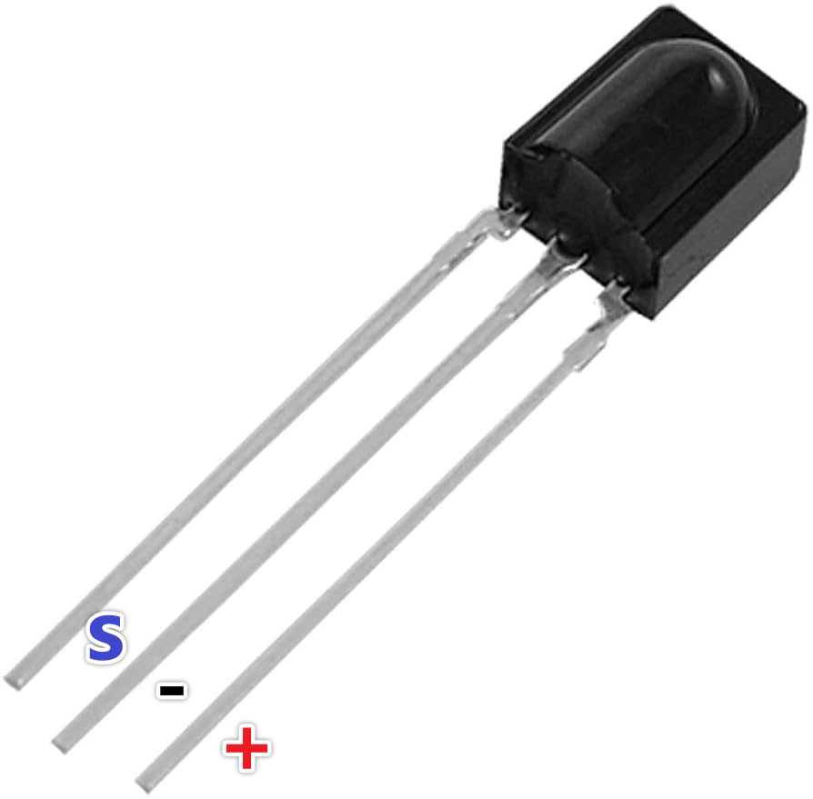

.. note:: 

    Bonjour, bienvenue dans la communauté SunFounder Raspberry Pi, Arduino et ESP32 sur Facebook ! Plongez dans l'univers de Raspberry Pi, Arduino et ESP32 avec d'autres passionnés.

    **Pourquoi nous rejoindre ?**

    - **Support d'experts** : Résolvez les problèmes après-vente et les défis techniques avec l'aide de notre communauté et de notre équipe.
    - **Apprendre et partager** : Échangez des conseils et des tutoriels pour améliorer vos compétences.
    - **Aperçus exclusifs** : Accédez en avant-première aux annonces de nouveaux produits et aux aperçus.
    - **Réductions spéciales** : Profitez de réductions exclusives sur nos derniers produits.
    - **Promotions festives et cadeaux** : Participez à des concours et des promotions spéciales.

    👉 Prêt à explorer et créer avec nous ? Cliquez sur [|link_sf_facebook|] et rejoignez-nous dès aujourd'hui !

.. _cpn_receiver:

Récepteur IR
===========================

**Récepteur IR**

* **S** : Sortie du signal
* **-** : GND
* **+** : Alimentation, 3.3V~5V

Le récepteur infrarouge SL838 est un composant capable de recevoir des signaux infrarouges et de produire des signaux compatibles avec le niveau TTL. Il a une taille comparable à celle d'un transistor en plastique standard et convient à toutes sortes de télécommandes et de transmissions infrarouges.

La communication infrarouge (IR) est une technologie de communication sans fil populaire, économique et facile à utiliser. La lumière infrarouge a une longueur d'onde légèrement supérieure à celle de la lumière visible, ce qui la rend imperceptible à l'œil humain - idéal pour la communication sans fil. Une méthode courante de modulation pour la communication infrarouge est la modulation à 38 kHz.

* Peut être utilisé pour la télécommande
* Large plage de tension de fonctionnement : 2.7~5V
* Filtre interne pour la fréquence PCM
* Compatibilité TTL et CMOS
* Forte capacité anti-interférence
* Conforme RoHS

**Télécommande**

.. image:: img/image186.jpeg
    :width: 400

Il s'agit d'une mini télécommande infrarouge sans fil mince avec 21 boutons fonctionnels et une distance de transmission allant jusqu'à 8 mètres. Elle est idéale pour le contrôle d'une large gamme d'appareils dans une chambre d'enfant.

* Taille : 85x39x6mm
* Portée de la télécommande : 8-10m
* Batterie : pile bouton lithium-manganèse 3V
* Fréquence porteuse infrarouge : 38 kHz
* Matériau de surface : PET de 0,125mm
* Durée de vie efficace : plus de 20 000 utilisations

**Exemple**

* :ref:`ar_receiver` (Projet de base)
* :ref:`car_remote` (Projet voiture)
* :ref:`car_remote_plus` (Projet voiture)
