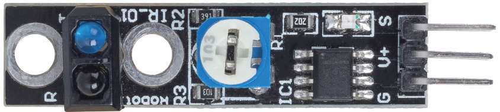
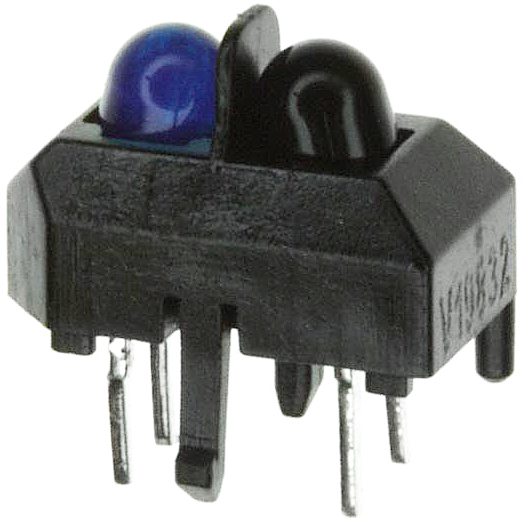

.. _cpn_track:

Line Tracking Module
================================

* S: Usually low level, high level when the black line is detected.
* V+：Power supply, 3.3v~5V
* G: Ground

This is a 1-channel Line Tracking module which, as the name suggests, tracks black lines on a white background or white lines against a black background.

The module uses a TCRT500 infrared sensor, which consists of an infrared LED (blue) and a photosensitive triplet (black).

* The blue infrared LED, when powered on, emits infrared light that is invisible to the human eye.
* The black phototransistor, which is used to receive infrared light, has an internal resistor whose resistance varies with the infrared light received; the more infrared light received, the lower its resistance decreases and vice versa.

There is a LM393 comparator on the module, which is used to compare the voltage of the phototransistor with the set voltage (adjusted by potentiometer), if it is greater than the set voltage, the output is 1; otherwise the output is 0.

Therefore, when the infrared emitter tube shines on a black surface, because the black will absorb light, the photosensitive transistor receives less infrared light, its resistance will increase (voltage increase), after LM393 comparator, the output high level.

Similarly, when it shines on a white surface, the reflected light will become more and the resistance of the photosensitive transistor will decrease (voltage decreases); therefore, the comparator outputs a low level and the indicator LED lights up.

* `TCRT5000 <https://www.vishay.com/docs/83760/tcrt5000.pdf>`_

**Features**

* Using infrared emission sensor TCRT5000
* Detection distance: 1-8mm, focal length of 2.5mm
* Comparator output signal clean, good waveform, driving capacity greater than 15mA
* Using potentiometer for sensitivity adjustment
* Operating voltage: 3.3V-5V
* Digital output: 0 (white) and 1 (black)
* Uses wide voltage LM393 comparator.
* Size: 42mmx10mm

**Example**

* :ref:`ar_line_track` (Basic Project)
* :ref:`follow_the_line` (Car Project)
* :ref:`sh_protect_heart` (Scratch Project)
