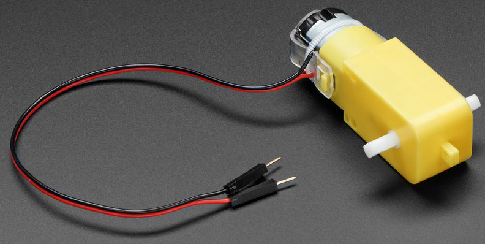

.. note:: 

    Bonjour, bienvenue dans la communauté SunFounder Raspberry Pi, Arduino et ESP32 sur Facebook ! Plongez dans l'univers de Raspberry Pi, Arduino et ESP32 avec d'autres passionnés.

    **Pourquoi nous rejoindre ?**

    - **Support d'experts** : Résolvez les problèmes après-vente et les défis techniques avec l'aide de notre communauté et de notre équipe.
    - **Apprendre et partager** : Échangez des conseils et des tutoriels pour améliorer vos compétences.
    - **Aperçus exclusifs** : Accédez en avant-première aux annonces de nouveaux produits et aux aperçus.
    - **Réductions spéciales** : Profitez de réductions exclusives sur nos derniers produits.
    - **Promotions festives et cadeaux** : Participez à des concours et des promotions spéciales.

    👉 Prêt à explorer et créer avec nous ? Cliquez sur [|link_sf_facebook|] et rejoignez-nous dès aujourd'hui !

.. _cpn_tt_motor:

Moteur TT
==============

Il s'agit d'un moteur DC à engrenage TT avec un rapport de réduction de 1:48. Il est livré avec 2 fils de 200 mm et des connecteurs mâles de 0,1", compatibles avec une plaque d'essai. Idéal pour une connexion rapide à une breadboard ou un bloc terminal.

Vous pouvez alimenter ces moteurs avec une tension de 3 à 6VDC, sachant qu'ils tourneront un peu plus vite à des tensions plus élevées.

Notez que ce sont des moteurs basiques, sans encodeur intégré, contrôle de vitesse ou retour de position. La tension est appliquée et le moteur tourne. Il peut y avoir des variations d'un moteur à l'autre. Si vous avez besoin de mouvements précis, vous devrez utiliser un système de retour séparé.

**Caractéristiques techniques**

* Tension nominale : 3~6V
* Courant à vide continu : 150mA +/- 10%
* Vitesse minimale de fonctionnement (3V) : 90+/- 10% RPM
* Vitesse minimale de fonctionnement (6V) : 200+/- 10% RPM
* Couple de blocage (3V) : 0,4kg.cm
* Couple de blocage (6V) : 0,8kg.cm
* Rapport de réduction : 1:48
* Dimensions du corps : 70 x 22 x 18mm
* Longueur des fils : 200mm & 28 AWG
* Poids : 30,6g

**Plan dimensionnel**

.. image:: img/motor_size.jpg

**Exemple**

* :ref:`ar_motor` (Projet de base)
* :ref:`car_move` (Projet voiture)
* :ref:`car_speed` (Projet voiture)
* :ref:`iot_car` (Projet IoT)

.. * :ref:`sh_test` (Projet Scratch)
