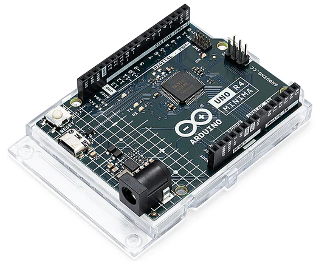

.. _cpn_uno:

Arduino Uno R4 Minima
=================================

**概要**

強化され、向上したArduino UNO R4 Minimaは、Renesasの優れた32ビットマイクロコントローラーを搭載しています。増強された処理能力、拡大したメモリ、そして新たなオンボード周辺機器のレベルを体験してください。最も良い点は？既存のシールドやアクセサリーとの互換性はそのまま保たれ、標準のフォームファクターや5 Vの動作電圧を変更する必要はありません。

Arduinoのエコシステムに参加するUNO R4は、初心者から熟練した電子工学の愛好家まで適している信頼性の高い追加品です。プロジェクトの境界を押し広げたいのか、それともちょうど始めたばかりのかに関わらず、この頑丈なボードは毎回信頼性の高いパフォーマンスを提供します。

UNO R4 Minimaが提供する特長：

* UNO形状とのハードウェア互換性：UNO R4 Minimaは、前身であるUNO R3と同じフォームファクター、ピン配置、および5 Vの動作電圧を保持しています。これにより、Arduino UNOの既存のシールドやプロジェクトのシームレスな移行が保証され、すでに確立されたArduino UNOの広範囲で独特なエコシステムを利用できます。
* 拡張メモリと高速クロック：より正確な計算と複雑なプロジェクトの容易な取り扱いのための準備をしてください。UNO R4 Minimaは、メモリを増やし、クロック速度を速めることで、要求の高いタスクにも努力なく対応できます。
* 追加のオンボード周辺機器：UNO R4 Minimaには、12ビットDAC、CAN BUS、OP AMPを含む一連のオンボード周辺機器が導入されています。これらの追加コンポーネントにより、デザインにおいて拡張された機能と柔軟性を手に入れることができます。
* 24 Vの拡張許容範囲：UNO R4 Minimaは、最大24 Vまでの電源供給を許容するようになりました。これにより、モーターやLEDストリップ、その他のアクチュエータとのシームレスな統合が可能になり、単一の電源を利用することでプロジェクトの単純化が実現します。
* SWDコネクタ：デバッグは、あらゆるプロジェクトの重要な側面です。外部のデバッガをUNO R4 Minimaに接続するだけで、システムの内部動作を努力なく監視できます。コントロールを保ち、貴重な洞察を得ることができます。
* HIDサポート：UNO R4 Minimaは、組み込みのHID（Human Interface Device）サポートを備えており、USBケーブルを介してコンピュータに接続すると、マウスやキーボードをシミュレートすることができます。この便利な機能により、キーストロークやマウスの動きをコンピュータに送信するのが簡単になり、使用性と機能性が向上します。

**技術仕様**

* ボード:
    * 名称: Arduino® UNO R4 Minima
    * SKU: ABX00080
* マイクロコントローラ: Renesas RA4M1 (Arm® Cortex®-M4)
* USB: USB-C® プログラミングポート
* ピン:
    * デジタルI/Oピン: 14
    * アナログ入力ピン: 6
    * DAC: 1
    * PWMピン: 6
* 通信:
    * UART: あり, 1x
    * I2C: あり, 1x
    * SPI: あり, 1x
    * CAN: あり 1 CAN Bus
* 電源:
    * 回路動作電圧: 5 V
    * 入力電圧 (VIN): 6-24 V
    * DC電流/ I/Oピンあたり: 8 mA
* クロック速度 メインコア 48 MHz
* メモリ RA4M1 256 kB Flash, 32 kB RAM
* サイズ:
    * 幅: 68.85 mm
    * 長さ: 53.34 mm

**ピン配置**

.. image:: img/uno_r4_pinsout.png
    :width: 800

* |link_r4_datasheet|
* |link_r4_schematic|
* |link_r4_doc|

.. SunFounder R4ボード
.. ===========================

.. .. image:: img/uno_r3.jpg
..     :width: 600
..     :align: center

.. .. note::

..     SunFounder R4ボードは、`Arduino Uno <https://store.arduino.cc/products/arduino-uno-rev3/>`_とほぼ同じ機能を持つメインボードであり、両方のボードは交換して使用できます。

.. SunFounder R4ボードは、ATmega328P（`データシート <http://ww1.microchip.com/downloads/en/DeviceDoc/Atmel-7810-Automotive-Microcontrollers-ATmega328P_Datasheet.pdf>`_）を基盤とするマイクロコントローラボードです。14個のデジタル入出力ピン（そのうち6個はPWM出力として使用できます）、6個のアナログ入力、16 MHzのセラミックレゾネータ（CSTCE16M0V53-R0）、USB接続、電源ジャック、ICSPヘッダ、リセットボタンを備えています。マイクロコントローラをサポートするために必要なものはすべて含まれています。USBケーブルでコンピュータに接続するか、AC-DCアダプタやバッテリで電源を供給して開始します。

.. **技術パラメータ**

.. .. image:: img/uno.jpg
..     :align: center

.. * マイクロコントローラ: ATmega328P
.. * 動作電圧: 5V
.. * 入力電圧（推奨）: 7-12V
.. * 入力電圧（制限）: 6-20V
.. * デジタルI/Oピン: 14 (0-13, うち6つはPWM出力（3, 5, 6, 9-11）を提供)
.. * PWMデジタルI/Oピン: 6 (3, 5, 6, 9-11)
.. * アナログ入力ピン: 6 (A0-A5)
.. * DC電流/I/Oピンあたり: 20 mA
.. * 3.3VピンのDC電流: 50 mA
.. * フラッシュメモリ: 32 KB（ATmega328P）、うち0.5 KBはブートローダに使用されます
.. * SRAM: 2 KB (ATmega328P)
.. * EEPROM: 1 KB (ATmega328P)
.. * クロック速度: 16 MHz
.. * LED_BUILTIN: 13
.. * 長さ: 68.6 mm
.. * 幅: 53.4 mm
.. * 重さ: 25 g
.. * I2Cポート: A4(SDA), A5(SCL)

.. **その他**

.. * `Arduino IDE <https://www.arduino.cc/en/software>`_
.. * `Arduinoプログラミング言語リファレンス <https://www.arduino.cc/reference/en/>`_
.. * :ref:`install_arduino`
.. * `ATmega328P データシート <http://ww1.microchip.com/downloads/en/DeviceDoc/Atmel-7810-Automotive-Microcontrollers-ATmega328P_Datasheet.pdf>`_

