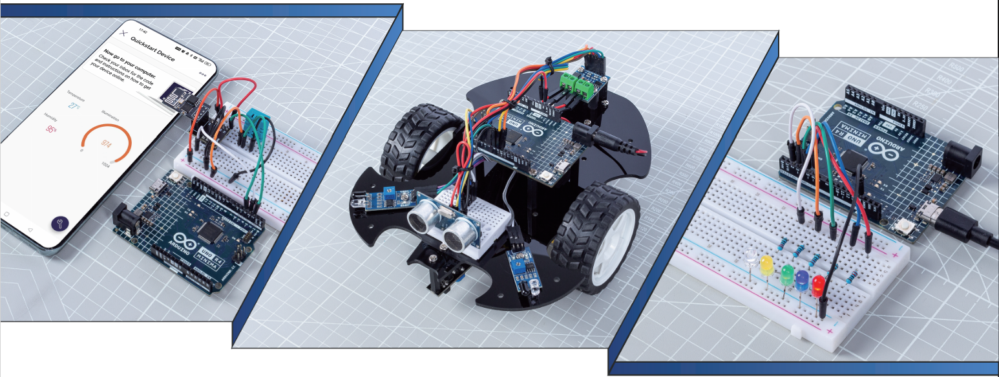

SunFounder 3 in 1 IoT/Smart Car/Learning Kit
==================================================

When you bought a learning kit online, did it come with a simple PDF or booklet with only the steps to build the project?

Or maybe you want to build your own smart car, but the ones you find online are pricey and complicated？

Or have you seen useful and interesting IoT projects made by others, but have no idea where to start?

All these problems can be solved with our 3 in 1 ultimate kit.

In the 3-in-1 ultimate kit, you will find a complete Arduino course to help beginners learn Arduino, as well as a wide variety of interesting projects that other learning kits do not offer, such as smart car projects and IoT projects. You will master Arduino as long as you follow the kit's course step by step, instead of just copying and pasting code, you will write your own code and implement your Arduino project however you like.

In addition, the kit also provides 30+ Scratch programming projects for younger students and enthusiasts, so beginners don't need any programming experience to write and make their own creations!

Come on! Start programing Arduino with confidence from zero to hero!

If you have any questions or other interesting ideas, feel free to send an email to cs@sunfounder.com.

**About the display language**

In addition to English, we are working on other languages for this course. Please contact service@sunfounder.com if you are interested in helping, and we will give you a free product in return. 
In the meantime, we recommend using Google Translate to convert English to the language you want to see.

The steps are as follows.

* In this course page, right-click and select **Translate to xx**. If the current language is not what you want, you can change it later.

.. image:: img/translate1.png
    :align: center

* There will be a language popup in the upper right corner. Click on the menu button to **choose another language**.

.. image:: img/translate2.png
    :align: center

* Select the language from the inverted triangle box, and then click **Done**.

.. image:: img/translate3.png
    :align: center

.. toctree::
    :maxdepth: 2

    About this Kit <self>
    components/component_list
    arduino_start/get_start
    download_code
    basic_project/basic_project
    car_project/car_project
    iot_project/iot_project
    faq/faq
    thank-learning

Copyright Notice
-----------------------

All contents including but not limited to texts, images, and code in this manual are owned by the SunFounder Company. You should only use it for personal study, investigation, enjoyment, or other non-commercial or nonprofit purposes, under the related regulations and copyrights laws, without infringing the legal rights of the author and relevant right holders. For any individual or organization that uses these for commercial profit without permission, the Company reserves the right to take legal action.

.. include:: test/test.rst