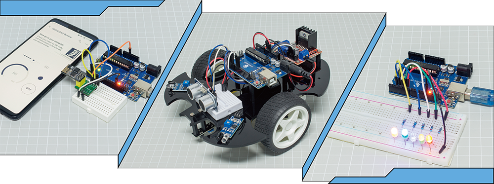

SunFounder 3 in 1 IoT/Smart Car/Learning Kit
==================================================

Thanks for choosing our 3 in 1 starter kit.

.. note::
    This document is available in the following languages.

        * |link_german_tutorials|
        * |link_jp_tutorials|
        * |link_en_tutorials|
        * |link_fr_tutorials|
        * |link_es_tutorials|
    
    Please click on the respective links to access the document in your preferred language.

When you bought a learning kit online, did it come with a simple PDF or booklet with only the steps to build the project?

Or maybe you want to build your own smart car, but the ones you find online are pricey and complicated？

Or have you seen useful and interesting IoT projects made by others, but have no idea where to start?

All these problems can be solved with our 3 in 1 starter kit.

In the 3-in-1 starter kit, you will find a complete Arduino course to help beginners learn Arduino, as well as a wide variety of interesting projects that other learning kits do not offer, such as smart car projects and IoT projects. You will master Arduino as long as you follow the kit's course step by step, instead of just copying and pasting code, you will write your own code and implement your Arduino project however you like.

In addition, the kit also provides 30+ Scratch programming projects for younger students and enthusiasts, so beginners don't need any programming experience to write and make their own creations!

Come on! Start programing Arduino with confidence from zero to hero!

If you have any questions, please send an email to service@sunfounder.com and we will respond as soon as possible.

**About the display language**

This document is available in other languages as well. To switch the display language, kindly click on the **Read the Docs** icon located in the lower left corner of the page.

.. image:: img/translation.png

**Contents**

.. toctree::
    :maxdepth: 2

    About this Kit <self>
    components/component_list
    arduino_start/get_start
    arduino_video_course/arduino_video_course
    download_code
    basic_project/basic_project
    car_project/car_project
    iot_project/iot_project
    pictoblox/play_with_scratch
    video_course
    faq/faq
    thank-learning

Copyright Notice
-----------------------

All contents including but not limited to texts, images, and code in this manual are owned by the SunFounder Company. You should only use it for personal study, investigation, enjoyment, or other non-commercial or nonprofit purposes, under the related regulations and copyrights laws, without infringing the legal rights of the author and relevant right holders. For any individual or organization that uses these for commercial profit without permission, the Company reserves the right to take legal action.
