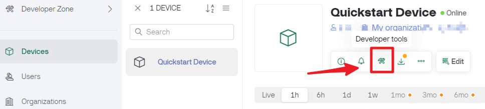
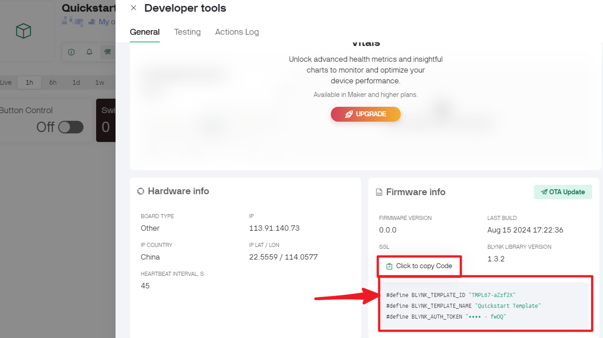

.. note::

    こんにちは、SunFounderのRaspberry Pi & Arduino & ESP32愛好家コミュニティへようこそ！Facebook上でRaspberry Pi、Arduino、ESP32についてもっと深く掘り下げ、他の愛好家と交流しましょう。

    **参加する理由は？**

    - **エキスパートサポート**：コミュニティやチームの助けを借りて、販売後の問題や技術的な課題を解決します。
    - **学び＆共有**：ヒントやチュートリアルを交換してスキルを向上させましょう。
    - **独占的なプレビュー**：新製品の発表や先行プレビューに早期アクセスしましょう。
    - **特別割引**：最新製品の独占割引をお楽しみください。
    - **祭りのプロモーションとギフト**：ギフトや祝日のプロモーションに参加しましょう。

    👉 私たちと一緒に探索し、創造する準備はできていますか？[|link_sf_facebook|]をクリックして今すぐ参加しましょう！

.. _connect_blynk:

1.3 R4ボードをBlynkに接続する
===============================

#. ESP8266モジュールとR4ボードを再接続します。ここではソフトウェアシリアルを使用しているため、TXとRXはそれぞれR4ボードの2番ピンと3番ピンに接続されます。

    .. note::

        ESP8266モジュールは安定した動作環境を提供するために高電流が必要ですので、9Vの電池が接続されていることを確認してください。

    .. image:: img/iot_1.4_bb.png

#. **devices** ページをクリックすると、作成した新しいデバイスが表示されます。次に、開発者ツールをクリックします。

#. **Firmware info** に ``TEMPLATE_ID`` 、 ``DEVICE_NAME`` 、 ``AUTH_TOKEN`` が表示されます。後でコピーする必要があります。

#. ``3in1-kit\iot_project\1.connect`` のパスの下にある ``1.connect.ino`` ファイルを開くか、このコードを **Arduino IDE** にコピーします。

    .. raw:: html
        
        <iframe src=https://create.arduino.cc/editor/sunfounder01/1c0c1a8f-2551-484f-9f4f-d5d4117cc864/preview?embed style="height:510px;width:100%;margin:10px 0" frameborder=0></iframe>

#. あなたのアカウントの **Firmware info** ページからコピーできる以下の3行のコードを置き換えます。これら3行のコードにより、R4ボードがあなたのblynkアカウントを見つけることができます。

    .. code-block:: arduino

        #define BLYNK_TEMPLATE_ID "TMPLxxxxxx"
        #define BLYNK_DEVICE_NAME "Device"
        #define BLYNK_AUTH_TOKEN "YourAuthToken"
    

#. 使用中のWiFiの ``ssid`` および ``password`` を入力します。

    .. code-block:: arduino

        char ssid[] = "ssid";
        char pass[] = "password";

#. コードをR4ボードにアップロードし、シリアルモニタを開いてボーレートを115200に設定します。R4ボードがBlynkと正常に通信すると、シリアルモニタに ``ready`` 文字が表示されます。

    .. image:: img/blynk_connect_network.png

    .. note::
    
        接続時に ``ESP is not responding`` というメッセージが表示される場合は、以下の手順に従ってください。

        * 9Vの電池が接続されていることを確認します。
        * ESP8266モジュールのRSTピンを1秒間GNDに接続してリセットし、その後、それを取り外します。
        * R4ボードのリセットボタンを押します。

        これらの操作を3-5回繰り返す必要がある場合があります。ご了承ください。

#. Blynkのステータスが **offline** から **online** に変わります。

    .. image:: img/sp220607_170326.png
