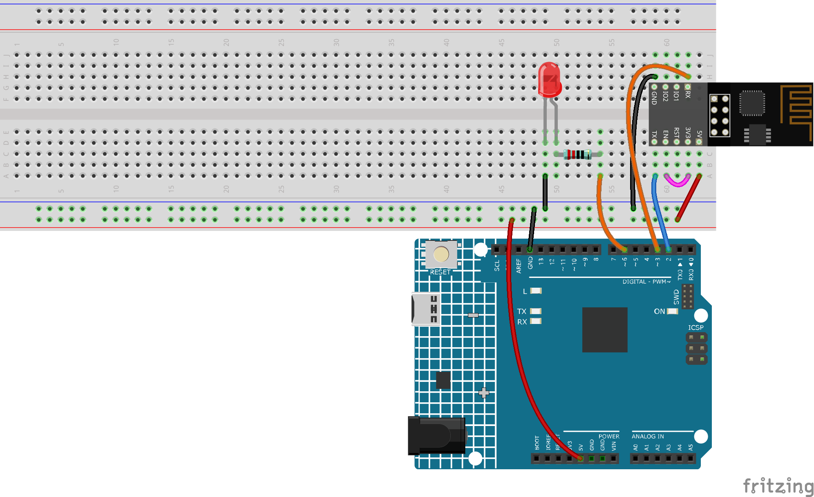

.. note::

    こんにちは、SunFounderのRaspberry Pi & Arduino & ESP32愛好家コミュニティへようこそ！Facebook上でRaspberry Pi、Arduino、ESP32についてもっと深く掘り下げ、他の愛好家と交流しましょう。

    **参加する理由は？**

    - **エキスパートサポート**：コミュニティやチームの助けを借りて、販売後の問題や技術的な課題を解決します。
    - **学び＆共有**：ヒントやチュートリアルを交換してスキルを向上させましょう。
    - **独占的なプレビュー**：新製品の発表や先行プレビューに早期アクセスしましょう。
    - **特別割引**：最新製品の独占割引をお楽しみください。
    - **祭りのプロモーションとギフト**：ギフトや祝日のプロモーションに参加しましょう。

    👉 私たちと一緒に探索し、創造する準備はできていますか？[|link_sf_facebook|]をクリックして今すぐ参加しましょう！

.. _iot_blink:

2. Blynkからデータを取得する
=================================

この章では、Blynkを使用して回路を制御する方法を学びます。インターネットを介してLEDを点灯させましょう！

**必要な部品**

このプロジェクトでは、以下のコンポーネントが必要です。

キット全体を購入すると非常に便利です。こちらがリンクです：

.. list-table::
    :widths: 20 20 20
    :header-rows: 1

    *   - 名前
        - このキットのアイテム
        - リンク
    *   - 3 in 1 Starter Kit
        - 380+
        - |link_3IN1_kit|

以下のリンクからそれぞれ個別に購入することもできます。

.. list-table::
    :widths: 30 20
    :header-rows: 1

    *   - コンポーネントの紹介
        - 購入リンク

    *   - :ref:`cpn_uno`
        - \-
    *   - :ref:`cpn_breadboard`
        - |link_breadboard_buy|
    *   - :ref:`cpn_esp8266`
        - |link_esp8266_buy|
    *   - :ref:`cpn_wires`
        - |link_wires_buy|
    *   - :ref:`cpn_resistor`
        - |link_resistor_buy|
    *   - :ref:`cpn_led`
        - |link_led_buy|

**1. 回路を組む**

.. note::

    ESP8266モジュールは安定した動作環境を提供するために高電流が必要ですので、9Vの電池が接続されていることを確認してください。

**2. ダッシュボードを編集**

#. 以前に作成した **Quickstart Device** に移動し、右上のメニューアイコンをクリックして **edit dashboard** を選択します。

    .. image:: img/sp220609_112825.png

#. Datastreamsは、Blynkのウィジェットとボード上のコードがお互いを認識することを可能にします。完全な設定プロセスを体験するために、DatastreamsページからすべてのDatastreamsを削除します。

    .. image:: img/sp220609_114723.png

#. Datastreamsを削除する前に、警告を慎重に読み、それが正しいことを確認してください。

    .. image:: img/sp220609_114929.png

#. Blynkのスイッチを使用してLEDを制御するために使用される **Virtual Pin** タイプのDatastreamを作成します。

    .. image:: img/sp220609_115124.png

#. **Virtual Pin** を設定します。ボタンとLEDはONとOFFのみ必要なので、DATA TYPEを ``Integer`` に設定し、MINとMAXを ``0`` と ``1`` に設定します。

    .. image:: img/sp220609_115520.png

#. **Web Dashboard** ページに移動し、既存のウィジェットを削除します。

    .. image:: img/sp220609_133707.png

#. 左の **Widget Box** から **switch** ウィジェットをドラッグアンドドロップします。

    .. image:: img/sp220609_114508.png

#. 次に、それを設定します。

    .. image:: img/sp20220615180127.png

#. **Datastream** を以前に設定したものとして選択します。

    .. image:: img/sp220609_133741.png

#. Datastreamを選択すると、いくつかのカスタム設定が表示されます。それを確認したら、保存をクリックします。

    .. image:: img/sp220609_133950.png

#. 最後に、 **Save And Apply** をクリックします。

    .. image:: img/sp220609_141733.png

**3. コードの実行**

#. ``3in1-kit\iot_project\2.get_data_from_blynk`` のパスの下の ``2.get_data_from_blynk.ino`` ファイルを開くか、このコードを **Arduino IDE** にコピーしてください。

    .. raw:: html
        
        <iframe src=https://create.arduino.cc/editor/sunfounder01/06b187a8-dabf-4866-b38c-742e0446cc3f/preview?embed style="height:510px;width:100%;margin:10px 0" frameborder=0></iframe>

#. ``Template ID``、 ``Device Name``、および ``Auth Token`` を自分のものに置き換えてください。使用しているWiFiの ``ssid`` と ``password`` も入力する必要があります。詳しいチュートリアルについては、 :ref:`connect_blynk` を参照してください。

#. 正しいボードとポートを選択した後、 **Upoad** ボタンをクリックします。

    .. image:: img/2_upload.png

#. シリアルモニタを開く（ボーレートを115200に設定）し、成功した接続のようなプロンプトが表示されるのを待ちます。

    .. image:: img/2_ready.png

    .. note::

        接続時に ``ESP is not responding`` というメッセージが表示された場合は、以下の手順に従ってください。

        * 9Vの電池が接続されていることを確認してください。
        * RSTピンを1秒間GNDに接続してESP8266モジュールをリセットし、それを抜きます。
        * ボードのリセットボタンを押します。

        こうした操作を3〜5回繰り返す必要があることもありますので、お待ちください。

#. Blynkに戻ると、ステータスがオンラインに変わり、blynkのスイッチウィジェットでR4ボードに接続されたLEDを制御できるようになります。

    .. image:: img/2_blynk_button.png

#. Blynkをモバイルデバイスで使用したい場合は、 :ref:`blynk_mobile` を参照してください。

**どのように動作するのか？**

このプロジェクトのコードと前章の :ref:`connect_blynk` のコードの違いは以下の行です。

.. code-block:: arduino

    const int ledPin=6;

    BLYNK_WRITE(V0)
    {
        int pinValue = param.asInt(); // ピン V0 からの受信値を変数に代入する
         // 以下も使用できます。
         // 文字列 i = param.asStr();
         // ダブル d = param.asDouble();
        digitalWrite(ledPin,pinValue);
    }

    void setup()
    {
        pinMode(ledPin,OUTPUT);
    }

ledPinの ``pinMode`` および ``digitalWrite`` に関しては、既によく知っていると思いますので、再度説明しません。注目すべきは ``BLYNK_WRITE(V0)`` 関数です。

これにより、Blynkの ``V0`` の値が変わると、Blynk.Cloudはデバイスに「私は **Virtual Pin** V0に書き込んでいます」と伝え、デバイスはこの情報を取得すると何かを実行できるようになります。

前の手順で V0 データストリームを作成し、それをスイッチ ウィジェットに適用しました。
これは、Switch Widget を操作するたびに ``BLYNK_WRITE(V0)`` がトリガーされることを意味します。

この関数には2つの指示を書きました。

.. code-block:: arduino

    int pinValue = param.asInt();

V0の値を取得し、変数 ``pinValue`` に割り当てます。

.. code-block:: arduino

    digitalWrite(ledPin,pinValue);

BlynkのスイッチウィジェットがLEDを制御できるように、取得したV0の値をledPinに書き込みます。

