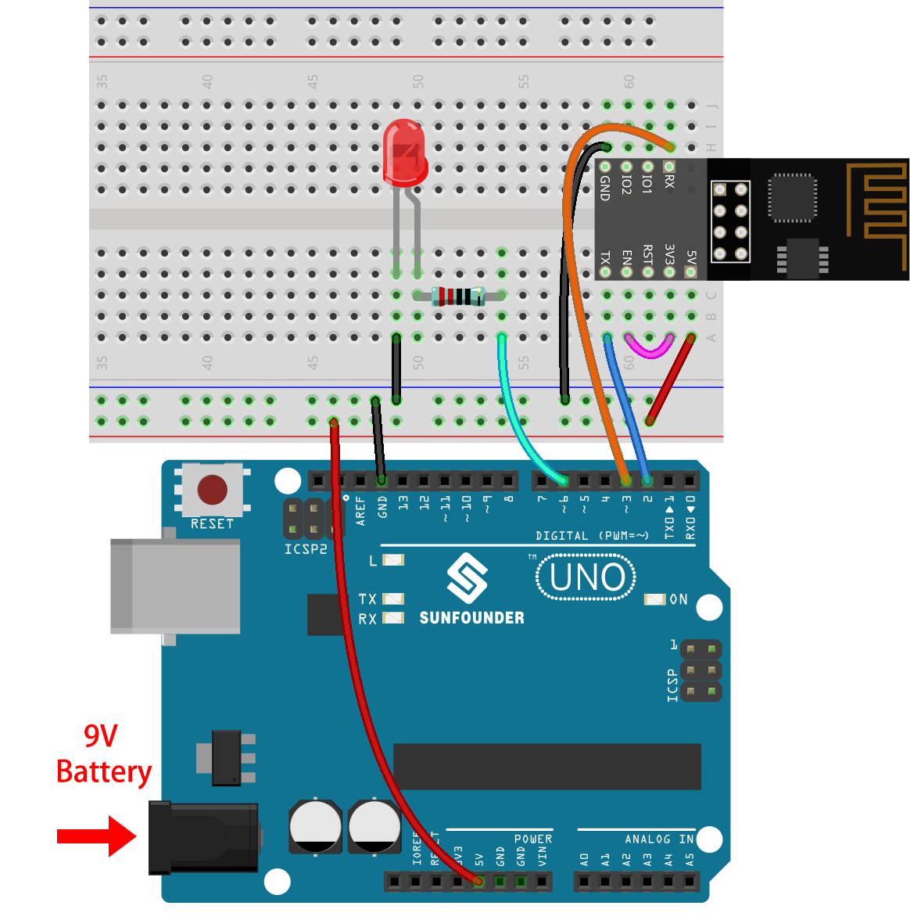

.. _iot_blink:

2. Daten von Blynk abrufen
=================================

In diesem Kapitel erfahren Sie, wie Sie den Schaltkreis mit Blynk steuern können. Lassen Sie uns die LEDs über das Internet leuchten!

**Benötigte Komponenten**

Für dieses Projekt benötigen wir die folgenden Komponenten.

Es ist definitiv praktisch, ein ganzes Set zu kaufen. Hier ist der Link:

.. list-table::
    :widths: 20 20 20
    :header-rows: 1

    *   - Name
        - ARTIKEL IN DIESEM KIT
        - LINK
    *   - 3 in 1 Starter Kit
        - 380+
        - |link_3IN1_kit|

Sie können sie auch separat über die untenstehenden Links kaufen.

.. list-table::
    :widths: 30 20
    :header-rows: 1

    *   - KOMPONENTENBESCHREIBUNG
        - KAUF-LINK
    *   - :ref:`cpn_uno`
        - |link_Uno_R3_buy|
    *   - :ref:`cpn_breadboard`
        - |link_breadboard_buy|
    *   - :ref:`cpn_esp8266`
        - |link_esp8266_buy|
    *   - :ref:`cpn_wires`
        - |link_wires_buy|
    *   - :ref:`cpn_resistor`
        - |link_resistor_buy|
    *   - :ref:`cpn_led`
        - |link_led_buy|

**1. Schaltkreis aufbauen**

.. note::

    Das ESP8266-Modul benötigt einen hohen Strom, um eine stabile Betriebsumgebung zu gewährleisten. Stellen Sie daher sicher, dass die 9V-Batterie angeschlossen ist.

**2. Dashboard bearbeiten**

#. Rufen Sie das zuvor erstellte **Schnellstartgerät** auf und klicken Sie auf das Symbol **Dashboard bearbeiten**.

    .. image:: img/blynk_edit_dashboard.png

#. Datenströme ermöglichen die Erkennung zwischen den Widgets auf Blynk und dem Code auf dem R3-Board.

    .. image:: img/blynk_edit_datastream.png

#. Um den gesamten Konfigurationsprozess zu erleben, entfernen Sie alle Datenströme von der Datenstromseite.

    .. image:: img/blynk_edit_datastream_delete.png

#. Erstellen Sie einen Datenstrom vom Typ **Virtueller Pin**, der verwendet wird, um die LED über Blynks Schalter zu steuern.

    .. image:: img/blynk_edit_virtualpin.png

#. Konfigurieren Sie den **Virtuellen Pin**. Da der Knopf und die LED nur EIN und AUS benötigen, stellen Sie den DATENTYP auf ``Integer`` und MIN und MAX auf ``0`` und ``1`` ein.

    .. image:: img/sp220609_115520.png

#. Wechseln Sie zur Seite **Web-Dashboard**.

    .. image:: img/blynk_edit_web_dashboard.png

#. Und löschen Sie die vorhandenen Widgets.

    .. image:: img/blynk_edit_delete_dashboard.png

#. Ziehen Sie ein **Schalter**-Widget aus der **Widget-Box** links.

    .. image:: img/blynk_edit_drag_switch_widget.png

#. Richten Sie es jetzt ein.

    .. image:: img/blynk_edit_edit_widget.png

#. Wählen Sie **Datastream** wie zuvor eingestellt.

    .. image:: img/sp220609_133741.png

#. Nach Auswahl von Datastream sehen Sie einige benutzerdefinierte Einstellungen. Drücken Sie dann auf Speichern.

    .. image:: img/sp220609_133950.png

#. Klicken Sie abschließend auf **Save And Apply**.

    .. image:: img/sp220609_141733.png

**3. Den Code ausführen**

#. Öffnen Sie die Datei ``2.get_data_from_blynk.ino`` unter dem Pfad ``3in1-kit\iot_project\2.get_data_from_blynk``, oder kopieren Sie diesen Code in die **Arduino IDE**.

    .. raw:: html
        
        <iframe src=https://create.arduino.cc/editor/sunfounder01/06b187a8-dabf-4866-b38c-742e0446cc3f/preview?embed style="height:510px;width:100%;margin:10px 0" frameborder=0></iframe>

#. Ersetzen Sie die ``Template ID``, ``Device Name`` und ``Auth Token`` durch Ihre eigenen. Geben Sie auch die ``ssid`` und das ``password`` Ihres WiFi ein. Für detaillierte Anleitungen verweisen Sie bitte auf :ref:`connect_blynk`.

#. Wählen Sie das richtige Board und den richtigen Port aus und klicken Sie auf den **Upoad**-Button.

    .. image:: img/2_upload.png

#. Öffnen Sie den Seriellen Monitor (Baudrate auf 115200 einstellen) und warten Sie auf eine Aufforderung, z.B. eine erfolgreiche Verbindung.

    .. image:: img/2_ready.png

    .. note::

        Wenn beim Verbinden die Meldung ``ESP antwortet nicht`` erscheint, befolgen Sie bitte diese Schritte.

        * Stellen Sie sicher, dass die 9V-Batterie angeschlossen ist.
        * Setzen Sie das ESP8266-Modul zurück, indem Sie den Pin RST für 1 Sekunde auf GND legen und dann wieder entfernen.
        * Drücken Sie den Reset-Button auf dem R3-Board.

        Manchmal müssen Sie den obigen Vorgang 3-5 Mal wiederholen, bitte haben Sie Geduld.

#. Zurück bei Blynk sehen Sie, dass der Status auf online geändert wurde und Sie können nun das Schalter-Widget auf Blynk verwenden, um die an das R3-Board angeschlossene LED zu steuern.

    .. image:: img/blynk_button_on.png

#. Wenn Sie Blynk auf mobilen Geräten verwenden möchten, verweisen Sie bitte auf :ref:`blynk_mobile`.

**Wie funktioniert das?**

Der Unterschied zwischen dem Code in diesem Projekt und dem Code im vorherigen Kapitel :ref:`connect_blynk` sind die folgenden Zeilen.

.. code-block:: arduino

    const int ledPin=6;

    BLYNK_WRITE(V0)
    {
        int pinValue = param.asInt();// Zuweisen des eingehenden Werts von Pin V0 zu einer Variablen
         // Sie können auch Folgendes verwenden:
         // String i = param.asStr();
         // double d = param.asDouble();
        digitalWrite(ledPin,pinValue);
    }

    void setup()
    {
        pinMode(ledPin,OUTPUT);
    }

Bezüglich der ``pinMode`` und ``digitalWrite`` des ledPin bin ich sicher, dass Sie bereits damit vertraut sind, deshalb werde ich sie nicht noch einmal erklären. Worauf Sie sich konzentrieren müssen, ist die Funktion ``BLYNK_WRITE(V0)``.

Was sie macht ist, dass, wenn der Wert von Blynks ``V0`` sich ändert, Blynk.Cloud Ihrem Gerät mitteilt "Ich schreibe auf den **Virtual Pin** V0", und Ihr Gerät wird in der Lage sein, etwas auszuführen, sobald es diese Information erhält.

Wir haben im vorherigen Schritt den V0 Datastream erstellt und ihn dem Switch-Widget zugewiesen.
Das bedeutet, dass jedes Mal, wenn wir das Switch-Widget bedienen, ``BLYNK_WRITE(V0)`` ausgelöst wird.

Wir schreiben zwei Anweisungen in dieser Funktion.

.. code-block:: arduino

    int pinValue = param.asInt();

Holen Sie sich den Wert von V0 und weisen Sie ihn der Variable ``pinValue`` zu.

.. code-block:: arduino

    digitalWrite(ledPin,pinValue);

Schreiben Sie den erhaltenen Wert von V0 auf den ledPin, sodass das Schalter-Widget auf Blynk die LED steuern kann.

