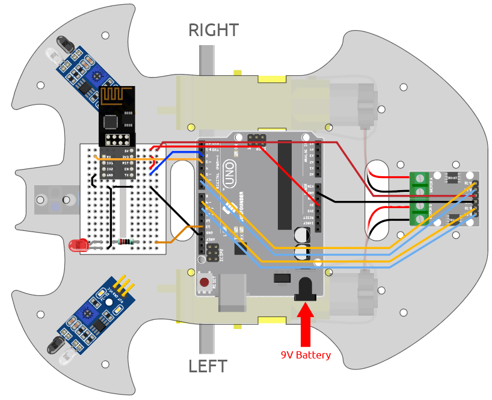

.. _iot_car:

8. Coche IoT
====================

Para este proyecto, utilizamos la aplicación Blynk en el teléfono móvil para controlar el coche. Sin embargo, necesitas consultar :ref:`car_projects` para montar el coche y obtener una comprensión básica de él.
En la era de la popularidad de la red 5G, este modo puede convertirse en uno de los principales métodos de producción en muchas industrias, así que vamos a experimentar este juego por adelantado.

**1. Construir el Circuito**

**2. Editar el Tablero de Mandos**

Blynk en móvil no puede editar Datastream, por lo que aún necesitamos hacer estos pasos en el lado web.

#. Crea un **Datastream** de tipo **Virtual Pin** en la página de **Datastream**, para registrar el valor del eje X del joystick. Configura NOMBRE a ``Xvalue``, TIPO DE DATO a ``Integer``, y MIN y MAX a ``-10`` y ``10``.

    .. image:: img/sp220613_164507.png

#. Crea un **Datastream** de tipo **Virtual Pin** para registrar el valor del eje Y del joystick. Configura NOMBRE a ``Yvalue``, TIPO DE DATO a ``Integer``, MIN y MAX a ``-10`` y ``10``.

    .. image:: img/sp220613_164717.png

Luego necesitas hacer lo siguiente en tu teléfono.

1. Busca "Blynk IoT" (no Blynk(legacy)) en GOOGLE Play o APP Store para descargarla.
2. Después de abrir la APP, inicia sesión, esta cuenta debe ser la misma que la utilizada en el cliente web.
3. Luego ve al Tablero de Control (si no tienes uno, crea uno) y verás que el Tablero de Control para móvil y web son independientes entre sí.

.. image:: img/APP_1.jpg

4. Haz clic en el Icono de Edición.
5. Haz clic en el área en blanco.
6. Selecciona un widget de Joystick.

.. image:: img/APP_2.jpg

7. Ahora verás un widget de Joystick aparecer en el área en blanco, haz clic en él.
8. Aparecerán los Ajustes del Joystick, selecciona los valores Xvalue y Yvalue que acabas de configurar en los datastreams.
9. Vuelve a la página del Tablero de Control y podrás operar el Joystick cuando quieras.

.. image:: img/APP_3.jpg

**3. Ejecutar el Código**

#. Abre el archivo ``8.iot_car.ino`` en la ruta ``3in1-kit\iot_project\8.iot_car``, o copia este código en **Arduino IDE**.

    .. raw:: html 
        
        <iframe src=https://create.arduino.cc/editor/sunfounder01/a1db6c35-2f26-425c-8636-53d2df7936d7/preview?embed style="height:510px;width:100%;margin:10px 0" frameborder=0></iframe>

#. Reemplaza el ``Template ID``, ``Device Name`` y ``Auth Token`` con los tuyos. También necesitas ingresar el ``ssid`` y ``password`` del WiFi que estás utilizando. Para tutoriales detallados, consulta :ref:`connect_blynk`.
#. Tras seleccionar la placa y puerto correctos, haz clic en el botón **Upoad**.

#. Abre el monitor Serial(configura la tasa de baudios a 115200) y espera un aviso como una conexión exitosa.

    .. image:: img/2_ready.png

    .. note::

        Si aparece el mensaje ``ESP is not responding`` al conectar, sigue estos pasos.

        * Asegúrate de que la batería de 9V esté conectada.
        * Restablece el módulo ESP8266 conectando el pin RST a GND durante 1 segundo, luego desenchúfalo.
        * Presiona el botón de reset en la placa R3.

        A veces, puede ser necesario repetir la operación anterior 3-5 veces, por favor ten paciencia.

#. Ahora desconecta el cable USB y alimenta el carro solo con una batería de 9V, luego espera a que se encienda el LED, indicando que el coche está conectado a Blynk.
#. Abre Blynk en tu teléfono y puedes usar el widget de Joystick para controlar el movimiento del coche.

    .. image:: img/iot_car.jpg

**¿Cómo funciona?**

Estas funciones se utilizan para controlar el movimiento del coche.

.. code-block:: arduino

    void moveForward(int speed) {...}
    void moveBackward(int speed) {...}
    void turnRight(int speed) {...}
    void turnLeft(int speed) {...}
    void stopMove() {...}

La sección IoT lee los valores del widget de Joystick y los asigna a las variables ``Xvalue`` y ``Yvalue``.

.. code-block:: arduino

    int Xvalue = 0;
    int Yvalue = 0;

    BLYNK_WRITE(V9)
    {
        Xvalue = param.asInt();
    }

    BLYNK_WRITE(V10)
    {
        Yvalue = param.asInt();
    }

En ``loop()``, haz que el coche realice diferentes acciones basadas en ``Xvalue`` y ``Yvalue``.

.. code-block:: arduino

    if (Yvalue >= 5) {
        moveForward(255);
    } else if (Yvalue <= -5) {
        moveBackward(255);
    } else if (Xvalue >= 5) {
        turnRight(150);
    } else if (Xvalue <= -5) {
        turnLeft(150);
    } else {
        stopMove();
    }

Además, añade una determinación de estado de red a ``loop()`` para encender un LED si está conectado a Blynk Cloud.

.. code-block:: arduino

    if (!Blynk.connected()) {
        digitalWrite(ledPin, LOW);
        Serial.print("offline!");
        bool result = Blynk.connect();
        Serial.println(result);
    } else {
        digitalWrite(ledPin, HIGH);
    }