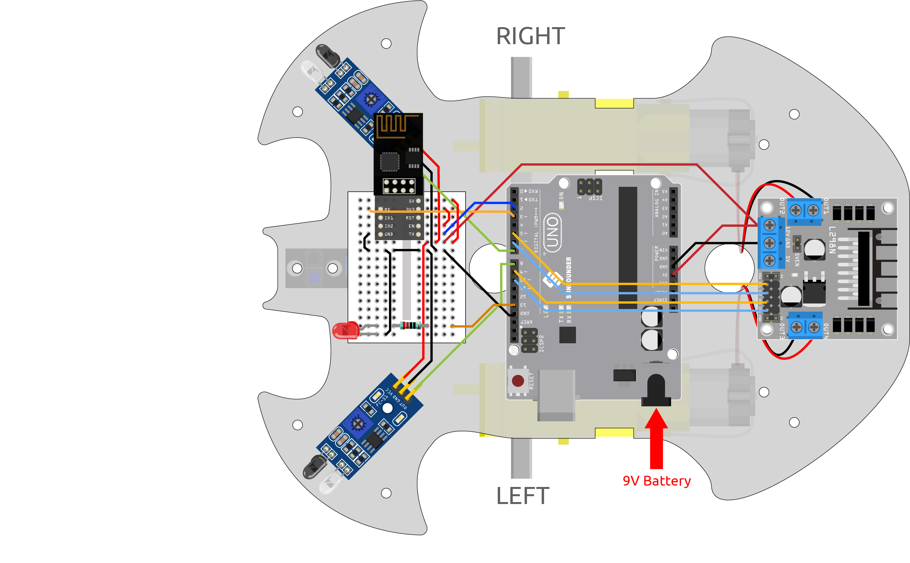

.. _iot_car:

8. IoT カー
====================

このプロジェクトでは、スマホのBlynkアプリを使用して車を制御しました。しかし、車を組み立て、基本的な理解を得るためには :ref:`car_projects` を参照する必要があります。
5Gネットワークが普及する時代に、このモードは多くの産業での主要な生産方法の一つになるかもしれません。先取りしてこの遊びを体験しましょう。

**1. 回路を組む**

**2. ダッシュボードを編集**

携帯のBlynkではデータストリームを編集できないため、これらの手順はWeb側で行う必要があります。

#. **Datastream** ページで、ジョイスティックのX軸の値を記録するための **Virtual Pin** タイプの **Datastream** を作成します。名前は ``Xvalue`` 、データタイプは ``Integer`` 、最小値と最大値は ``-10`` と ``10`` に設定します。

    .. image:: img/sp220613_164507.png

#. ジョイスティックのY軸値を記録するために、 **Virtual Pin** 型の **Datastream** を作成します。NAMEを ``Yvalue`` 、DATA TYPEを ``Integer`` 、MINとMAXを ``-10`` と ``10`` に設定する。

    .. image:: img/sp220613_164717.png

次に、携帯電話で以下の操作を行う必要があります。

1. GOOGLE PlayまたはAPP Storeで "Blynk IoT" (Blynk(legacy)ではない) を検索してダウンロードします。
2. アプリを開いた後、ログインします。このアカウントは、Webクライアントで使用されたものと同じである必要があります。
3. 次に、ダッシュボードに移動します(持っていない場合は作成します)。ここで、モバイル用とWeb用のダッシュボードが互いに独立していることがわかります。

.. image:: img/APP_1.jpg

4. 編集アイコンをクリックします。
5. 空白のエリアをクリックします。
6. ジョイスティックウィジェットを選択します。

.. image:: img/APP_2.jpg

7. 空白のエリアにジョイスティックウィジェットが表示されますので、それをクリックします。
8. ジョイスティックの設定が表示されますので、データストリームで先ほど設定したXvalueとYvalueを選択します。
9. ダッシュボードページに戻り、ジョイスティックを操作することができます。

.. image:: img/APP_3.jpg

**3. コードの実行**

#. パス ``3in1-kit\iot_project\8.iot_car`` の下にある ``8.iot_car.ino`` ファイルを開くか、このコードを **Arduino IDE** にコピーします。

    .. raw:: html 
        
        <iframe src=https://create.arduino.cc/editor/sunfounder01/b4978cad-adbb-4a65-bc3b-f860d68c3001/preview?embed style="height:510px;width:100%;margin:10px 0" frameborder=0></iframe>

#. ``Template ID`` 、 ``Device Name`` 、および ``Auth Token`` を自分のものに置き換えます。また、使用しているWiFiの ``ssid`` および ``password`` を入力する必要があります。詳しいチュートリアルは、 :ref:`connect_blynk` を参照してください。
#. 正しいボードとポートを選択した後、 **Upoad** ボタンをクリックします。

#. シリアルモニターを開き(ボーレートを115200に設定)、接続成功のようなプロンプトが表示されるのを待ちます。

    .. image:: img/2_ready.png

    .. note::

        接続時に ``ESP is not responding`` というメッセージが表示された場合は、以下の手順に従ってください。

        * 9Vのバッテリーが接続されていることを確認します。
        * ESP8266モジュールのRSTピンを1秒間GNDに接続してリセットし、その後、取り外します。
        * R3ボードのリセットボタンを押します。

        これらの操作を3-5回繰り返す必要があることもありますので、お待ちください。

#. USBケーブルを抜いて、9Vのバッテリーだけでカートに電力を供給します。LEDが点灯すると、車がBlynkに接続されていることを示しています。
#. 携帯電話のBlynkを開き、ジョイスティックウィジェットを使用して車の動きを制御します。

    .. image:: img/iot_car.jpg

**どのように動作するか?**

これらの関数は、車の動きを制御するために使用されます。

.. code-block:: arduino

    void moveForward(int speed) {...}
    void moveBackward(int speed) {...}
    void turnRight(int speed) {...}
    void turnLeft(int speed) {...}
    void stopMove() {...}

IoTセクションでは、ジョイスティックウィジェットの値を読み取り、 ``Xvalue`` と ``Yvalue`` の変数に代入します。

.. code-block:: arduino

    int Xvalue = 0;
    int Yvalue = 0;

    BLYNK_WRITE(V9)
    {
        Xvalue = param.asInt();
    }

    BLYNK_WRITE(V10)
    {
        Yvalue = param.asInt();
    }

``loop()`` の中で、 ``Xvalue`` と ``Yvalue`` に基づいて車が異なるアクションを実行するようにします。

.. code-block:: arduino

    if (Yvalue >= 5) {
        moveForward(255);
    } else if (Yvalue <= -5) {
        moveBackward(255);
    } else if (Xvalue >= 5) {
        turnRight(150);
    } else if (Xvalue <= -5) {
        turnLeft(150);
    } else {
        stopMove();
    }

また、 ``loop()`` にBlynk Cloudに接続されている場合にLEDを点灯するネットワークステータスの判定を追加します。

.. code-block:: arduino

    if (!Blynk.connected()) {
        digitalWrite(ledPin, LOW);
        Serial.print("offline!");
        bool result = Blynk.connect();
        Serial.println(result);
    } else {
        digitalWrite(ledPin, HIGH);
    }