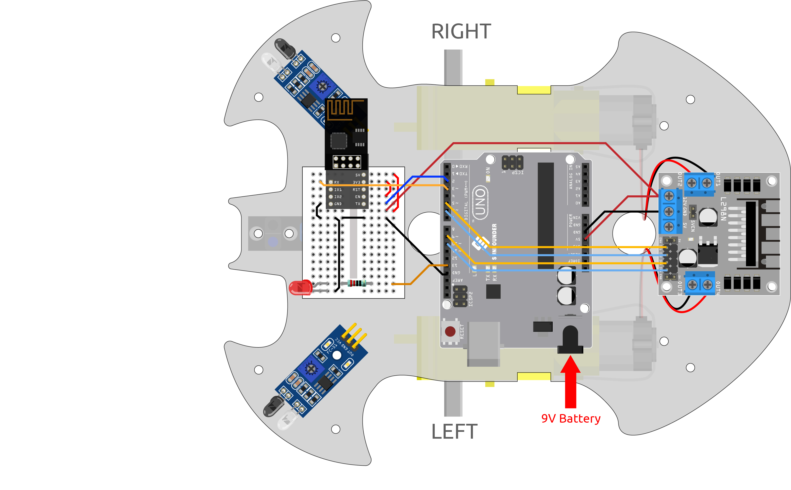

.. _iot_car:

8. IoT Car
====================

We used the Blynk APP on the cell phone to control the car for this project. But you need to refer to :ref:`car_projects` to assemble the car and to get a basic understanding of it.
In the era of 5G network popularity, this mode may become one of the main production methods in many industries, so let's experience this play in advance.

**1. Build the Cirduit**

**2. Edit Dashboard**

Blynk on mobile cannot edit Datastream, so we still need to do these steps on the web side.

#. Create a **Datastream** of type **Virtual Pin** on the **Datastream** page, to record the X-axis value of the joystick. Set NAME to ``Xvalue``, DATA TYPE to ``Integer``, and MIN and MAX to ``-10`` and ``10``.

    .. image:: img/sp220613_164507.png

#. Create a **Datastream** of type **Virtual Pin** to record the Y-axis value of the joystick. Set NAME to ``Yvalue``, DATA TYPE to ``Integer``, MIN and MAX to ``-10`` and ``10``.

    .. image:: img/sp220613_164717.png

Next you need to do the following on your phone.

1. Search for "Blynk IoT" (not Blynk(legacy)) in GOOGLE Play or APP Store to download it.
2. After opening the APP, sign in, this account should be the same as the account used on the web client.
3. Then go to Dashboard (if you don't have one, create one) and you will see that the Dashboard for mobile and web are independent of each other.

.. image:: img/APP_1.jpg

4. Click Edit Icon.
5. Click on the blank area. 
6. Select a Joystick widget.

.. image:: img/APP_2.jpg

7. Now you will see a Joystick widget appear in the blank area, click on it.
8. Joystick Settings will appear, select the Xvalue and Yvalue you just set in the datastreams.
9. Go back to the Dashboard page and you can operate the Joystick when you want.

.. image:: img/APP_3.jpg

**3. Run the Code**

#. Open the ``8.iot_car.ino`` file under the path of ``3in1-kit\iot_project\8.iot_car``, or copy this code into **Arduino IDE**.

    .. raw:: html 
        
        <iframe src=https://create.arduino.cc/editor/sunfounder01/a1db6c35-2f26-425c-8636-53d2df7936d7/preview?embed style="height:510px;width:100%;margin:10px 0" frameborder=0></iframe>

#. Replace the ``Template ID``, ``Device Name``, and ``Auth Token`` with your own. You also need to enter the ``ssid`` and ``password`` of the WiFi you are using. For detailed tutorials, please refer to :ref:`connect_blynk`.
#. After selecting the correct board and port, click the **Upoad** button.

#. Open the Serial monitor(set baudrate to 115200) and wait for a prompt such as a successful connection to appear.

    .. image:: img/2_ready.png

    .. note::

        If the message ``ESP is not responding`` appears when you connect, please follow these steps.

        * Make sure the 9V battery is plugged in.
        * Reset the ESP8266 module by connecting the pin RST to GND for 1 second, then unplug it.
        * Press the reset button on the R3 board.

        Sometimes, you may need to repeat the above operation 3-5 times, please be patient.

#. Now unplug the USB cable and power the cart with a 9V battery alone, then wait for the LED to light up, representing that the car is connected to Blynk.
#. Open Blynk on your phone and you can use the Joystick widget to control the movement of the car.

    .. image:: img/iot_car.jpg

**How it works?**

These functions are used to control the movement of the car.

.. code-block:: arduino

    void moveForward(int speed) {...}
    void moveBackward(int speed) {...}
    void turnRight(int speed) {...}
    void turnLeft(int speed) {...}
    void stopMove() {...}

The IoT section reads the values of the Joystick widget and assigns them to the variables ``Xvalue`` and ``Yvalue``.

.. code-block:: arduino

    int Xvalue = 0;
    int Yvalue = 0;

    BLYNK_WRITE(V9)
    {
        Xvalue = param.asInt();
    }

    BLYNK_WRITE(V10)
    {
        Yvalue = param.asInt();
    }

At ``loop()``, make the car perform different actions based on ``Xvalue`` and ``Yvalue``.

.. code-block:: arduino

    if (Yvalue >= 5) {
        moveForward(255);
    } else if (Yvalue <= -5) {
        moveBackward(255);
    } else if (Xvalue >= 5) {
        turnRight(150);
    } else if (Xvalue <= -5) {
        turnLeft(150);
    } else {
        stopMove();
    }

Also, add a network status determination to ``loop()`` to light up an LED if it is connected to Blynk Cloud.

.. code-block:: arduino

    if (!Blynk.connected()) {
        digitalWrite(ledPin, LOW);
        Serial.print("offline!");
        bool result = Blynk.connect();
        Serial.println(result);
    } else {
        digitalWrite(ledPin, HIGH);
    }